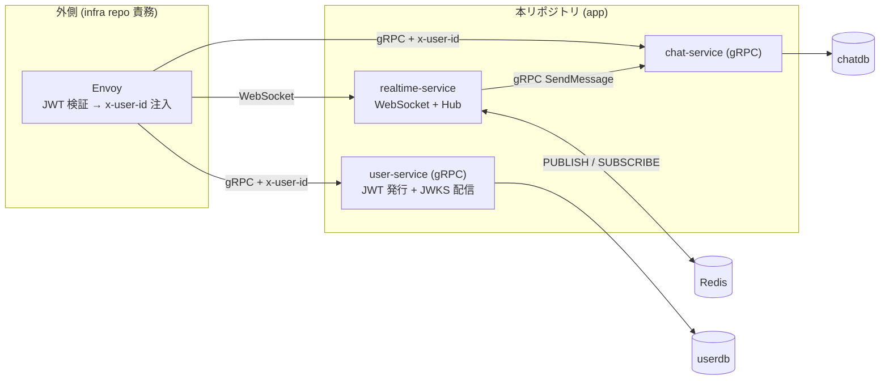

# Go Microservices Chat (app repo)

リアルタイムチャットプラットフォームの **アプリケーションコード + dev E2E 環境** を担うリポジトリ。Go + gRPC + Redis Pub/Sub + WebSocket でマイクロサービス設計を学ぶ。

**本番向けのオーケストレーション (K8s / Gateway API / SecurityPolicy / Helm / NetworkPolicy 等) は別リポジトリに分離**。このリポジトリには Go サービス / proto / Dockerfile + **dev 専用の `compose.yaml` + `envoy.yaml` + E2E スクリプト** を置く。

## プロジェクトの目的 (2 軸)

1. **マイクロサービスアーキテクチャを学ぶ** — サービス分割 / gRPC サービス間通信 / Database per Service / Redis Pub/Sub による WebSocket 水平スケール / 認証発行の責務分離
2. **chat サービスを通じて Go の書き方・概念・フローを学ぶ** — 層構造 / 依存性注入 / `context.Context` / goroutine + channel / interface によるテスト容易性

## スコープ

### このリポジトリに含めるもの
- 3 マイクロサービス (`user-service` / `chat-service` / `realtime-service`) の Go 実装
- proto 定義 + Buf 生成コード
- 共有パッケージ (`pkg/auth/` 他)
- 各サービスの Dockerfile (Phase 3)
- **Go 単体テスト** (InMem Repository + fake クライアントで完結、`go test ./...` が外部依存ゼロで PASS)
- **dev / E2E 専用の `compose.yaml` + `envoy.yaml` + `scripts/e2e/*.sh`** (Phase 4) — Envoy standalone 経由で JWT 検証経路を含む全フローを手元で確認。`make e2e-all` で立ち上げ → 全シナリオ → 片付けまで一気通貫

### このリポジトリに **含めない** もの
- 本番向け K8s マニフェスト / Gateway API / SecurityPolicy / Helm chart → infra リポジトリの責務
- JWT **検証** ロジック (Go 側には書かない) → dev では Envoy standalone、本番では Envoy Gateway が担当
- NetworkPolicy / Rate Limit / TLS 終端 / Observability 等の運用系 → infra 側

## 信頼境界 (重要)

**アプリ側 Go コードは JWT を検証しない**。常に upstream (ゲートウェイ) から渡される `x-user-id` メタデータを信じて読むだけ。Istio / Google Cloud ESP / AWS API Gateway 等と同じパターン。

| 責務 | 所在 |
|------|------|
| JWT **発行** (login 時の署名) | `user-service` (本リポジトリ) |
| JWKS **配信** (公開鍵を HTTP で公開) | `user-service` (本リポジトリ) |
| JWT **検証** (署名・期限・issuer) | **infra 側 Envoy** (compose: standalone / K8s: Envoy Gateway) |
| `x-user-id` メタデータを信じて読む | 全サービス (本リポジトリ) — `pkg/auth/context.go` の `RequesterID(ctx)` |

bufconn / 手動動作確認では `metadata.AppendToOutgoingContext(ctx, "x-user-id", "alice-uuid")` で直接注入してテストする。

## アーキテクチャ



## サービス一覧

| サービス | 役割 | プロトコル | データストア |
|---------|------|-----------|------------|
| **user-service** | User CRUD + JWT 発行 + JWKS 配信 | gRPC + JWKS HTTP | PostgreSQL (`userdb`) |
| **chat-service** | 公開ルーム / メンバーシップ / メッセージ永続化 | gRPC Unary | PostgreSQL (`chatdb`) |
| **realtime-service** | WebSocket 接続 + Redis Pub/Sub 経由で fan-out | WebSocket + gRPC client (chat 呼び出し用) | Redis (bus として) |

> user-service と chat-service は別 DB (`userdb` / `chatdb`) に論理分離。接続先は env var (`DATABASE_URL`) で差し替え可能。物理分離したければ infra repo 側で PG インスタンスを 2 つ立てる。

## 技術スタック

| カテゴリ | 技術 |
|---------|------|
| 言語 | Go 1.22 |
| RPC | gRPC (`google.golang.org/grpc`) + Protocol Buffers (Buf CLI) |
| DB ドライバ | pgx v5 (PostgreSQL) |
| ログ | log/slog (JSON) |
| JWT 署名 | golang-jwt/jwt (RS256、**発行のみ**) |
| Pub/Sub | Redis (go-redis) |
| WebSocket | gorilla/websocket |
| コンテナ | Docker (multi-stage build / distroless) |

## プロジェクト構成

```
go-microservices-chat/
├── services/                  # マイクロサービス実装
│   ├── user-service/          # Phase 1 (+ Phase 3 で Dockerfile)
│   ├── chat-service/          # Phase 1 で Room、Phase 2 で Message を追加
│   └── realtime-service/      # Phase 2
├── proto/                     # Protocol Buffers 定義 (API の一次ソース)
├── gen/go/                    # Buf 生成コード (`buf generate` で再生成)
├── pkg/                       # 共有パッケージ
│   ├── auth/
│   │   ├── issuer.go          # RS256 JWT 発行 (秘密鍵で署名)
│   │   ├── jwks.go            # JWKS HTTP Handler (公開鍵を JSON で配る)
│   │   └── context.go         # RequesterID(ctx) helper
│   └── interceptor/
│       └── logging.go         # gRPC Logging Interceptor
├── compose.yaml               # ★ Phase 4: dev / E2E 専用
├── envoy.yaml                 # ★ Phase 4: Envoy standalone (JWT 検証 filter)
├── scripts/e2e/               # ★ Phase 4: E2E シナリオ
├── docs/                      # 設計ドキュメント
├── Makefile                   # proto-gen / test / image-build / e2e-{up,run,down}
├── go.work                    # Go Workspace
└── .gitignore
```

## セットアップ

### 前提ツール

- Go 1.22+
- [Buf CLI](https://buf.build/docs/installation)
- Docker + docker compose
- `grpcurl` / `wscat` / `jq` (Phase 4 の E2E 検証用)

> `go test ./...` は InMem Repository + fake クライアントで完結 (Postgres / Redis 無しで PASS)。**実 PG / 実 Redis / JWT 検証経路までを通した検証は Phase 4 の `make e2e-all`** で本リポジトリ内で完結する。

### 実行

```bash
# proto コード生成
make proto-gen

# 単体テスト (外部依存ゼロで PASS)
go test ./...

# Docker イメージビルド (Phase 3)
make image-build-all

# E2E 検証 (Phase 4: compose 立ち上げ → シナリオ実行 → 片付け)
make e2e-all
```

本番向けの K8s デプロイは別リポジトリ `go-microservices-chat-infra` (想定) が担当。

## 開発フェーズ (4 Phase)

| Phase | 内容 | 成果物 |
|-------|------|------|
| **1** | user-service (JWT 発行 + JWKS 配信 + User CRUD) + chat-service (Room) + InMem テスト完結 | `services/user-service/` / `services/chat-service/` / bufconn テスト PASS |
| **2** | chat-service Message + realtime-service (WebSocket + Hub + Redis Pub/Sub) | `services/realtime-service/` / pubsub interface の InMem + Redis 両実装 |
| **3** | 3 サービスの Dockerfile (multi-stage / distroless) + `make image-build-all` | 3 Dockerfile + イメージ |
| **4** | `compose.yaml` + `envoy.yaml` + `scripts/e2e/*.sh` — Envoy standalone 経由で golden path / Pub/Sub 複数インスタンス / 認証失敗ケースを検証 | 動作確認済みの dev stack + E2E スクリプト一式 |

> Phase 4 まで完了した時点で **Envoy の JWT 検証経路を含む全フローが手元で動く**。infra リポジトリはこれを K8s (Deployment / Gateway API / SecurityPolicy) に写すのが主な作業になる。

## ドキュメント

- [Phase 1: user + room 実装](docs/phase/phase-1.md)
- [Phase 2: Message + realtime-service](docs/phase/phase-2.md)
- [Phase 3: Dockerfile + イメージビルド](docs/phase/phase-3.md)
- [Phase 4: compose + Envoy + E2E](docs/phase/phase-4.md)
- [マイクロサービス詳細設計](docs/architecture/microservices.md)
- [API 設計](docs/architecture/api-design.md)
- [クライアント画面設計](docs/architecture/client-screens.md)
- [データモデル](docs/architecture/data-model.md)
- [ディレクトリ構成](docs/architecture/directory-structure.md)
- [リアルタイムメッセージ配信フロー](docs/flow/realtime-message-flow.md)
