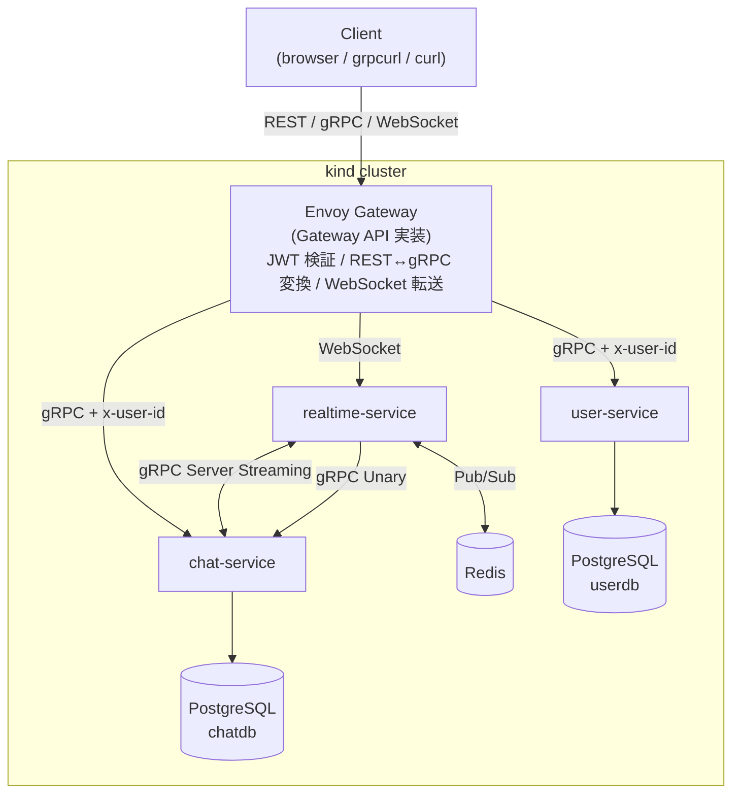

# Go Microservices Chat

リアルタイムチャットプラットフォームを **Go + gRPC + Kubernetes (kind) + Envoy Gateway** で構築するマイクロサービス学習プロジェクト。

## プロジェクトの目的

1. **マイクロサービスアーキテクチャを学ぶ** — サービス分割、サービス間通信 (gRPC / WebSocket / Pub/Sub)、疎結合、エッジ Gateway の役割を、実際に動くチャットアプリを通じて理解する
2. **chat サービスを通じて Go の書き方・概念・フローを学ぶ** — 層構造・依存性注入・`context.Context`・goroutine/channel・interface 設計など、Go バックエンドのイディオムを習得する
3. **実務で通用する現代的なインフラ構成を体験する** — K8s (kind でローカル) / Envoy Gateway (Gateway API) / gRPC という CNCF 三点セットで「モダンで枯れない」構成を手で動かす

**制約**: クラウド費用をかけずローカル (kind) で完結する。マネージドクラウドサービスは使わない。

## 想定規模

| 項目 | 想定値 |
|------|--------|
| 同時接続ユーザー数 | 〜100 人 |
| 総ユーザー数 | 〜1,000 人 |
| チャットルーム数 | 〜100 |
| メッセージ量 | 〜1,000 件/日 |

> 学習プロジェクトのため実トラフィックはない。ローカル kind クラスタで動く規模を想定する。

## 主な設計判断

| 判断 | 選定 | 理由 |
|------|------|------|
| 実行基盤 | **kind (ローカル K8s)** | 本番に近い構成をローカルで検証できる。途中で Docker Compose → K8s に移行するコストを最初から払う |
| エッジ Gateway | **Envoy Gateway (Gateway API)** | CNCF 標準。JWT 検証・REST↔gRPC 変換・レートリミットが **YAML だけ** で実現。Go で api-gateway を書かない |
| サービス間通信 | **gRPC (google.golang.org/grpc)** | 業界標準、型安全、コード生成。最も「枯れない」選択 |
| クライアント向け REST | **Envoy gRPC-JSON Transcoder** | proto の `google.api.http` アノテーションから REST を自動公開。手書きゼロ |
| リアルタイム (クライアント) | **WebSocket** | 双方向通信、ブラウザ対応 |
| リアルタイム (サービス間) | **gRPC Server Streaming** | サービス間の疎結合を維持 |
| 配信責務の分離 | **Redis Pub/Sub** | 1 インスタンスでも N インスタンス拡張を前提とした設計を学ぶ |
| データストア | **PostgreSQL** 統一 | 学習の焦点をマイクロサービス設計に絞る |
| 認証 | **自前 JWT + bcrypt** | 仕組みを自分で実装して理解する。Cognito 等は使わない |
| Proto 管理 | **Buf CLI** | lint / generate / 依存管理を統一 |
| HTTP / gRPC ライブラリ | **google.golang.org/grpc** (Connect RPC ではない) | 採用実績と求人需要で圧倒的に優位 |
| サービス内部構成 | **垂直分割 (package-per-feature)** | Go 標準ライブラリのイディオムに合わせる |

## アーキテクチャ



## サービス一覧

| サービス | 役割 | プロトコル | データストア |
|---------|------|-----------|------------|
| **user-service** | ユーザー管理・フレンド機能・認証 | gRPC | PostgreSQL |
| **chat-service** | チャットルーム・メッセージ管理 | gRPC | PostgreSQL |
| **realtime-service** | WebSocket 接続・リアルタイム配信 | WebSocket + gRPC | Redis |
| **Envoy Gateway** (Go 実装なし) | 認証・ルーティング・REST↔gRPC 変換 | YAML 設定のみ | - |

## 技術スタック

| カテゴリ | 技術 |
|---------|------|
| 言語 | Go 1.22 |
| RPC | gRPC (`google.golang.org/grpc`) + Protocol Buffers (Buf CLI) |
| DB ドライバー | pgx v5 (PostgreSQL) |
| ログ | log/slog |
| 実行基盤 | Kubernetes (kind) |
| エッジ Gateway | Envoy Gateway (Gateway API) |
| パッケージ管理 | Helm (Envoy Gateway インストール用) |
| コンテナ | Docker (multi-stage build) |
| 認証 | 自前 JWT (golang-jwt/jwt) + bcrypt |
| キャッシュ/Pub/Sub | Redis (go-redis) |
| WebSocket | gorilla/websocket |

## プロジェクト構成

```
go-microservices-chat/
├── services/                  # マイクロサービス (Go コード)
│   ├── user-service/          # Phase 0 で最小版、Phase 1 で完成
│   ├── chat-service/          # Phase 2 で追加
│   └── realtime-service/      # Phase 3 で追加
├── proto/                     # Protocol Buffers 定義 (API の一次ソース)
├── gen/go/                    # Buf 生成コード
├── pkg/                       # 共有パッケージ (auth, logger, interceptor, errors)
├── deploy/                    # K8s マニフェスト / Envoy Gateway 設定
│   ├── kind-config.yaml
│   ├── gateway/               # Gateway / GRPCRoute / SecurityPolicy
│   ├── services/              # 各サービスの Deployment / Service
│   ├── postgres/              # PostgreSQL StatefulSet
│   └── redis/                 # Redis Deployment
├── docs/                      # 設計ドキュメント
├── Makefile                   # kind / buf / deploy コマンド
└── go.work                    # Go Workspace
```

> `docker-compose.yml` / `services/api-gateway/` は **使わない**。すべて K8s + Envoy Gateway で完結。

## セットアップ

### 前提条件

**Phase 0〜3 (Go 開発期間) に必要**:
- Go 1.22+
- Docker (PostgreSQL / Redis を単発で `docker run` する)
- [Buf CLI](https://buf.build/docs/installation)
- [grpcurl](https://github.com/fullstorydev/grpcurl)
- [golang-migrate](https://github.com/golang-migrate/migrate) CLI

**Phase 4 (K8s 期間) で追加**:
- [kind](https://kind.sigs.k8s.io/) (ローカル K8s クラスタ)
- [kubectl](https://kubernetes.io/docs/tasks/tools/)
- [helm](https://helm.sh/)

### Phase 0-3 の起動 (Go で完結)

```bash
# 1. Proto コード生成
make proto-gen

# 2. PostgreSQL / Redis を単発起動
make db-up         # docker run postgres
make redis-up      # docker run redis (Phase 3 以降で必要)
make db-migrate

# 3. サービスを並行起動 (別ターミナルで)
make run-user      # Phase 1 完了後
make run-chat      # Phase 2 完了後
make run-realtime  # Phase 3 完了後

# 4. 動作確認 (x-user-id を手動注入)
grpcurl -plaintext -H "x-user-id: <uuid>" \
  localhost:50051 user.v1.UserService/GetUser
```

### Phase 4 の起動 (K8s + Envoy)

```bash
# 1. kind クラスタ + Gateway
make cluster-up
make gateway-install

# 2. 全サービスのビルドと K8s デプロイ
make image-build-all
make deploy-all     # PostgreSQL / Redis / 3 サービス / Gateway / SecurityPolicy

# 3. port-forward
kubectl -n envoy-gateway-system port-forward svc/<gateway-svc-name> 8080:80 50051:50051

# 4. REST でログイン → 保護エンドポイントを叩く
curl -X POST http://localhost:8080/api/v1/auth/login ...
```

### テスト

```bash
# Go 単体テスト (K8s 不要、Phase 0-3 のどの段階でも動く)
go test ./...
```

## 開発フェーズ

**技術軸で分離した 5 Phase 構成 (Phase 0〜4)**。Phase 1〜3 は Go に集中し、Phase 4 で K8s + Envoy に集中する。途中で構成変更や切り替えが起きないように、サービス側の Go コード設計 (`TrustedUserID` Interceptor + JWT 発行のみで検証なし) を工夫してある。

| Phase | 内容 | 状態 |
|-------|------|------|
| 0 | **プロジェクト骨組み** — Go Workspace / Buf CLI / ディレクトリ規約 / Makefile スケルトン (K8s / Envoy には触れない) | 未着手 |
| 1 | **user-service (Go で完結)** — Go 基礎 + gRPC + PostgreSQL + 認証プリミティブ (bcrypt / RS256 / JWKS) + フレンド | 未着手 |
| 2 | **chat-service (Go で完結)** — Room / Message + サービス間 gRPC 通信 (localhost で 2 プロセス並走) | 未着手 |
| 3 | **realtime-service (Go で完結)** — WebSocket + Hub + gRPC Server Streaming + Redis Pub/Sub (localhost で 3 プロセス並走) | 未着手 |
| 4 | **K8s + Envoy で全サービスをデプロイ** — kind / Gateway API / Envoy Gateway / SecurityPolicy / Transcoder / NetworkPolicy | 未着手 |

> Phase 構成は 2026-04-17 に再編。「Go 集中期間 (1-3)」と「インフラ集中期間 (4)」を分離。Phase 1-3 では `docker run postgres/redis` + `go run` でローカル完結、Phase 4 で kind + Envoy に載せ替え。**サービス側の Go コードは Phase 4 で一切変更しない**。

## ドキュメント

- [Phase 0: プロジェクト骨組み](docs/learning/phase-0.md)
- [Phase 1: user-service (Go で完結)](docs/learning/phase-1.md)
- [Phase 2: chat-service (Go で完結)](docs/learning/phase-2.md)
- [Phase 3: realtime-service (Go で完結)](docs/learning/phase-3.md)
- [Phase 4: K8s + Envoy でデプロイ](docs/learning/phase-4.md)
- [マイクロサービス詳細設計](docs/architecture/microservices.md)
- [API 設計](docs/architecture/api-design.md)
- [データモデル](docs/architecture/data-model.md)
- [ディレクトリ構成](docs/architecture/directory-structure.md)
