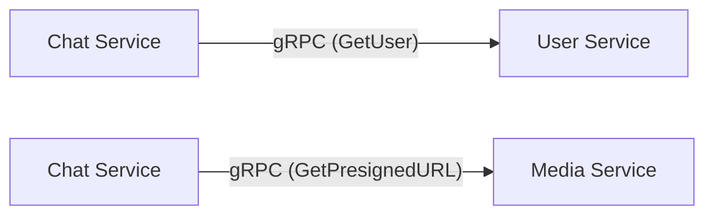
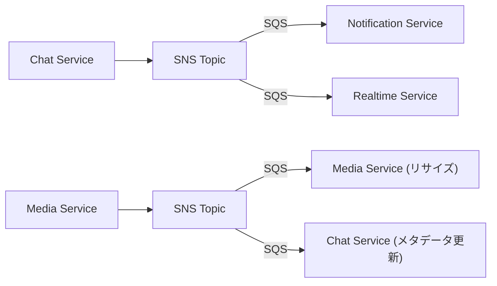
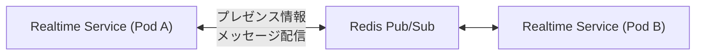
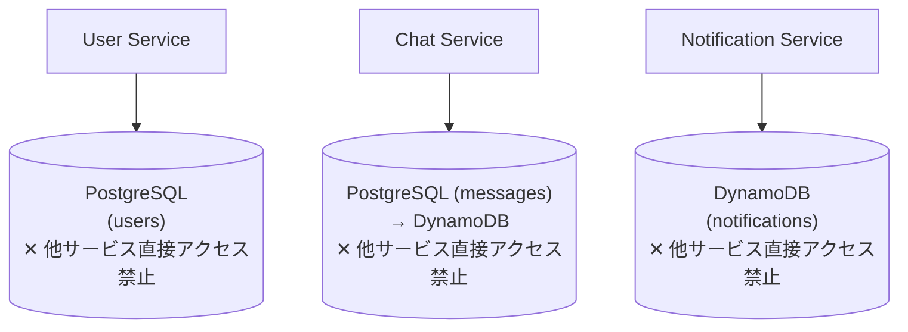

# マイクロサービス詳細設計

## サービス一覧と責務

### 1. User Service

**責務**: ユーザーのライフサイクル管理

| 項目 | 内容 |
|------|------|
| ポート | gRPC: 50051, REST: 8001 |
| データストア | PostgreSQL (users DB) |
| プロトコル | REST (外部向け) + gRPC (内部向け) |

**機能**:
- ユーザー登録・認証（Cognito 連携）
- プロフィール管理（表示名、アバター、ステータス）
- フレンド管理（申請、承認、ブロック）
- オンライン状態の管理

**所有データ**:
- ユーザーアカウント情報
- プロフィールデータ
- フレンドリレーション

---

### 2. Chat Service

**責務**: チャットルームとメッセージの永続化管理

| 項目 | 内容 |
|------|------|
| ポート | gRPC: 50052 |
| データストア | PostgreSQL → DynamoDB (Phase 4 で移行) |
| プロトコル | gRPC |

**機能**:
- チャットルーム作成・管理（1:1, グループ）
- メッセージの送信・保存・取得
- メッセージの既読管理
- チャット履歴のページネーション

**所有データ**:
- チャットルーム情報
- メッセージデータ
- 既読ステータス

---

### 3. Realtime Service

**責務**: WebSocket 接続管理とリアルタイムメッセージ配信

| 項目 | 内容 |
|------|------|
| ポート | WebSocket: 8081, gRPC: 50055 |
| データストア | Redis (Pub/Sub + プレゼンス) |
| プロトコル | WebSocket (クライアント向け) + gRPC Server Streaming (内部向け) |

**機能**:
- WebSocket 接続の確立・維持・切断管理
- リアルタイムメッセージのブロードキャスト
- ユーザーのプレゼンス（オンライン/オフライン）管理

**所有データ**:
- アクティブ接続情報（Redis）
- プレゼンス状態（Redis）

---

### 4. Notification Service

**責務**: 通知の生成・管理・配信

| 項目 | 内容 |
|------|------|
| ポート | gRPC: 50053 |
| データストア | DynamoDB (notifications テーブル) |
| プロトコル | gRPC |

**機能**:
- 通知の生成と保存
- 未読通知の管理
- プッシュ通知の配信（将来的に SNS Mobile Push）
- 通知設定の管理

**所有データ**:
- 通知履歴
- 通知設定

---

### 5. Media Service

**責務**: ファイルアップロードと画像処理

| 項目 | 内容 |
|------|------|
| ポート | gRPC: 50054, REST: 8004 |
| データストア | Amazon S3 |
| プロトコル | REST (アップロード) + gRPC (メタデータ) |

**機能**:
- ファイルアップロード（Presigned URL 方式）
- 画像リサイズ・サムネイル生成
- ファイルメタデータの管理
- Content-Type バリデーション

**所有データ**:
- アップロードファイル（S3）
- ファイルメタデータ

---

### 6. API Gateway

**責務**: 外部リクエストの認証・ルーティング・制御

| 項目 | 内容 |
|------|------|
| ポート | REST: 8080 |
| データストア | なし (Stateless) |
| プロトコル | REST → gRPC 変換 |

**機能**:
- JWT トークン検証（Cognito 連携）
- REST → gRPC プロトコル変換
- レート制限
- リクエストログ・トレーシング
- CORS 設定

---

## サービス間通信の詳細

### 同期通信 (gRPC)

サービス間の直接的なリクエスト/レスポンスが必要な場合に使用。



**使用場面**:
| 呼び出し元 | 呼び出し先 | RPC | 目的 |
|-----------|-----------|-----|------|
| API Gateway | User Service | GetUser, CreateUser | ユーザー操作 |
| API Gateway | Chat Service | SendMessage, GetMessages | メッセージ操作 |
| Chat Service | User Service | GetUser | 送信者情報の取得 |
| Chat Service | Media Service | GetPresignedURL | ファイル添付 |
| API Gateway | Notification Service | GetNotifications | 通知取得 |

### 非同期通信 (SNS/SQS)

疎結合が必要な場合、または複数サービスへのファンアウトが必要な場合に使用。



**イベント定義**:
| イベント | 発行元 | 購読者 | 内容 |
|---------|--------|--------|------|
| `message.sent` | Chat Service | Notification, Realtime | 新規メッセージ送信 |
| `message.read` | Chat Service | Realtime | 既読更新 |
| `user.status_changed` | User Service | Realtime | オンライン状態変更 |
| `media.uploaded` | Media Service | Chat | ファイルアップロード完了 |
| `room.member_added` | Chat Service | Notification | メンバー追加 |

### Redis Pub/Sub

同一サービスの複数インスタンス間でリアルタイムデータを共有する場合に使用。



## Database-per-Service パターン

各サービスが独自のデータストアを所有し、他サービスのデータには API 経由でのみアクセスする。



**原則**:
1. 各サービスは自分のデータストアにのみ直接アクセスする
2. 他サービスのデータが必要な場合は gRPC で問い合わせる
3. データの整合性はイベント駆動（結果整合性）で担保する
4. 共有データベースは使用しない

## サービスディスカバリ

Kubernetes 環境では、Kubernetes Service (ClusterIP) による DNS ベースのサービスディスカバリを使用。

```
# サービス名で他サービスにアクセス
user-service.chat-app.svc.cluster.local:50051
chat-service.chat-app.svc.cluster.local:50052
```

## 関連ドキュメント

- [データモデル設計](./data-model.md)
- [API 設計](./api-design.md)
