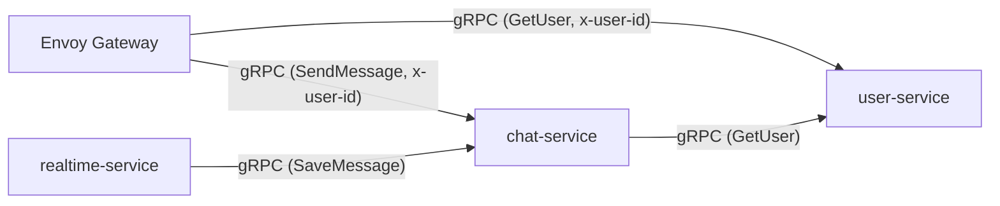
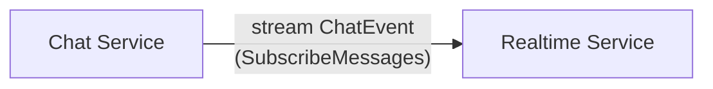
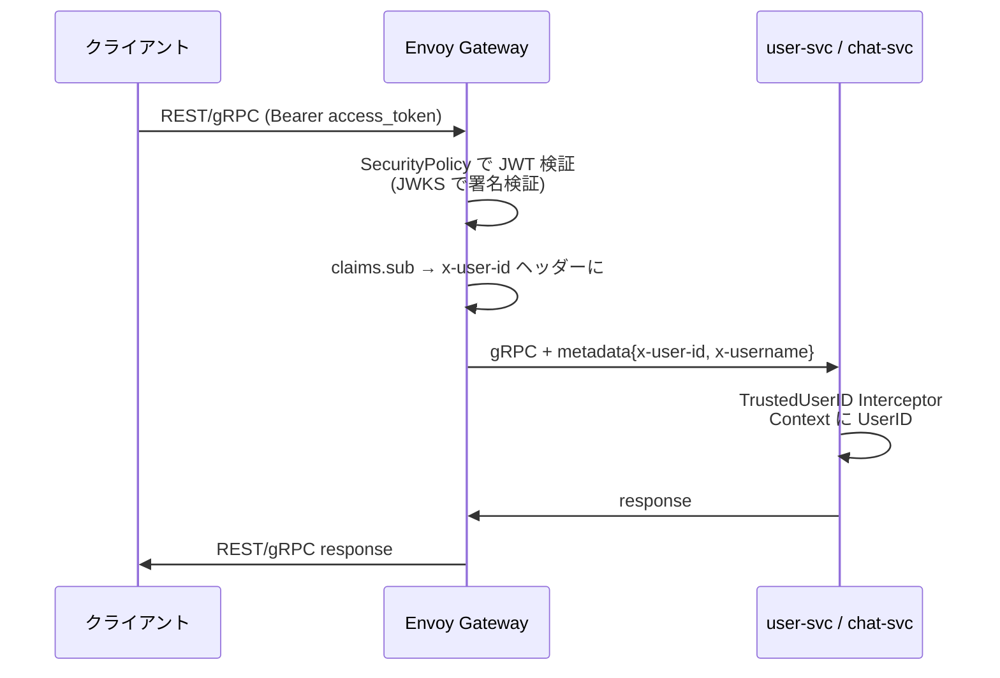
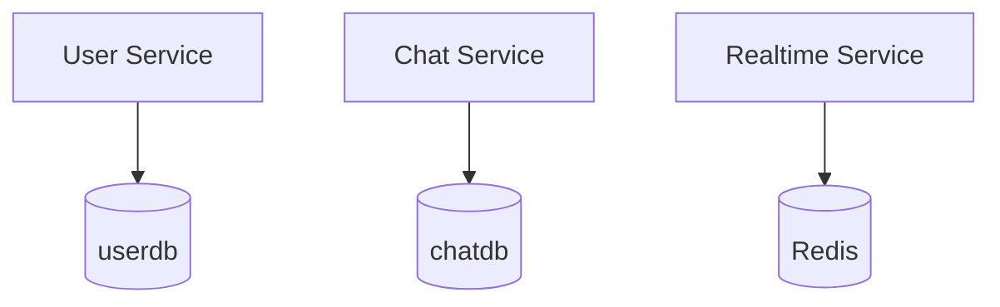

# マイクロサービス詳細設計

## スコープ

本プロジェクトは学習目的のため、マイクロサービスの **本質的な構造を体験するのに必要な最小構成** に絞る。

| サービス | 実装 Phase | デプロイ Phase | 役割 |
|---------|-------|-------|------|
| user-service | 1 (Go) | 4 (K8s) | ユーザー管理・認証・フレンド |
| chat-service | 2 (Go) | 4 (K8s) | チャットルーム・メッセージ永続化 |
| realtime-service | 3 (Go) | 4 (K8s) | WebSocket 接続・リアルタイム配信 |

**api-gateway は Go で実装しない**。代わりに **Envoy Gateway (Phase 4 で YAML 設定)** が以下を担当：
- REST↔gRPC 変換 (gRPC-JSON Transcoder)
- JWT 検証 (SecurityPolicy)
- レートリミット (BackendTrafficPolicy)
- CORS / ログ / ルーティング

notification-service / media-service 等は将来の発展課題とし、主要フローの学習には含めない。

---

## 実行環境の 2 段階

**Phase 1〜3 (ローカル Go 開発期間)**:
- `go run` でサービスを並行起動
- `docker run postgres/redis` でミドルウェア起動
- grpcurl で `x-user-id` を手動注入してテスト

**Phase 4 (K8s + Envoy 期間)**:
- kind クラスタ上で全サービスが Pod として動作
- Envoy Gateway が JWT 検証 / REST 変換 / ルーティングを担当
- **サービス側の Go コードは Phase 3 から一切変更なし**

---

## サービス一覧と責務

### 1. User Service

**責務**: ユーザーのライフサイクル管理と認証

| 項目 | 内容 |
|------|------|
| ポート | gRPC: 50051 |
| データストア | PostgreSQL (userdb) |
| プロトコル | gRPC (Phase 1 から)。REST は Phase 4 で Envoy Transcoder 経由で外部公開 |
| K8s リソース | Deployment / Service / Secret / NetworkPolicy / Migration Job |

**機能**:
- ユーザー登録・ログイン (bcrypt + 自前 JWT)
- リフレッシュトークン管理 (DB 保管、ローテーション)
- プロフィール管理（表示名、アバター、ステータス）
- フレンド管理（申請、承認、ブロック）
- オンライン状態の管理 (Phase 3 で realtime-service と連携、Phase 1 ではスタブ)
- JWKS 公開 (Envoy の SecurityPolicy が参照)

---

### 2. Chat Service

**責務**: チャットルームとメッセージの永続化管理

| 項目 | 内容 |
|------|------|
| ポート | gRPC: 50052 |
| データストア | PostgreSQL (chatdb) |
| プロトコル | gRPC (Unary + Server Streaming) |
| K8s リソース | Deployment / Service / Migration Job |

**機能**:
- チャットルーム作成・管理（1:1, グループ）
- メッセージの送信・保存・取得
- メッセージの既読管理
- チャット履歴のページネーション (cursor-based)
- realtime-service 向けの `SubscribeMessages` (gRPC Server Streaming)

---

### 3. Realtime Service

**責務**: WebSocket 接続管理とリアルタイムメッセージ配信

| 項目 | 内容 |
|------|------|
| ポート | WebSocket: 8081 |
| データストア | Redis (Pub/Sub + プレゼンス) |
| プロトコル | WebSocket (クライアント向け) + gRPC (chat-service との双方向) |
| K8s リソース | Deployment / Service |

**機能**:
- WebSocket 接続の確立・維持・切断管理 (Hub パターン)
- メッセージ受信 → chat-service へ保存 (gRPC Unary) + Redis Pub/Sub 経由で配信
- chat-service からのサーバーストリームを受信して配信
- ユーザーのプレゼンス管理

---

### 4. Envoy Gateway (Gateway API 実装)

**責務**: 外部リクエストの認証・ルーティング・REST↔gRPC 変換・レートリミット

**コード実装なし。すべて YAML で宣言。**

| 項目 | 内容 |
|------|------|
| ポート | 80 (REST / WebSocket) / 50051 (gRPC) |
| データストア | なし (Stateless)、レートリミット用 Redis と連携 |
| 設定方式 | Gateway API (Gateway / GRPCRoute / HTTPRoute) + Envoy Gateway 拡張 (SecurityPolicy / BackendTrafficPolicy / EnvoyPatchPolicy) |

**機能**:
- JWT トークン検証 (`SecurityPolicy` + JWKS)
- JWT claims (`sub` など) を内部 gRPC リクエストの metadata に注入 (`claimToHeaders`)
- REST→gRPC 変換 (`gRPC-JSON Transcoder` Envoy フィルター)
- WebSocket の透過的転送 (`HTTPRoute` + WebSocket upgrade)
- レート制限 (`BackendTrafficPolicy` + Redis カウンター)
- CORS 設定
- アクセスログ

---

## サービス間通信の詳細

### 同期通信 (gRPC Unary)



| 呼び出し元 | 呼び出し先 | RPC | 目的 |
|-----------|-----------|-----|------|
| Envoy Gateway | user-service | Login, Register, Refresh, GetUser ... | 外部リクエスト転送 |
| Envoy Gateway | chat-service | CreateRoom, SendMessage ... | 外部リクエスト転送 |
| chat-service | user-service | GetUser | メンバー存在確認 |
| realtime-service | chat-service | SaveMessage | WebSocket メッセージの永続化 |

### ストリーミング通信 (gRPC Server Streaming)



REST API 経由で送られたメッセージや、編集・削除通知など **realtime-service が WebSocket で直接受け取らないイベント** を chat-service から push する。

### Pub/Sub (Redis Pub/Sub)

本プロジェクトの realtime-service は **1 インスタンス** で動かす (学習目的)。この構成だけなら Hub (プロセス内 channel) だけで同一プロセスの全 WebSocket に配信でき、Redis Pub/Sub は不要。

しかしここで **あえて Redis Pub/Sub を経由させる**。同じインスタンスが publish → subscribe する冗長な構成になるが、以下の利点がある。

| 観点 | 理由 |
|------|------|
| マルチインスタンスへの拡張性 | インスタンス数を 2 以上に増やすだけで、他インスタンスにも自動で配信される (コード変更なし) |
| 責務の分離 | 「WebSocket で受信する責務」と「ルーム全員に配信する責務」がコード上で分離される |
| 学習価値 | Pub/Sub パターンと Hub パターンの組み合わせを手で実装して理解する |

#### Redis の他の役割

| 用途 | キー形式 | 備考 |
|------|---------|------|
| プレゼンス | `presence:<user_id>` | TTL 60s、ハートビートで延長 |
| 接続マッピング (N インスタンス時) | `ws:connections:<user_id>` | どのインスタンスに接続があるか |
| レートリミット | `ratelimit:login:<user_id>` | Envoy から参照 |

---

## 認証情報の伝搬 (Phase 4 の Envoy 導入後)

JWT 検証は **Envoy Gateway に集約** し、内部サービスは gRPC メタデータで user_id を受け取る。



**信頼境界**: 外部呼び出しの JWT 検証は Envoy Gateway のみ。内部サービスは Envoy を信頼し、K8s `NetworkPolicy` で外部からの直接アクセスを拒否する。

---

## Database-per-Service パターン

各サービスが独自のデータベースを所有する。本プロジェクトでは PostgreSQL の **DB を分けて運用** する。



**原則**:
1. 各サービスは自分のデータストアにのみ直接アクセス
2. 他サービスのデータが必要な場合は gRPC で問い合わせる
3. 外部キーをサービス境界を跨いで張らない

> 物理的には単一の PostgreSQL StatefulSet 上に複数 DB を配置するが、**論理的には別物として扱う**。

---

## サービスディスカバリ

**Phase 1〜3 (ローカル)**:

```
localhost:50051    # user-service (go run)
localhost:50052    # chat-service (go run)
localhost:8081     # realtime-service (go run)
localhost:5432     # PostgreSQL (docker run)
localhost:6379     # Redis (docker run)
```

**Phase 4 (K8s)**: K8s の内部 DNS を使う：

```
user-service.chat-app.svc.cluster.local:50051
chat-service.chat-app.svc.cluster.local:50052
realtime-service.chat-app.svc.cluster.local:8081
postgres.chat-app.svc.cluster.local:5432
redis.chat-app.svc.cluster.local:6379
```

Namespace 内なら `user-service:50051` で解決可能。環境変数 `USER_SERVICE_ADDR` などを Phase 1〜3 と Phase 4 で切り替えることで、Go コードは同じものが動く。

---

## 関連ドキュメント

- [データモデル設計](./data-model.md)
- [API 設計](./api-design.md)
- [ディレクトリ構成](./directory-structure.md)
