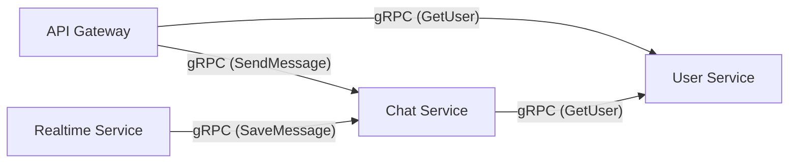
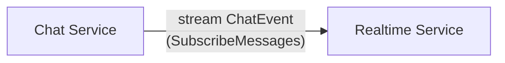
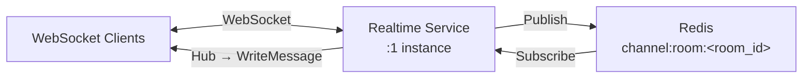
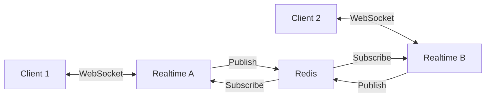
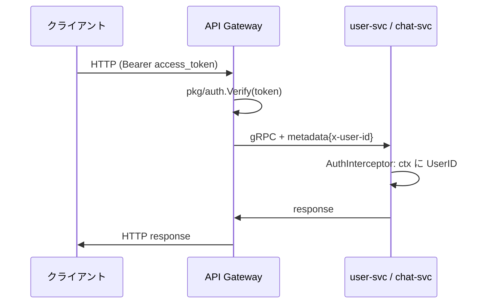
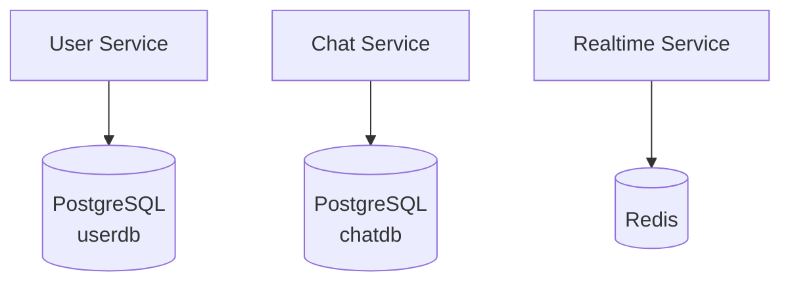

# マイクロサービス詳細設計

## スコープ

本プロジェクトは学習目的のため、マイクロサービスの **本質的な構造を体験するのに必要な最小構成** に絞る。

| サービス | Phase | 役割 |
|---------|-------|------|
| user-service | 1 (完了) / 2 (認証追加) | ユーザー管理・認証 |
| api-gateway | 3 | 外部境界・JWT 検証・ルーティング |
| chat-service | 3 | チャットルーム・メッセージ永続化 |
| realtime-service | 4 | WebSocket 接続・リアルタイム配信 |

notification-service / media-service 等は将来の発展課題とし、主要フローの学習には含めない。

---

## サービス一覧と責務

### 1. User Service

**責務**: ユーザーのライフサイクル管理と認証

| 項目 | 内容 |
|------|------|
| ポート | REST: 8001 / gRPC: 50051 (Phase 3 で追加) |
| データストア | PostgreSQL (userdb) |
| プロトコル | REST (Phase 1) + gRPC (Phase 3) |

**機能**:
- ユーザー登録・ログイン (bcrypt + 自前 JWT — Phase 2)
- リフレッシュトークン管理 (Phase 2)
- プロフィール管理（表示名、アバター、ステータス）
- フレンド管理（申請、承認、ブロック）
- オンライン状態の管理 (Phase 4 で realtime-service と連携)

**所有データ**:
- ユーザーアカウント情報 (`password_hash` 含む)
- リフレッシュトークン
- プロフィールデータ
- フレンドリレーション

---

### 2. Chat Service

**責務**: チャットルームとメッセージの永続化管理

| 項目 | 内容 |
|------|------|
| ポート | gRPC: 50052 |
| データストア | PostgreSQL (chatdb) |
| プロトコル | gRPC (Unary + Server Streaming) |

**機能**:
- チャットルーム作成・管理（1:1, グループ）
- メッセージの送信・保存・取得
- メッセージの既読管理
- チャット履歴のページネーション
- realtime-service 向けの `SubscribeMessages` (gRPC Server Streaming)

**所有データ**:
- チャットルーム情報
- メッセージデータ
- 既読ステータス

---

### 3. Realtime Service

**責務**: WebSocket 接続管理とリアルタイムメッセージ配信

| 項目 | 内容 |
|------|------|
| ポート | WebSocket: 8081 |
| データストア | Redis (Pub/Sub + プレゼンス) |
| プロトコル | WebSocket (クライアント向け) + gRPC Server Streaming (chat-service から) |

**機能**:
- WebSocket 接続の確立・維持・切断管理 (Hub パターン)
- メッセージ受信 → chat-service へ保存 (gRPC Unary) + Redis Pub/Sub 経由で配信 (1 インスタンスでも N インスタンスでも同じコード)
- chat-service からのサーバーストリーム (REST 経由メッセージ等) を受信して配信
- ユーザーのプレゼンス（オンライン/オフライン）管理

**所有データ**:
- アクティブ接続情報（Redis）
- プレゼンス状態（Redis）

---

### 4. API Gateway

**責務**: 外部リクエストの認証・ルーティング・REST→gRPC 変換

| 項目 | 内容 |
|------|------|
| ポート | REST: 8080 |
| データストア | なし (Stateless) |
| プロトコル | REST → gRPC 変換 (grpc-gateway) |

**機能**:
- JWT トークン検証（Phase 2 で作成した `pkg/auth` を再利用）
- REST → gRPC プロトコル変換
- gRPC メタデータ `x-user-id` を内部サービスに伝搬
- レート制限 (Redis カウンター)
- リクエストログ・CORS 設定

---

## サービス間通信の詳細

### 同期通信 (gRPC Unary)

サービス間のリクエスト/レスポンス。



**使用場面**:
| 呼び出し元 | 呼び出し先 | RPC | 目的 |
|-----------|-----------|-----|------|
| API Gateway | User Service | GetUser, CreateUser, Login, Refresh | ユーザー操作・認証 |
| API Gateway | Chat Service | SendMessage, GetMessages, CreateRoom | メッセージ・ルーム操作 |
| Chat Service | User Service | GetUser | 送信者情報の取得 |
| Realtime Service | Chat Service | SaveMessage | WebSocket 経由メッセージの永続化 |

### ストリーミング通信 (gRPC Server Streaming)

リアルタイムイベントの push。



REST API 経由で送られたメッセージや、編集・削除通知など **realtime-service が WebSocket で直接受け取らないイベント** を chat-service から push する。

### Pub/Sub (Redis Pub/Sub)

本プロジェクトの realtime-service は **1 インスタンス** で動かす (Docker Compose、学習目的)。この構成だけなら Hub (プロセス内 channel) だけで同一プロセスの全 WebSocket に配信でき、Redis Pub/Sub は不要。

しかしここで **あえて Redis Pub/Sub を経由させる**。同じインスタンスが publish → subscribe する冗長な構成になるが、以下の利点がある。

| 観点 | 理由 |
|------|------|
| マルチインスタンスへの拡張性 | インスタンス数を 2 以上に増やすだけで、他インスタンスにも自動で配信される (コード変更なし) |
| 責務の分離 | 「WebSocket で受信する責務」と「ルーム全員に配信する責務」がコード上で分離される |
| 学習価値 | Pub/Sub パターンと Hub パターンの組み合わせを手で実装して理解する |

#### 配信フロー (1 インスタンス構成)



1. クライアント A が WebSocket でメッセージ送信
2. realtime-service がメッセージを **Redis channel にパブリッシュ** (自分では直接 Hub に流さない)
3. realtime-service は起動時から同じ channel を購読している
4. Redis から配信されてきたメッセージを Hub に渡し、ルーム内の全 WebSocket に書き込む

#### N インスタンス化したときの挙動



コードは上記 1 インスタンス構成と同じ。Client 1 が発言すると Realtime A が publish → Redis → Realtime A と B が subscribe 受信 → それぞれの Hub が自分に繋がっている WebSocket に配信。

#### Redis の他の役割

| 用途 | キー形式 | 備考 |
|------|---------|------|
| プレゼンス | `presence:<user_id>` | TTL 60s、ハートビートで延長 |
| 接続マッピング (N インスタンス時) | `ws:connections:<user_id>` | どのインスタンスに接続があるか (1 インスタンスでは不要) |
| レートリミット | `ratelimit:login:<ip>` | Phase 2 のログイン試行カウンター |

---

## 認証情報の伝搬 (Phase 2 + 3)

JWT 検証は API Gateway に集約し、内部サービスは gRPC メタデータで user_id を受け取る。



**信頼境界**: 外部呼び出しの JWT 検証は API Gateway のみ。内部サービスは API Gateway を信頼する (Docker ネットワーク内の通信)。

---

## Database-per-Service パターン

各サービスが独自のデータベースを所有し、他サービスのデータには API 経由でのみアクセスする。本プロジェクトでは PostgreSQL の **DB を分けて運用** する。



**原則**:
1. 各サービスは自分のデータストアにのみ直接アクセスする
2. 他サービスのデータが必要な場合は gRPC で問い合わせる
3. 共有データベースは使用しない
4. 外部キーをサービス境界を跨いで張らない

> 物理的には単一の PostgreSQL インスタンス上に複数 DB を配置するが、**論理的には別物として扱う**。マイクロサービスの所有権境界を保つため。

---

## サービスディスカバリ

Docker Compose 環境では、Docker ネットワーク上のサービス名で DNS 解決される。

```
user-service:50051
chat-service:50052
realtime-service:8081
```

---

## 関連ドキュメント

- [データモデル設計](./data-model.md)
- [API 設計](./api-design.md)
- [ディレクトリ構成](./directory-structure.md)
