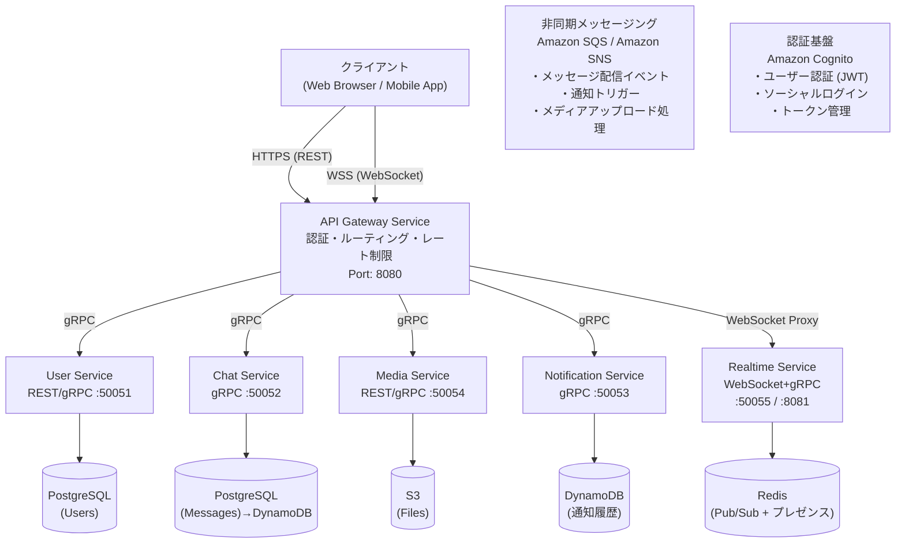
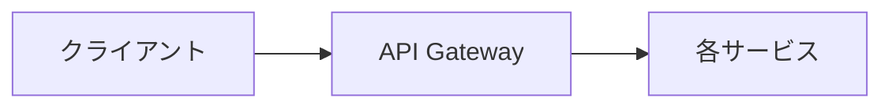
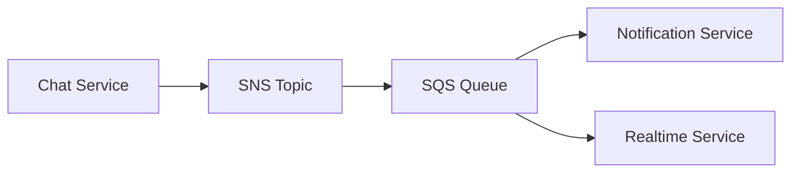

# Cloud Native Chat Platform - アーキテクチャ概要

## プロジェクト概要

リアルタイムチャットプラットフォームを Go + AWS + Kubernetes で構築するマイクロサービス学習プロジェクト。

### 学習目標

- Go によるマイクロサービス開発（REST, gRPC, WebSocket）
- AWS マネージドサービスの実践的な活用
- Kubernetes によるコンテナオーケストレーション
- Terraform による Infrastructure as Code
- 転職ポートフォリオ / AWS SAA-C03 / CKA / CKAD 対策

## システムアーキテクチャ図

## マイクロサービス一覧

| サービス | 役割 | プロトコル | データストア |
|---------|------|-----------|------------|
| **user-service** | ユーザー管理・プロフィール | REST + gRPC | PostgreSQL |
| **chat-service** | チャットルーム・メッセージ管理 | gRPC | PostgreSQL → DynamoDB |
| **realtime-service** | WebSocket接続管理・リアルタイム配信 | WebSocket + gRPC Streaming | Redis |
| **notification-service** | 通知管理・プッシュ配信 | gRPC | DynamoDB |
| **media-service** | ファイルアップロード・画像処理 | REST + gRPC | S3 |
| **api-gateway** | 認証・ルーティング・レート制限 | REST → gRPC 変換 | - (Stateless) |

## 通信パターン

### 同期通信（リクエスト/レスポンス）

- **REST API**: クライアント ↔ API Gateway 間
- **gRPC (Unary)**: API Gateway ↔ 内部サービス間
- **gRPC Streaming**: Realtime Service のリアルタイムメッセージ配信

### 非同期通信（イベント駆動）

- **Amazon SNS**: イベントのファンアウト（1つのイベントを複数サービスへ）
- **Amazon SQS**: メッセージキューイング（確実な配信保証）
- **Redis Pub/Sub**: リアルタイムのプレゼンス情報とメッセージ配信

### 通信パターンの使い分け

| パターン | ユースケース | 理由 |
|---------|------------|------|
| REST | クライアント → API Gateway | ブラウザ互換性、シンプル |
| gRPC Unary | サービス間 RPC | 型安全、高速、コード生成 |
| gRPC Streaming | リアルタイム配信 | 双方向通信、効率的 |
| WebSocket | クライアント ↔ Realtime | ブラウザのリアルタイム通信 |
| SNS/SQS | イベント通知 | 非同期、疎結合、信頼性 |

## 技術スタック

| カテゴリ | 技術 |
|---------|------|
| 言語 | Go 1.23+ |
| Web フレームワーク | net/http (stdlib), Chi Router |
| gRPC | google.golang.org/grpc, protobuf |
| WebSocket | gorilla/websocket |
| データベース | PostgreSQL, DynamoDB, Redis |
| オブジェクトストレージ | Amazon S3 |
| メッセージング | Amazon SQS, Amazon SNS |
| 認証 | Amazon Cognito (JWT) |
| コンテナ | Docker, Amazon ECR |
| オーケストレーション | Kubernetes (Amazon EKS) |
| IaC | Terraform |
| CI/CD | GitHub Actions |
| 可観測性 | OpenTelemetry, Prometheus, Grafana |

## 関連ドキュメント

- [マイクロサービス詳細](./microservices.md)
- [データモデル設計](./data-model.md)
- [API 設計](./api-design.md)
- [ディレクトリ構成](./directory-structure.md)
- [AWS サービス](../aws/services.md)
- [Kubernetes アーキテクチャ](../kubernetes/architecture.md)
- [Terraform 構成](../terraform/structure.md)
- [学習フェーズ](../learning/phase-1.md)
