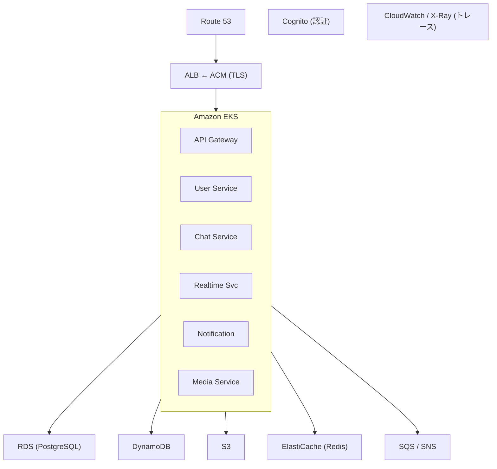

# AWS サービス一覧と選定理由

## 使用する AWS サービス

### コンピューティング・コンテナ

| サービス | 用途 | 選定理由 |
|---------|------|---------|
| **Amazon EKS** | Kubernetes クラスター | マネージド K8s、運用負荷の軽減 |
| **Amazon ECR** | コンテナレジストリ | EKS との統合がシームレス |

### データベース

| サービス | 用途 | 選定理由 |
|---------|------|---------|
| **Amazon RDS (PostgreSQL)** | ユーザーデータ、チャットデータ（Phase 1-3） | リレーショナルデータ、SQL学習 |
| **Amazon DynamoDB** | メッセージ、通知（Phase 4〜） | 高スループット、サーバーレス、NoSQL 学習 |
| **Amazon ElastiCache (Redis)** | プレゼンス、Pub/Sub | リアルタイム性、低レイテンシ |

### ストレージ

| サービス | 用途 | 選定理由 |
|---------|------|---------|
| **Amazon S3** | ファイル・画像保存 | 高耐久性、Presigned URL によるセキュアなアクセス |

### メッセージング

| サービス | 用途 | 選定理由 |
|---------|------|---------|
| **Amazon SQS** | メッセージキュー | 確実な配信保証、デッドレターキュー |
| **Amazon SNS** | イベントファンアウト | 1対多のイベント配信 |

### 認証

| サービス | 用途 | 選定理由 |
|---------|------|---------|
| **Amazon Cognito** | ユーザー認証・JWT | マネージド認証、OAuth2/OIDC 対応 |

### ネットワーキング

| サービス | 用途 | 選定理由 |
|---------|------|---------|
| **Amazon VPC** | ネットワーク隔離 | セキュリティの基盤 |
| **Elastic Load Balancer (ALB)** | L7 ロードバランシング | Ingress Controller 連携 |
| **Amazon Route 53** | DNS | ドメイン管理 |
| **AWS Certificate Manager** | TLS 証明書 | 自動更新の HTTPS 証明書 |

### 可観測性

| サービス | 用途 | 選定理由 |
|---------|------|---------|
| **Amazon CloudWatch** | ログ・メトリクス | EKS との統合、アラーム設定 |
| **AWS X-Ray** | 分散トレーシング | マイクロサービス間のトレース可視化 |

### CI/CD・管理

| サービス | 用途 | 選定理由 |
|---------|------|---------|
| **AWS IAM** | アクセス制御 | 最小権限の原則 |
| **AWS Secrets Manager** | シークレット管理 | DB パスワード、API キーの安全な管理 |
| **AWS Systems Manager Parameter Store** | 設定管理 | 環境変数の一元管理 |

### インフラ管理

| サービス | 用途 | 選定理由 |
|---------|------|---------|
| **Amazon S3** (Terraform バックエンド) | Terraform state 保存 | リモートステート管理 |
| **Amazon DynamoDB** (Terraform ロック) | state ロック | 同時実行の防止 |

---

## アーキテクチャ図（AWS サービスマッピング）

---

## コスト管理のヒント

### 開発環境でのコスト削減

| 設定 | 推奨 |
|------|------|
| EKS ノード | t3.medium x 2（開発時のみ起動） |
| RDS | db.t3.micro, Single-AZ |
| DynamoDB | On-Demand（低トラフィック時にコスト効率が良い） |
| ElastiCache | cache.t3.micro, Single Node |
| NAT Gateway | 開発時は 1 AZ のみ |

### 無料利用枠の活用

- **DynamoDB**: 25GB ストレージ、25 WCU/RCU（無料枠）
- **S3**: 5GB ストレージ（無料枠）
- **SQS**: 100万リクエスト/月（無料枠）
- **SNS**: 100万パブリッシュ/月（無料枠）
- **Cognito**: 50,000 MAU（無料枠）

## 関連ドキュメント

- [DynamoDB 設計詳細](./dynamodb-design.md)
- [Terraform 構成](../terraform/structure.md)
