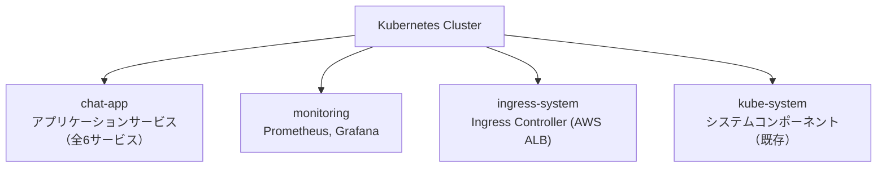
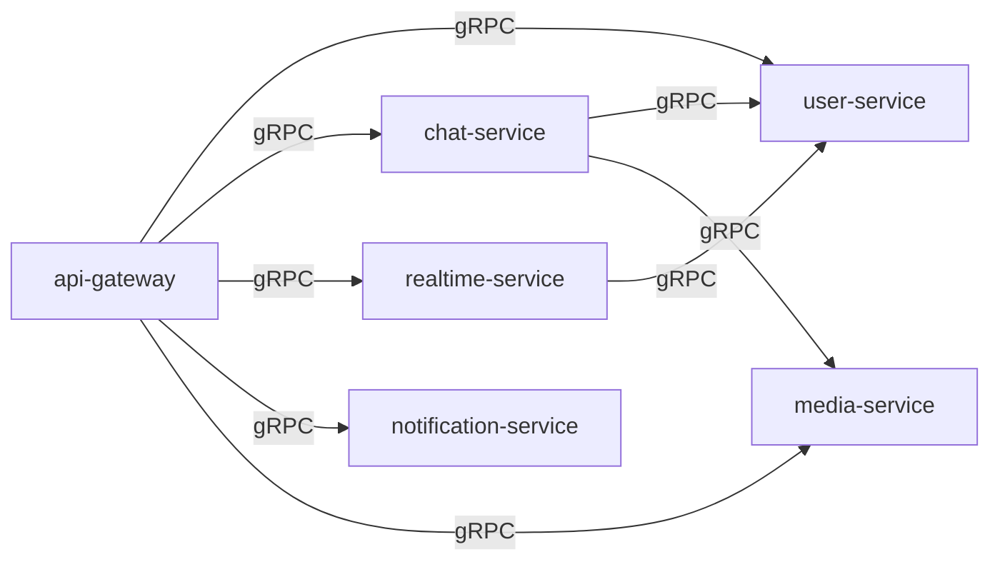

# Kubernetes アーキテクチャ

## 概要

Amazon EKS 上で 6 つのマイクロサービスを運用する Kubernetes アーキテクチャ。
Kustomize を使って dev / staging / prod の環境分離を実現する。

---

## Namespace 戦略



**設計判断**: アプリケーションサービスを単一 Namespace `chat-app` にまとめる

理由:
- サービス数が 6 個と少なく、Namespace 分離のメリットが小さい
- サービス間通信が頻繁であり、同一 Namespace 内の方が DNS 名がシンプル
- NetworkPolicy で十分なアクセス制御が可能
- CKA/CKAD の学習では NetworkPolicy の方が重要

---

## 各サービスの Kubernetes リソース

### リソース一覧

| サービス | Deployment | Service | HPA | PDB | Ingress |
|---------|-----------|---------|-----|-----|---------|
| api-gateway | ○ | ClusterIP + Ingress | ○ | ○ (prod) | ○ |
| user-service | ○ | ClusterIP | ○ | ○ (prod) | - |
| chat-service | ○ | ClusterIP | ○ | ○ (prod) | - |
| realtime-service | ○ | ClusterIP | ○ | ○ (prod) | - |
| notification-service | ○ | ClusterIP | ○ | ○ (prod) | - |
| media-service | ○ | ClusterIP | ○ | ○ (prod) | - |

### Deployment テンプレート（例: user-service）

```yaml
apiVersion: apps/v1
kind: Deployment
metadata:
  name: user-service
  namespace: chat-app
  labels:
    app: user-service
    version: v1
spec:
  replicas: 2
  selector:
    matchLabels:
      app: user-service
  template:
    metadata:
      labels:
        app: user-service
        version: v1
    spec:
      serviceAccountName: user-service
      containers:
        - name: user-service
          image: <account-id>.dkr.ecr.<region>.amazonaws.com/user-service:latest
          ports:
            - name: grpc
              containerPort: 50051
              protocol: TCP
            - name: http
              containerPort: 8001
              protocol: TCP
          env:
            - name: DB_HOST
              valueFrom:
                secretKeyRef:
                  name: user-service-secrets
                  key: db-host
            - name: DB_PASSWORD
              valueFrom:
                secretKeyRef:
                  name: user-service-secrets
                  key: db-password
          resources:
            requests:
              cpu: 100m
              memory: 128Mi
            limits:
              cpu: 500m
              memory: 512Mi
          livenessProbe:
            grpc:
              port: 50051
            initialDelaySeconds: 10
            periodSeconds: 10
          readinessProbe:
            grpc:
              port: 50051
            initialDelaySeconds: 5
            periodSeconds: 5
          startupProbe:
            grpc:
              port: 50051
            failureThreshold: 30
            periodSeconds: 2
      topologySpreadConstraints:
        - maxSkew: 1
          topologyKey: topology.kubernetes.io/zone
          whenUnsatisfiable: DoNotSchedule
          labelSelector:
            matchLabels:
              app: user-service
```

### Service テンプレート

```yaml
apiVersion: v1
kind: Service
metadata:
  name: user-service
  namespace: chat-app
spec:
  type: ClusterIP
  selector:
    app: user-service
  ports:
    - name: grpc
      port: 50051
      targetPort: 50051
      protocol: TCP
    - name: http
      port: 8001
      targetPort: 8001
      protocol: TCP
```

### HPA (Horizontal Pod Autoscaler)

```yaml
apiVersion: autoscaling/v2
kind: HorizontalPodAutoscaler
metadata:
  name: user-service
  namespace: chat-app
spec:
  scaleTargetRef:
    apiVersion: apps/v1
    kind: Deployment
    name: user-service
  minReplicas: 2
  maxReplicas: 10
  metrics:
    - type: Resource
      resource:
        name: cpu
        target:
          type: Utilization
          averageUtilization: 70
    - type: Resource
      resource:
        name: memory
        target:
          type: Utilization
          averageUtilization: 80
  behavior:
    scaleDown:
      stabilizationWindowSeconds: 300
      policies:
        - type: Percent
          value: 25
          periodSeconds: 60
    scaleUp:
      stabilizationWindowSeconds: 30
      policies:
        - type: Percent
          value: 100
          periodSeconds: 30
```

### PodDisruptionBudget (prod のみ)

```yaml
apiVersion: policy/v1
kind: PodDisruptionBudget
metadata:
  name: user-service
  namespace: chat-app
spec:
  minAvailable: 1
  selector:
    matchLabels:
      app: user-service
```

### Ingress（API Gateway 用）

```yaml
apiVersion: networking.k8s.io/v1
kind: Ingress
metadata:
  name: api-gateway
  namespace: chat-app
  annotations:
    kubernetes.io/ingress.class: alb
    alb.ingress.kubernetes.io/scheme: internet-facing
    alb.ingress.kubernetes.io/target-type: ip
    alb.ingress.kubernetes.io/certificate-arn: <acm-cert-arn>
    alb.ingress.kubernetes.io/listen-ports: '[{"HTTPS": 443}]'
    alb.ingress.kubernetes.io/ssl-redirect: "443"
spec:
  rules:
    - host: api.chat-app.example.com
      http:
        paths:
          - path: /
            pathType: Prefix
            backend:
              service:
                name: api-gateway
                port:
                  number: 8080
```

---

## NetworkPolicy

### デフォルト拒否ポリシー

```yaml
apiVersion: networking.k8s.io/v1
kind: NetworkPolicy
metadata:
  name: default-deny-all
  namespace: chat-app
spec:
  podSelector: {}
  policyTypes:
    - Ingress
    - Egress
```

### サービスごとの許可ポリシー（例: user-service）

```yaml
apiVersion: networking.k8s.io/v1
kind: NetworkPolicy
metadata:
  name: user-service-policy
  namespace: chat-app
spec:
  podSelector:
    matchLabels:
      app: user-service
  policyTypes:
    - Ingress
    - Egress
  ingress:
    # API Gateway からの gRPC を許可
    - from:
        - podSelector:
            matchLabels:
              app: api-gateway
      ports:
        - port: 50051
          protocol: TCP
    # Chat Service からの gRPC を許可
    - from:
        - podSelector:
            matchLabels:
              app: chat-service
      ports:
        - port: 50051
          protocol: TCP
  egress:
    # DNS を許可
    - to: []
      ports:
        - port: 53
          protocol: UDP
        - port: 53
          protocol: TCP
    # RDS (PostgreSQL) への接続を許可
    - to: []
      ports:
        - port: 5432
          protocol: TCP
    # AWS サービスエンドポイントへの HTTPS を許可
    - to: []
      ports:
        - port: 443
          protocol: TCP
```

### 通信マトリクス



---

## Kustomize による環境分離

### base/kustomization.yaml

```yaml
apiVersion: kustomize.config.k8s.io/v1beta1
kind: Kustomization

namespace: chat-app

resources:
  - namespace.yaml
  - user-service/deployment.yaml
  - user-service/service.yaml
  - user-service/hpa.yaml
  - chat-service/deployment.yaml
  - chat-service/service.yaml
  - chat-service/hpa.yaml
  - realtime-service/deployment.yaml
  - realtime-service/service.yaml
  - realtime-service/hpa.yaml
  - notification-service/deployment.yaml
  - notification-service/service.yaml
  - notification-service/hpa.yaml
  - media-service/deployment.yaml
  - media-service/service.yaml
  - media-service/hpa.yaml
  - api-gateway/deployment.yaml
  - api-gateway/service.yaml
  - api-gateway/ingress.yaml
  - api-gateway/hpa.yaml
  - network-policies/default-deny.yaml

commonLabels:
  project: cloud-native-chat
```

### overlays/dev/kustomization.yaml

```yaml
apiVersion: kustomize.config.k8s.io/v1beta1
kind: Kustomization

bases:
  - ../../base

namePrefix: dev-
commonLabels:
  env: dev

patches:
  - path: replicas-patch.yaml
  - path: resources-patch.yaml
```

### 環境別パラメータ

| パラメータ | dev | staging | prod |
|-----------|-----|---------|------|
| replicas | 1 | 2 | 3 |
| CPU request | 50m | 100m | 200m |
| CPU limit | 250m | 500m | 1000m |
| Memory request | 64Mi | 128Mi | 256Mi |
| Memory limit | 256Mi | 512Mi | 1Gi |
| HPA minReplicas | 1 | 2 | 3 |
| HPA maxReplicas | 3 | 5 | 10 |
| PDB | なし | なし | minAvailable: 1 |

---

## ConfigMap / Secret 管理

### ConfigMap（非機密設定）

```yaml
apiVersion: v1
kind: ConfigMap
metadata:
  name: app-config
  namespace: chat-app
data:
  LOG_LEVEL: "info"
  LOG_FORMAT: "json"
  GRPC_MAX_MESSAGE_SIZE: "4194304"
```

### Secret（AWS Secrets Manager 連携）

AWS Secrets Manager から Kubernetes Secret を同期する External Secrets Operator を使用。

```yaml
apiVersion: external-secrets.io/v1beta1
kind: ExternalSecret
metadata:
  name: user-service-secrets
  namespace: chat-app
spec:
  refreshInterval: 1h
  secretStoreRef:
    name: aws-secrets-manager
    kind: ClusterSecretStore
  target:
    name: user-service-secrets
  data:
    - secretKey: db-host
      remoteRef:
        key: chat-app/user-service/db
        property: host
    - secretKey: db-password
      remoteRef:
        key: chat-app/user-service/db
        property: password
```

---

## ServiceAccount と IRSA

各サービスに専用の ServiceAccount を作成し、IAM Roles for Service Accounts (IRSA) で AWS 権限を付与。

```yaml
apiVersion: v1
kind: ServiceAccount
metadata:
  name: chat-service
  namespace: chat-app
  annotations:
    eks.amazonaws.com/role-arn: arn:aws:iam::<account>:role/chat-service-role
```

| サービス | 必要な AWS 権限 |
|---------|---------------|
| user-service | Cognito (認証), RDS (DB) |
| chat-service | DynamoDB (メッセージ), SQS/SNS (イベント) |
| realtime-service | ElastiCache (Redis), SQS (イベント受信) |
| notification-service | DynamoDB (通知), SQS (イベント受信) |
| media-service | S3 (ファイル), SQS/SNS (イベント) |
| api-gateway | Cognito (トークン検証) |

---

## CKA/CKAD 試験対応マッピング

### CKA で学べるトピック

| 試験トピック | プロジェクトでの実践 |
|-------------|-------------------|
| クラスターアーキテクチャ | EKS のコントロールプレーン・ワーカーノード理解 |
| ワークロードスケジューリング | topologySpreadConstraints, nodeAffinity |
| サービスとネットワーキング | ClusterIP, Ingress, NetworkPolicy |
| ストレージ | PV/PVC（ログ永続化、将来拡張） |
| トラブルシューティング | kubectl debug, logs, describe, events |

### CKAD で学べるトピック

| 試験トピック | プロジェクトでの実践 |
|-------------|-------------------|
| アプリケーション設計とビルド | マルチコンテナ Pod、Init Container |
| アプリケーションのデプロイ | Deployment, Rolling Update 戦略 |
| アプリケーションの可観測性 | Probe (Liveness/Readiness/Startup), ログ |
| アプリケーション環境 | ConfigMap, Secret, ServiceAccount |
| サービスとネットワーキング | Service, Ingress, NetworkPolicy |

## 関連ドキュメント

- [アーキテクチャ概要](../architecture/overview.md)
- [ディレクトリ構成](../architecture/directory-structure.md)
- [Terraform 構成](../terraform/structure.md)
