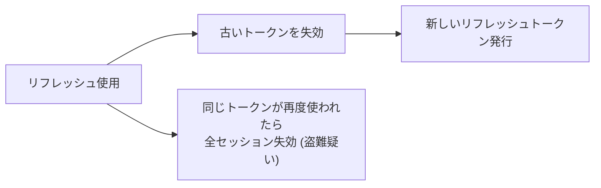
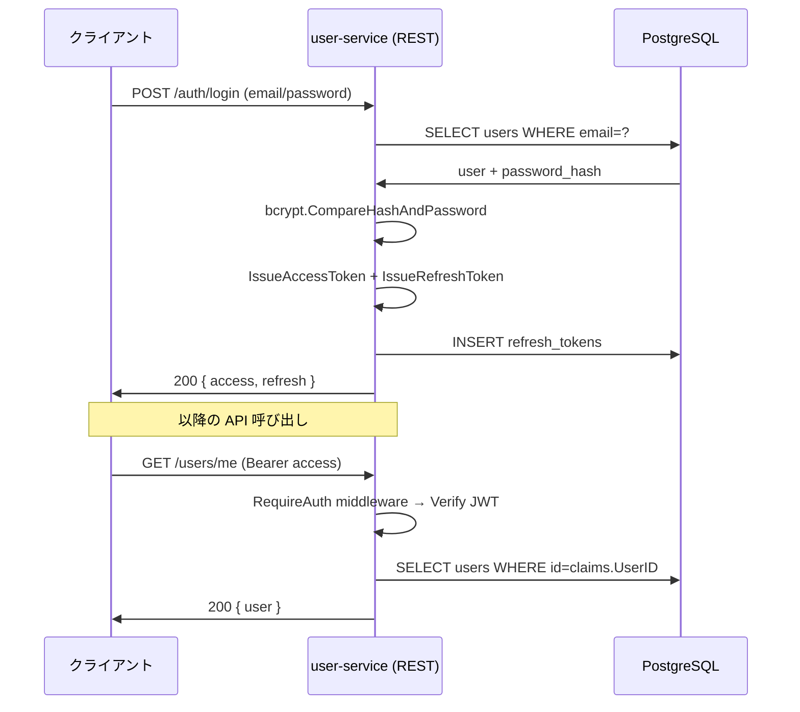

# Phase 2: 認証・認可 (自前 JWT + bcrypt)

---

## 学習目標

本フェーズでは、マネージド認証サービス (Cognito, Auth0 など) に頼らず、**JWT とパスワードハッシュを自前で実装する**。トークンとは何か、なぜハッシュ化するのか、Context で値を伝搬するとはどういうことか — 認証・認可の根本を手を動かして理解する。

この段階ではまだ user-service 単体 (REST API) 構成。Phase 3 で gRPC + API Gateway に拡張し、認証情報を内部サービスに伝搬させる予定。

| # | 目標 | 詳細 |
|---|------|------|
| 1 | パスワードを安全に保管できる | bcrypt によるハッシュ化、ソルト、Cost パラメータ |
| 2 | JWT の仕組みを理解して発行・検証できる | Header / Payload / Signature、HS256 vs RS256 |
| 3 | アクセストークンとリフレッシュトークンを設計できる | 寿命、ローテーション、失効 |
| 4 | Chi ミドルウェアで JWT 検証を実装できる | Bearer 抽出、クレーム取り出し、`context.Context` 伝搬 |
| 5 | リソース所有者ベースの認可を実装できる | 「他人のプロフィールは編集できない」を保証する |
| 6 | セキュリティの基本を押さえられる | ログマスク、レートリミット、CORS |

---

## 前提知識

- **Phase 1 完了**: user-service が REST API + PostgreSQL で動作していること
- HTTP ヘッダーと Cookie の基本
- 公開鍵暗号と共通鍵暗号の違い（概念レベル）
- Go の `context.Context` によるリクエストスコープ値の受け渡し

---

## なぜ自前で実装するのか

| 観点 | 自前 JWT | マネージド (Cognito 等) |
|------|----------|-------------------------|
| 学習効果 | ◎ 仕組みが分かる | △ ブラックボックス |
| 費用 | 無料 | 無料枠外で課金 |
| 運用 | 失効管理を自分で実装 | フルマネージド |
| 本番適正 | 小〜中規模なら十分 | 大規模・高セキュリティ要件で有利 |

本プロジェクトは学習目的のため、自前実装で認証の仕組みを理解することを優先する。

---

## ステップ

### ステップ 1: パスワードハッシュ化 (bcrypt)

プレーンテキストでパスワードを保管することの危険性を理解し、bcrypt で安全に保管する。

- [ ] ハッシュ関数とパスワード保管の基礎:

| 概念 | 説明 |
|------|------|
| ハッシュ関数 | 一方向関数。平文から復元できない |
| ソルト | レインボーテーブル攻撃を防ぐランダム値 |
| Cost (Work Factor) | 計算コスト。上げると総当たり攻撃が遅くなる |
| bcrypt | ソルトを自動で組み込む。Cost 指定可能 |

- [ ] `golang.org/x/crypto/bcrypt` の利用:

```go
package auth

import (
    "fmt"

    "golang.org/x/crypto/bcrypt"
)

const bcryptCost = 12 // 2026 年時点の推奨値

func HashPassword(plain string) (string, error) {
    hash, err := bcrypt.GenerateFromPassword([]byte(plain), bcryptCost)
    if err != nil {
        return "", fmt.Errorf("hash password: %w", err)
    }
    return string(hash), nil
}

func VerifyPassword(hashed, plain string) error {
    if err := bcrypt.CompareHashAndPassword([]byte(hashed), []byte(plain)); err != nil {
        return fmt.Errorf("verify password: %w", err)
    }
    return nil
}
```

- [ ] `users` テーブルに `password_hash` カラムを追加 (新しい migration ファイル)
- [ ] 登録 API でのハッシュ化、ログイン API でのハッシュ比較の実装
- [ ] Cost パラメータの選び方 (ローカルで時間計測 → ログイン 1 回あたり 100〜300ms の範囲に収まるよう調整)
- [ ] **絶対にやってはいけないこと**: 平文保管、MD5/SHA-1 でのハッシュ、自作のハッシュ関数

**確認ポイント**: `SELECT password_hash FROM users` で `$2a$12$...` 形式のハッシュが保存され、ログインで検証できること。

---

### ステップ 2: JWT の構造を理解する

JWT (JSON Web Token) の 3 つのパートと署名アルゴリズムを理解する。

- [ ] JWT の構造:

```
<Header>.<Payload>.<Signature>
Base64URL(header).Base64URL(payload).Signature(bytes)
```

- [ ] Header / Payload / Signature の内容:

| パート | 役割 | 例 |
|--------|------|-----|
| Header | アルゴリズム情報 | `{"alg": "HS256", "typ": "JWT"}` |
| Payload | クレーム (主張) | `{"sub": "user_123", "exp": 1234567890, ...}` |
| Signature | 改ざん検知 | `HMACSHA256(base64(header) + "." + base64(payload), secret)` |

- [ ] 主なクレーム:

| クレーム | 説明 | 必須? |
|----------|------|-------|
| `sub` (Subject) | ユーザー識別子 | 推奨 |
| `iss` (Issuer) | 発行者 | 任意 |
| `aud` (Audience) | 対象受信者 | 任意 |
| `exp` (Expiration) | 有効期限 (Unix 時刻) | 必須 |
| `iat` (Issued At) | 発行時刻 | 推奨 |
| `jti` (JWT ID) | ユニーク ID (失効管理用) | 推奨 |

- [ ] HS256 (HMAC) vs RS256 (RSA) の使い分け:

| アルゴリズム | 署名鍵 | 検証鍵 | 適した場面 |
|-------------|--------|--------|------------|
| HS256 | 共通鍵 | 共通鍵 (同じ) | モノリス、単一信頼境界 |
| RS256 | 秘密鍵 | 公開鍵 | 発行者と検証者が分離、マイクロサービス |

- [ ] 本プロジェクトの方針:
  - 学習フェーズ: **HS256** (シンプル、秘密鍵管理が 1 個で済む)
  - 発展課題: **RS256** に切り替え、公開鍵を各サービスに配布 (Phase 3 でサービスが増えたら検討)

**確認ポイント**: JWT を https://jwt.io で貼り付けるか手で Base64 デコードし、Header / Payload が読めること。

---

### ステップ 3: JWT の発行・検証を実装する

`github.com/golang-jwt/jwt/v5` を使って JWT の発行・検証を `pkg/auth/` に実装する。将来 Phase 3 で他サービスからも使えるように **共有パッケージ配下** に置く。

- [ ] 秘密鍵の管理:

```go
// 環境変数から 32 バイト以上のランダム値を読み込む
// 生成例: openssl rand -base64 48
type JWTConfig struct {
    Secret          []byte
    Issuer          string
    AccessTokenTTL  time.Duration
    RefreshTokenTTL time.Duration
}
```

- [ ] アクセストークン発行:

```go
package auth

import (
    "fmt"
    "time"

    "github.com/golang-jwt/jwt/v5"
    "github.com/google/uuid"
)

type Claims struct {
    jwt.RegisteredClaims
    UserID   string   `json:"user_id"`
    Username string   `json:"username"`
    Roles    []string `json:"roles,omitempty"`
}

type TokenIssuer struct {
    cfg JWTConfig
}

func (t *TokenIssuer) IssueAccessToken(userID, username string, roles []string) (string, error) {
    now := time.Now()
    claims := Claims{
        RegisteredClaims: jwt.RegisteredClaims{
            Issuer:    t.cfg.Issuer,
            Subject:   userID,
            ID:        uuid.NewString(),
            IssuedAt:  jwt.NewNumericDate(now),
            ExpiresAt: jwt.NewNumericDate(now.Add(t.cfg.AccessTokenTTL)),
        },
        UserID:   userID,
        Username: username,
        Roles:    roles,
    }

    token := jwt.NewWithClaims(jwt.SigningMethodHS256, claims)
    signed, err := token.SignedString(t.cfg.Secret)
    if err != nil {
        return "", fmt.Errorf("sign access token: %w", err)
    }
    return signed, nil
}
```

- [ ] トークン検証:

```go
type TokenVerifier struct {
    cfg JWTConfig
}

func (v *TokenVerifier) Verify(tokenStr string) (*Claims, error) {
    claims := &Claims{}
    token, err := jwt.ParseWithClaims(tokenStr, claims, func(t *jwt.Token) (interface{}, error) {
        if _, ok := t.Method.(*jwt.SigningMethodHMAC); !ok {
            return nil, fmt.Errorf("unexpected signing method: %v", t.Header["alg"])
        }
        return v.cfg.Secret, nil
    })
    if err != nil {
        return nil, fmt.Errorf("parse token: %w", err)
    }
    if !token.Valid {
        return nil, fmt.Errorf("invalid token")
    }
    return claims, nil
}
```

- [ ] 単体テスト: 発行 → 検証 ラウンドトリップ、期限切れ、改ざん、不正なアルゴリズム

**確認ポイント**: `IssueAccessToken` → `Verify` のラウンドトリップが成功し、1 文字でも改ざんすると検証失敗すること。

---

### ステップ 4: リフレッシュトークンの設計

短寿命のアクセストークンと長寿命のリフレッシュトークンを組み合わせる。

- [ ] トークン寿命の設計:

| トークン | 推奨寿命 | 用途 |
|---------|----------|------|
| アクセストークン | 15 分 | API リクエスト時の認証 |
| リフレッシュトークン | 30 日 | 新しいアクセストークンの発行 |

- [ ] リフレッシュトークンの保管方法:

| 方法 | メリット | デメリット |
|------|----------|-----------|
| DB に保存 (hash) | 失効可能、セッション一覧表示可能 | DB 負荷 |
| JWT のみ (stateless) | DB 不要 | 失効不可 |

本プロジェクトは失効可能なように **DB 保存** を選ぶ。

- [ ] `refresh_tokens` テーブルの設計:

```sql
CREATE TABLE refresh_tokens (
    id              UUID PRIMARY KEY DEFAULT gen_random_uuid(),
    user_id         UUID NOT NULL REFERENCES users(id) ON DELETE CASCADE,
    token_hash      VARCHAR(255) NOT NULL,  -- bcrypt ではなく sha256 でよい (検索性優先)
    expires_at      TIMESTAMPTZ NOT NULL,
    revoked_at      TIMESTAMPTZ,
    user_agent      VARCHAR(255),
    ip_address      INET,
    created_at      TIMESTAMPTZ NOT NULL DEFAULT NOW()
);

CREATE INDEX idx_refresh_tokens_user ON refresh_tokens(user_id);
CREATE INDEX idx_refresh_tokens_hash ON refresh_tokens(token_hash);
```

- [ ] リフレッシュエンドポイントの実装:

```
POST /api/v1/auth/refresh
  Body: { "refresh_token": "..." }
  Resp: { "access_token": "...", "refresh_token": "..." (rotated) }
```

- [ ] **リフレッシュトークンローテーション** (再利用検知):



**確認ポイント**: 期限切れアクセストークン + 有効リフレッシュトークンで API 呼び出し → 自動で新しいペアが発行されること。

---

### ステップ 5: Chi ミドルウェアで JWT 検証

user-service の REST API (`/api/v1/users/me` など) に認証ミドルウェアを適用する。

- [ ] ミドルウェアの基本パターン:

```go
package middleware

import (
    "context"
    "net/http"
    "strings"

    "github.com/your-org/go-microservices-chat/pkg/auth"
)

type ctxKey string

const userClaimsKey ctxKey = "userClaims"

func RequireAuth(verifier *auth.TokenVerifier) func(http.Handler) http.Handler {
    return func(next http.Handler) http.Handler {
        return http.HandlerFunc(func(w http.ResponseWriter, r *http.Request) {
            header := r.Header.Get("Authorization")
            token, ok := strings.CutPrefix(header, "Bearer ")
            if !ok {
                writeError(w, http.StatusUnauthorized, "missing bearer token")
                return
            }

            claims, err := verifier.Verify(token)
            if err != nil {
                writeError(w, http.StatusUnauthorized, "invalid token")
                return
            }

            ctx := context.WithValue(r.Context(), userClaimsKey, claims)
            next.ServeHTTP(w, r.WithContext(ctx))
        })
    }
}

func ClaimsFromContext(ctx context.Context) (*auth.Claims, bool) {
    c, ok := ctx.Value(userClaimsKey).(*auth.Claims)
    return c, ok
}
```

- [ ] Chi ルーティングへの適用:

```go
r := chi.NewRouter()

// 認証不要
r.Post("/api/v1/auth/register", handler.Register)
r.Post("/api/v1/auth/login", handler.Login)
r.Post("/api/v1/auth/refresh", handler.Refresh)
r.Get("/healthz", handler.Healthz)

// 認証必須 (Route グループで囲む)
r.Group(func(r chi.Router) {
    r.Use(middleware.RequireAuth(verifier))
    r.Get("/api/v1/users/me", handler.GetMe)
    r.Put("/api/v1/users/me", handler.UpdateMe)
    r.Get("/api/v1/users/{id}", handler.GetUser)
})
```

- [ ] エラーレスポンスのフォーマット統一 (401, 403)

**確認ポイント**: 未認証リクエストは 401、有効トークン付きリクエストは 200、期限切れは 401 が返ること。

---

### ステップ 6: リソース所有者ベースの認可

「自分のプロフィールしか編集できない」を保証する。

- [ ] 認証 (Authentication) と認可 (Authorization) の違い:

| | 認証 | 認可 |
|---|------|------|
| 問い | 誰か? | 何ができるか? |
| 本プロジェクト | JWT 検証 | ユーザーがリソースの所有者か? |
| HTTP ステータス | 401 Unauthenticated | 403 Forbidden |

- [ ] 所有者チェックの実装:

```go
func (s *UserService) UpdateUser(ctx context.Context, targetID string, req UpdateUserInput) (*domain.User, error) {
    claims, ok := middleware.ClaimsFromContext(ctx)
    if !ok {
        return nil, errors.New("unauthenticated") // ここまで来ないはずだが防御的に
    }
    if claims.UserID != targetID {
        return nil, errors.New("forbidden: cannot update other users")
    }
    // ...
}
```

- [ ] エラー型と HTTP ステータスのマッピング:

```go
// pkg/errors/errors.go などで
var (
    ErrUnauthenticated = errors.New("unauthenticated")
    ErrForbidden       = errors.New("forbidden")
)

// Handler 層での変換
switch {
case errors.Is(err, ErrUnauthenticated):
    http.Error(w, "unauthenticated", http.StatusUnauthorized)
case errors.Is(err, ErrForbidden):
    http.Error(w, "forbidden", http.StatusForbidden)
}
```

- [ ] ロールベースの認可 (任意): `users` テーブルに `role` 列を追加し、admin のみ許可する API を作る

> **ルームメンバーシップによる認可** (チャットルームに所属していないとメッセージ送信不可) は Phase 3 以降で chat-service を作ってから実装する。

**確認ポイント**: 他人のプロフィールを更新しようとすると 403 が返ること。

---

### ステップ 7: セキュリティの基本

よくあるセキュリティ課題に対策を入れる。

- [ ] **ログにトークンを出さない**: リクエストログで `Authorization` ヘッダーをマスク

```go
// ログミドルウェアで Authorization ヘッダーを "Bearer ****" に置換
func maskAuth(h http.Header) http.Header {
    c := h.Clone()
    if c.Get("Authorization") != "" {
        c.Set("Authorization", "Bearer ****")
    }
    return c
}
```

- [ ] **レートリミット**: ログイン試行は IP + ユーザー単位で制限
  - 学習簡易版: メモリ上のカウンター
  - 発展: Redis で共有カウンター (Phase 3 以降)
- [ ] **CORS 設定**: Chi ミドルウェア (`go-chi/cors`) で許可オリジンを限定
- [ ] **Constant-time 比較**: トークン比較は `crypto/subtle.ConstantTimeCompare`
- [ ] **パスワードポリシー**: 最小 8 文字 (現実的には数字・記号混在も要求)
- [ ] **HTTPS 必須** (本番想定): 開発では HTTP でよいが、トークンの露出リスクを意識する

**確認ポイント**: ログイン連続失敗が 10 回以上で一時的にロックされること。`docker compose logs` に生のトークンが出ないこと。

---

### ステップ 8: Phase 3 への接続

Phase 3 で gRPC + マルチサービス + API Gateway に進む際、Phase 2 の認証資産がどう再利用されるかを先に見ておく (実装は Phase 3)。

- [ ] JWT 検証は API Gateway (新設) に移動する:
  - 外部は API Gateway が JWT を検証する (境界)
  - 内部サービスは API Gateway を信頼し、gRPC メタデータ `x-user-id` を受け取る
- [ ] gRPC サーバーインターセプターで `x-user-id` を Context に詰める処理を追加する
- [ ] `pkg/auth/` パッケージはそのまま API Gateway で再利用できる (共有に置いたのはこのため)

> 信頼境界の設計: 外部からの呼び出しに対する JWT 検証は 1 箇所 (API Gateway) に集約し、内部呼び出しは Docker ネットワーク (Phase 3) による隔離を信頼する。

**確認ポイント**: Phase 3 で API Gateway を作るとき、`pkg/auth` を import してすぐ検証機能が使えること。

---

## 成果物

Phase 2 完了時に以下が動作していること:

- [x] `users.password_hash` に bcrypt ハッシュが保管されている
- [x] `POST /api/v1/auth/register`, `POST /api/v1/auth/login` で JWT ペアが発行される
- [x] `POST /api/v1/auth/refresh` でトークンローテーションが動作する
- [x] Chi ミドルウェアで JWT 検証され、`context.Context` に `Claims` が入る
- [x] 他人のプロフィール更新が 403 で拒否される
- [x] ログで `Authorization` ヘッダーがマスクされている
- [x] ログイン連続失敗でレートリミットが効く

### 認証フロー (Phase 2 完了時)



---

## 学べる技術

| カテゴリ | 技術 | 用途 |
|----------|------|------|
| パスワード保管 | bcrypt | ソルト付きハッシュ化 |
| トークン | JWT (HS256) | ステートレスな認証トークン |
| ライブラリ | golang-jwt/jwt/v5 | JWT 発行・検証 |
| セッション | リフレッシュトークンローテーション | 長寿命セッション + 盗難検知 |
| ミドルウェア | Chi middleware | 認証情報の抽出と `context.Context` への伝搬 |
| Context | context.Context | リクエストスコープのユーザー情報 |
| 認可 | リソース所有者チェック | アクセス制御の基本形 |
| セキュリティ | ログマスク / レートリミット / CORS | 運用的な防御の基本 |

---

## 参考リソース

### 公式ドキュメント

| リソース | URL | 説明 |
|----------|-----|------|
| golang-jwt/jwt | https://github.com/golang-jwt/jwt | Go 用 JWT ライブラリ |
| bcrypt | https://pkg.go.dev/golang.org/x/crypto/bcrypt | 公式 bcrypt 実装 |
| JWT 仕様 (RFC 7519) | https://datatracker.ietf.org/doc/html/rfc7519 | JWT の公式仕様 |
| OWASP Authentication Cheat Sheet | https://cheatsheetseries.owasp.org/cheatsheets/Authentication_Cheat_Sheet.html | 認証のベストプラクティス |
| OWASP Password Storage Cheat Sheet | https://cheatsheetseries.owasp.org/cheatsheets/Password_Storage_Cheat_Sheet.html | パスワード保管の指針 |

### 書籍

| リソース | 著者 | 説明 |
|----------|------|------|
| API Security in Action | Neil Madden | API のセキュリティ設計 (Manning) |
| Web API: The Good Parts | 水野貴明 | API 設計全般、認証含む |

---

## 前のフェーズ

[Phase 1: Go 基礎 - REST API](./phase-1.md)

## 次のフェーズ

Phase 2 が完了したら [Phase 3: gRPC + マルチサービス + API Gateway](./phase-3.md) に進む。
