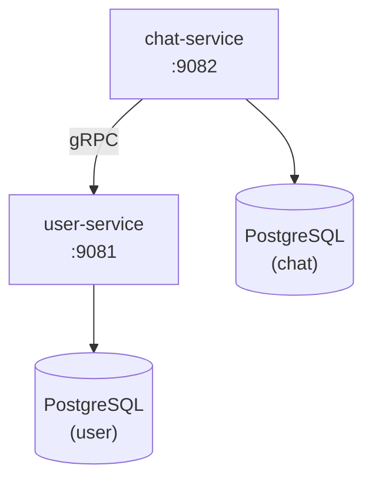
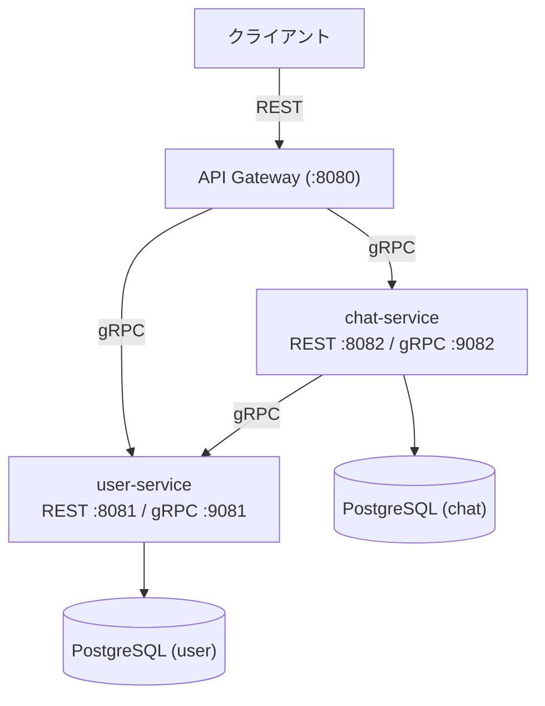

# Phase 2: gRPC + マルチサービス (chat-service 追加)

> **期間目安**: 約4-6週間
> **難易度**: ★★★☆☆（初級〜中級）

---

## 学習目標

本フェーズでは、Protocol Buffers と gRPC を学び、複数サービスが連携するマイクロサービスアーキテクチャの基礎を構築する。

| # | 目標 | 詳細 |
|---|------|------|
| 1 | Protocol Buffers を理解する | proto3 構文、メッセージ型、サービス定義 |
| 2 | gRPC サーバー/クライアントを実装できる | Unary RPC の実装と通信 |
| 3 | マルチサービス構成を構築できる | user-service と chat-service の連携 |
| 4 | Go Workspace でモノレポを管理できる | go.work を使った複数モジュール管理 |
| 5 | 共有パッケージを整理できる | pkg/ ディレクトリによる共通コードの再利用 |

---

## 前提知識

- **Phase 1 完了**: user-service REST API が動作していること
- Go の基本文法（構造体、インターフェース、エラーハンドリング）
- HTTP サーバーと REST API の実装経験
- PostgreSQL の基本操作

---

## ステップ

### ステップ 1: Protocol Buffers の基礎

Protocol Buffers（protobuf）のスキーマ定義言語を学ぶ。

- [ ] Protocol Buffers とは何か（バイナリシリアライゼーション形式）
- [ ] proto3 構文の基本
- [ ] メッセージ型の定義（scalar types, repeated, oneof, map）
- [ ] サービス定義（rpc メソッド）
- [ ] `protoc` コンパイラのインストール
- [ ] Go 用プラグイン（`protoc-gen-go`, `protoc-gen-go-grpc`）の設定
- [ ] Buf CLI の導入と `buf.yaml`, `buf.gen.yaml` の設定

```protobuf
// proto/user/v1/user.proto の例
syntax = "proto3";
package user.v1;

message User {
  string id = 1;
  string name = 2;
  string email = 3;
  google.protobuf.Timestamp created_at = 4;
}

service UserService {
  rpc GetUser(GetUserRequest) returns (GetUserResponse);
  rpc CreateUser(CreateUserRequest) returns (CreateUserResponse);
  rpc ListUsers(ListUsersRequest) returns (ListUsersResponse);
}
```

**確認ポイント**: `.proto` ファイルから Go コードが自動生成され、型が利用できること。

---

### ステップ 2: Go での gRPC サーバー/クライアント実装

gRPC の基本的なサーバーとクライアントを実装する。

- [ ] gRPC の概念理解（HTTP/2, ストリーミング, メタデータ）
- [ ] `google.golang.org/grpc` パッケージの導入
- [ ] gRPC サーバーの起動と登録
- [ ] Unary RPC の実装（リクエスト → レスポンス）
- [ ] gRPC クライアントの実装（`grpc.Dial`, `grpc.NewClient`）
- [ ] メタデータの送受信
- [ ] gRPC ステータスコードとエラーハンドリング（`status`, `codes` パッケージ）
- [ ] gRPC リフレクション（`grpcurl` でのテスト用）

**確認ポイント**: gRPC サーバーが起動し、`grpcurl` でメソッドを呼び出せること。

---

### ステップ 3: chat-service の gRPC サービス実装

チャット機能の中核となる chat-service を新規実装する。

- [ ] chat-service のプロジェクト作成（Phase 1 と同じ構成）
- [ ] proto 定義:

| サービス | メソッド | 説明 |
|----------|----------|------|
| `ChatRoomService` | `CreateRoom` | チャットルーム作成 |
| `ChatRoomService` | `GetRoom` | ルーム情報取得 |
| `ChatRoomService` | `ListRooms` | ルーム一覧取得 |
| `ChatRoomService` | `AddMember` | メンバー追加 |
| `ChatRoomService` | `RemoveMember` | メンバー削除 |
| `MessageService` | `SendMessage` | メッセージ送信 |
| `MessageService` | `GetMessages` | メッセージ履歴取得 |

- [ ] PostgreSQL テーブル設計（rooms, room_members, messages）
- [ ] Repository パターンの適用
- [ ] Service 層の実装
- [ ] gRPC ハンドラーの実装

**確認ポイント**: chat-service 単体でルーム管理とメッセージの CRUD ができること。

---

### ステップ 4: user-service を gRPC 対応に拡張

既存の user-service に gRPC エンドポイントを追加する。

- [ ] user-service の proto ファイル作成
- [ ] gRPC サーバーの追加（REST と gRPC を同時に提供）
- [ ] 既存の Service 層を gRPC ハンドラーから呼び出す
- [ ] ポート設計:

| サービス | REST ポート | gRPC ポート |
|----------|------------|------------|
| user-service | `:8081` | `:9081` |
| chat-service | `:8082` | `:9082` |

- [ ] Graceful Shutdown で両サーバーを安全に停止

**確認ポイント**: user-service が REST と gRPC の両方で同じ機能を提供できること。

---

### ステップ 5: サービス間 gRPC 通信

chat-service から user-service を gRPC で呼び出す。

- [ ] chat-service に user-service の gRPC クライアントを組み込む
- [ ] ルーム作成時にユーザー存在確認（user-service への問い合わせ）
- [ ] メッセージ送信時の送信者検証
- [ ] コネクション管理（接続プール、タイムアウト設定）
- [ ] リトライロジック（基本的な再試行）
- [ ] サーキットブレーカーの概念理解（実装は後のフェーズ）



**確認ポイント**: chat-service がユーザー情報を user-service から取得してルーム作成できること。

---

### ステップ 6: Go Workspace (go.work) でモノレポ管理

Go Workspace を使って複数サービスを効率的に管理する。

- [ ] `go.work` ファイルの作成（`go work init`）
- [ ] 各サービスモジュールの登録（`go work use`）
- [ ] ローカルモジュール参照の理解（replace 不要）
- [ ] 共有 proto パッケージの参照設定
- [ ] IDE（VS Code）での Workspace 対応設定

```
cloud-native-chat-platform/
├── go.work
├── go.work.sum
├── proto/                  # proto 定義
│   ├── user/v1/
│   └── chat/v1/
├── gen/                    # 自動生成コード
│   └── go/
├── services/
│   ├── user-service/       # go.mod
│   └── chat-service/       # go.mod
└── pkg/                    # 共有パッケージ（go.mod）
```

**確認ポイント**: `go work` 環境で全サービスのビルドとテストが通ること。

---

### ステップ 7: pkg/ 共有パッケージの整理

サービス間で共通利用するパッケージを整理する。

- [ ] `pkg/logger` - 共通ログ設定（slog ベース）
- [ ] `pkg/middleware` - 共通ミドルウェア（認証、ログ、リカバリー）
- [ ] `pkg/config` - 共通設定読み込み（環境変数, YAML）
- [ ] `pkg/errors` - 共通エラー型
- [ ] `pkg/grpcutil` - gRPC ユーティリティ（インターセプター等）

| パッケージ | 役割 | 利用サービス |
|-----------|------|-------------|
| `pkg/logger` | 構造化ログの統一 | 全サービス |
| `pkg/middleware` | HTTP/gRPC ミドルウェア | 全サービス |
| `pkg/config` | 設定管理の統一 | 全サービス |
| `pkg/errors` | エラーコードの統一 | 全サービス |
| `pkg/grpcutil` | gRPC 共通処理 | gRPC 対応サービス |

**確認ポイント**: 各サービスが `pkg/` の共通パッケージを import して利用できること。

---

### ステップ 8: gRPC のテスト

gRPC サービスのテスト手法を学ぶ。

- [ ] `bufconn` を使ったインメモリ gRPC テスト
- [ ] テスト用 gRPC サーバーのセットアップ
- [ ] Unary RPC のテスト
- [ ] エラーケースのテスト（NotFound, InvalidArgument 等）
- [ ] モックサービスの作成（サービス間通信のテスト用）
- [ ] インテグレーションテストの整理

```go
// bufconn を使ったテストの例
func setupTestServer(t *testing.T) *grpc.ClientConn {
    lis := bufconn.Listen(1024 * 1024)
    srv := grpc.NewServer()
    // サービス登録
    pb.RegisterUserServiceServer(srv, newTestUserService())
    go srv.Serve(lis)

    conn, err := grpc.DialContext(ctx, "bufnet",
        grpc.WithContextDialer(func(ctx context.Context, s string) (net.Conn, error) {
            return lis.DialContext(ctx)
        }),
        grpc.WithTransportCredentials(insecure.NewCredentials()),
    )
    require.NoError(t, err)
    return conn
}
```

**確認ポイント**: `go test ./...` で gRPC サービスのテストが PASS すること。

---

### ステップ 9: API Gateway の基礎実装

外部クライアント向けに REST → gRPC 変換を行うゲートウェイを構築する。

- [ ] API Gateway の役割と設計方針
- [ ] grpc-gateway の導入（proto アノテーション）
- [ ] REST エンドポイントから gRPC サービスへの変換
- [ ] 統一的なエラーレスポンス
- [ ] CORS 設定
- [ ] 基本的なレートリミット（概念理解）

| REST エンドポイント | gRPC メソッド | サービス |
|--------------------|--------------|---------|
| `POST /api/v1/users` | `UserService.CreateUser` | user-service |
| `GET /api/v1/users/{id}` | `UserService.GetUser` | user-service |
| `POST /api/v1/rooms` | `ChatRoomService.CreateRoom` | chat-service |
| `POST /api/v1/rooms/{id}/messages` | `MessageService.SendMessage` | chat-service |

**確認ポイント**: REST リクエストが API Gateway 経由で gRPC サービスに正しくルーティングされること。

---

## 成果物

Phase 2 完了時に以下が動作していること:

- [x] user-service が REST + gRPC 両方のエンドポイントを提供する
- [x] chat-service が gRPC でルーム管理・メッセージ管理を提供する
- [x] chat-service → user-service の gRPC 通信が動作する
- [x] Go Workspace でモノレポが管理されている
- [x] 共有パッケージ（pkg/）が整理されている
- [x] gRPC テスト（bufconn）が整備されている
- [x] API Gateway が REST → gRPC 変換を行う

### サービス構成図



---

## 学べる技術

| カテゴリ | 技術 | 用途 |
|----------|------|------|
| シリアライゼーション | Protocol Buffers (proto3) | API スキーマ定義 |
| RPC フレームワーク | gRPC | サービス間通信 |
| コード生成 | Buf CLI | proto 管理とコード生成 |
| ワークスペース | go.work | モノレポ管理 |
| API Gateway | grpc-gateway | REST → gRPC 変換 |
| テスト | bufconn | gRPC インメモリテスト |

---

## 参考リソース

### 公式ドキュメント

| リソース | URL | 説明 |
|----------|-----|------|
| gRPC Go Quick Start | https://grpc.io/docs/languages/go/quickstart/ | gRPC Go の公式クイックスタート |
| Protocol Buffers Guide | https://protobuf.dev/programming-guides/proto3/ | proto3 言語ガイド |
| Buf Documentation | https://buf.build/docs/ | Buf CLI の公式ドキュメント |
| grpc-gateway | https://grpc-ecosystem.github.io/grpc-gateway/ | grpc-gateway の公式ドキュメント |

### 書籍・コース

| リソース | 著者 | 説明 |
|----------|------|------|
| gRPC: Up and Running | Kasun Indrasiri | gRPC の包括的な解説書 |
| gRPC Go Course | Clement Jean | Udemy の gRPC Go コース |

### ツール

| ツール | 用途 |
|--------|------|
| grpcurl | gRPC API のコマンドラインテスト |
| grpcui | gRPC の Web UI テストツール |
| Buf CLI | proto ファイルの管理・lint・コード生成 |
| Evans | インタラクティブ gRPC クライアント |

---

## 認定試験との関連

Phase 2 も Go 開発が中心だが、マイクロサービスアーキテクチャの基礎概念を習得することで、以下の試験トピックへの理解が深まる:

| 試験 | 関連ポイント |
|------|-------------|
| AWS SAA-C03 | マイクロサービスアーキテクチャの理解は、AWS 上でのサービス設計に直結する |
| CKA/CKAD | 複数サービスの構成管理は、Kubernetes でのマルチ Pod デプロイの前提知識となる |

> **注**: サービス間通信のパターン（同期 / 非同期）やサービスディスカバリの概念は、後の Kubernetes フェーズ（Phase 5-6）で本格的に活用する。

---

## 前のフェーズ

[Phase 1: Go 基礎 - REST API](./phase-1.md)

## 次のフェーズ

Phase 2 が完了したら [Phase 3: リアルタイム通信](./phase-3.md) に進む。
