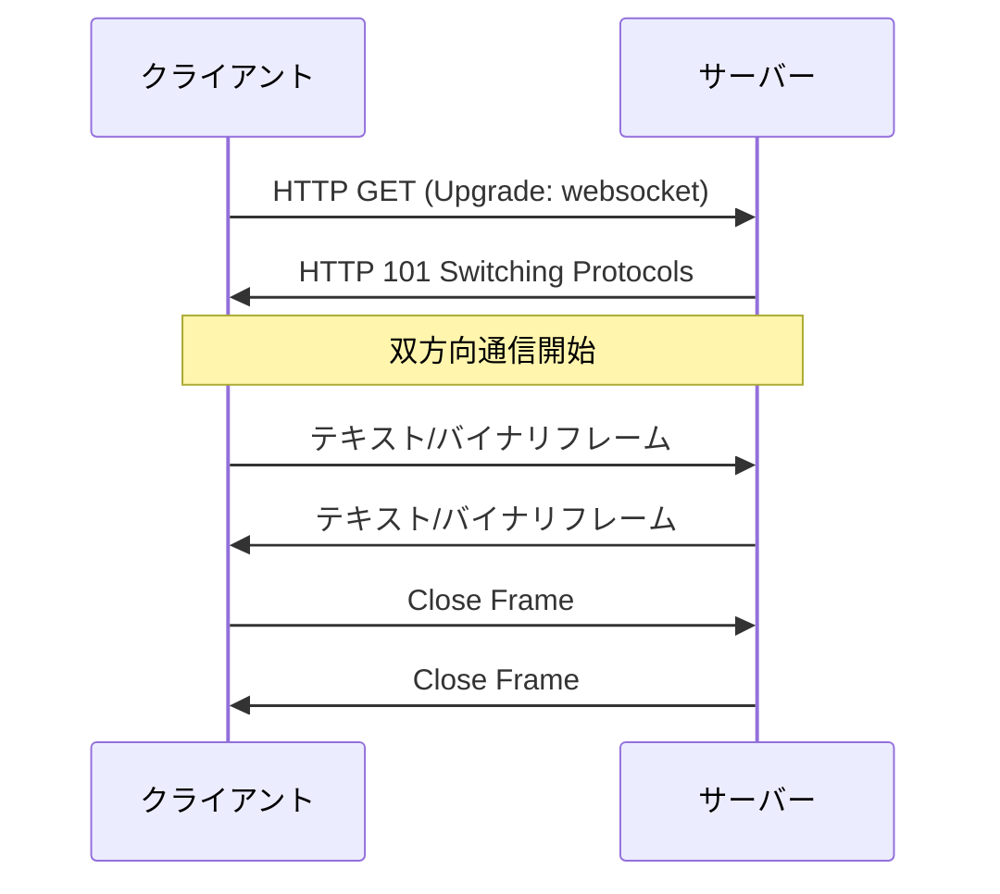

# Phase 3: realtime-service (WebSocket + gRPC Server Streaming + Redis Pub/Sub)

---

## 学習目標

3 つ目のサービス (realtime-service) を **Go で完結** して実装する。WebSocket と gRPC Server Streaming を活用してリアルタイムチャットを実現し、Redis Pub/Sub で配信責務を分離する。

**K8s・Envoy は Phase 4 まで登場しない**。Phase 3 のゴールは「3 プロセス (user / chat / realtime) が localhost で連携し、ブラウザ から WebSocket でリアルタイム通信できる」まで。

| # | 目標 | 詳細 |
|---|------|------|
| 1 | WebSocket を理解し Go で実装できる | `gorilla/websocket`、Hub パターン |
| 2 | gRPC Server Streaming を実装できる | chat-service → realtime-service のリアルタイム push |
| 3 | Redis Pub/Sub を活用できる | 受信と配信の責務分離、N インスタンス拡張の土台 |
| 4 | 3 プロセスでの統合を体験できる | user / chat / realtime を並行起動 |

---

## 前提知識

- **Phase 2 完了**: user-service + chat-service が 2 プロセスで連携動作していること
- goroutine と channel の基礎
- gRPC の Unary RPC 実装経験
- TCP/IP の基本概念

---

## 構成 (Phase 3 完了時のローカル環境)

```
[Browser] <──WebSocket──> [go run realtime-service :8081]
                                    │
                                    │ gRPC Unary (SaveMessage)
                                    │ gRPC Server Streaming (SubscribeMessages)
                                    ▼
                          [go run chat-service :50052]
                                    │
                                    │ gRPC (GetUser)
                                    ▼
                          [go run user-service :50051]

                          [docker run redis :6379]  ← realtime-service が Pub/Sub で利用
                          [docker run postgres :5432]
```

---

## ステップ構成

| 部 | テーマ | ステップ |
|----|--------|----------|
| A | WebSocket の基礎 | 1〜2 |
| B | realtime-service の Hub 実装 | 3 |
| C | gRPC Server Streaming と chat 連携 | 4 |
| D | Redis Pub/Sub と拡張性 | 5〜7 |
| E | WebSocket のエラーハンドリング | 8 |

---

## A. WebSocket の基礎

### ステップ 1: WebSocket プロトコル

- [ ] WebSocket とは (双方向・全二重)
- [ ] HTTP との違い、HTTP Upgrade ハンドシェイク
- [ ] フレーム構造 (テキスト / バイナリ / ping/pong / close)
- [ ] ライフサイクル (接続 → 通信 → 切断)
- [ ] セキュリティ (Origin チェック、WSS)



**確認ポイント**: ハンドシェイクと通信フローを説明できる。

---

### ステップ 2: gorilla/websocket で最小サーバー

- [ ] `gorilla/websocket` の導入
- [ ] `Upgrader` 設定 (バッファ・Origin チェック)
- [ ] エコーサーバー実装

```go
var upgrader = websocket.Upgrader{
    ReadBufferSize:  1024,
    WriteBufferSize: 1024,
    CheckOrigin:     func(r *http.Request) bool { return true },
}

func handleWS(w http.ResponseWriter, r *http.Request) {
    conn, err := upgrader.Upgrade(w, r, nil)
    if err != nil {
        return
    }
    defer conn.Close()
    for {
        msgType, msg, err := conn.ReadMessage()
        if err != nil {
            break
        }
        conn.WriteMessage(msgType, msg)
    }
}
```

**確認ポイント**: ブラウザまたは `wscat` からエコー動作が確認できる。

---

## B. realtime-service の Hub 実装

### ステップ 3: Hub パターン

realtime-service の骨格を実装する。垂直分割で `internal/hub/` と `internal/ws/` に分ける。

```
services/realtime-service/
├── cmd/server/main.go
├── go.mod
└── internal/
    ├── config/
    ├── hub/              # ルーム・クライアント管理
    │   ├── hub.go
    │   ├── room.go
    │   └── client.go
    └── ws/               # WebSocket ハンドラ
        └── handler.go
```

- [ ] `Hub` 構造体: チャネル経由でイベントを受ける 1 goroutine で動く
- [ ] `Room`: ルームごとのクライアント集合
- [ ] `Client`: 1 接続 = 読み取り goroutine + 書き込み goroutine の 2 つ

```go
// Hub のメインループ (1 goroutine)
func (h *Hub) Run() {
    for {
        select {
        case client := <-h.register:
            h.rooms[client.roomID][client] = true

        case client := <-h.unregister:
            delete(h.rooms[client.roomID], client)
            close(client.send)

        case msg := <-h.broadcast:
            for c := range h.rooms[msg.roomID] {
                c.send <- msg.data
            }
        }
    }
}
```

- [ ] メッセージ型の定義:

| メッセージ型 | 方向 | 説明 |
|-------------|------|------|
| `chat_message` | C→S | メッセージ送信 |
| `chat_message` | S→C | メッセージ配信 |
| `join_room` | C→S | ルーム参加 |
| `leave_room` | C→S | ルーム退出 |
| `presence_update` | S→C | プレゼンス変更 |
| `error` | S→C | エラー通知 |

**確認ポイント**: 複数クライアント (ブラウザ 2 タブや wscat) が同じルームに入り、1 つが送信 → 全員に配信される。

---

## C. gRPC Server Streaming と chat 連携

### ステップ 4: gRPC Server Streaming で chat-service とリアルタイム連携

chat-service が発行するイベント (REST 経由で投稿されたメッセージ、編集、削除通知など) を realtime-service に push するためのストリーム。

- [ ] `proto/chat/v1/chat.proto` に以下の RPC を追加:

```protobuf
service ChatService {
  // ...既存

  // Server Streaming: chat-service 内のイベントを流す
  rpc SubscribeMessages(SubscribeRequest) returns (stream ChatEvent);
}
```

- [ ] realtime-service 起動時に chat-service の `SubscribeMessages` に接続 (goroutine で永続ストリーム)
- [ ] chat-service 側は **内部チャネル** をトリガーにストリームに流す

```
Unary RPC (Phase 2 で実装済み):
  realtime-service ──リクエスト──→ chat-service
  realtime-service ←──レスポンス── chat-service

Server Streaming (Phase 3 で実装):
  realtime-service ──リクエスト──→ chat-service
  realtime-service ←── ChatEvent 1 ── chat-service
  realtime-service ←── ChatEvent 2 ── chat-service
            ...（閉じるまで続く）
```

**確認ポイント**: chat-service に `SendMessage` (gRPC) を叩くと、その内容が WebSocket でクライアントに届く。

---

## D. Redis Pub/Sub と拡張性

### ステップ 5: Redis のローカル起動

```bash
docker run -d --name chat-redis -p 6379:6379 redis:7-alpine
```

- [ ] `go-redis` v9 の導入
- [ ] `PING` コマンドでの接続確認

**確認ポイント**: `docker exec -it chat-redis redis-cli ping` が PONG。

---

### ステップ 6: Pub/Sub パターンで配信責務を分離

```
ユーザーA が「こんにちは」を送信:

  ブラウザA ──WebSocket──→ realtime-service が受信
                                  │
                  ┌───────────────┼───────────────┐
                  │ (並行)        │               │ (並行)
                  ▼               │               ▼
          gRPC Unary で           │     Redis Pub/Sub で Publish
          chat-service に保存      │     (channel:room:<room_id>)
          (永続化)                │               │
                  │               │               ▼
                  ▼               │     同じ realtime-service が Subscribe
            DB に保存完了          │     → Hub → ルーム内の WebSocket に書き込み
                                  │               │
                                  │               ▼
                                  │     ユーザーB, C のブラウザに届く
```

- [ ] WebSocket 受信 → `chat-service.SaveMessage` (gRPC Unary) **+** Redis `PUBLISH channel:room:<room_id>` を並行実行 (goroutine)
- [ ] 起動時から同じ channel を Subscribe
- [ ] Subscribe 側 → Hub → `conn.WriteMessage()` でルーム内の WebSocket に配信

**なぜ Redis を経由させるか**: 1 インスタンスだけなら Hub の channel 直結でも動くが、「受信」と「配信」の責務を Go コード上で分離しておくと、**N インスタンスに増やしてもコード変更なしで動く**。

**確認ポイント**: メッセージ送信が永続化と配信の両方で動く。`redis-cli SUBSCRIBE channel:room:*` でパブリッシュを直接観察できる。

---

### ステップ 7: プレゼンス管理

Phase 1 で `GetUserPresence` をスタブ実装したが、Phase 3 で realtime-service が実データ源になる。

| 状態 | 説明 |
|------|------|
| `online` | 接続中でアクティブ |
| `away` | 接続中だが非アクティブ |
| `offline` | 未接続 |

- [ ] Redis キー `presence:<user_id>` (TTL 60s、ハートビートで延長)
- [ ] WebSocket 接続時に online に、切断時に offline に
- [ ] ルーム内のオンラインメンバー一覧取得
- [ ] プレゼンス変更イベントを Pub/Sub で配信

**確認ポイント**: 1 タブで接続 → 別タブで presence 確認 → 最初のタブを閉じる → 一定時間後に offline。

---

## E. WebSocket のエラーハンドリング

### ステップ 8: 堅牢な接続管理

- [ ] サーバーサイド:

| エラー | 対応 |
|--------|------|
| 読み取りエラー | 接続クリーン close + リソース解放 |
| 書き込みエラー | クライアントをルームから除外 |
| パニック | recover + ログ |
| 認証エラー | 適切な Close フレームで拒否 |

- [ ] クライアントサイド (参考):

| 戦略 | 説明 |
|------|------|
| Exponential Backoff | 1s → 2s → 4s → ... |
| Jitter | ランダム揺らぎ |
| 最大リトライ回数 | 無限ループ防止 |
| 再接続時の状態復元 | ルーム再参加、未読取得 |

- [ ] Ping/Pong によるヘルスチェック
- [ ] Graceful Shutdown (既存接続を閉じてからプロセス終了)

**確認ポイント**: realtime-service を再起動しても、クライアントが自動再接続して復旧する (クライアント側を用意できるなら)。

---

## 成果物

Phase 3 完了時に以下が動作していること (すべてローカル):

- [ ] realtime-service が `go run` で起動、`:8081` で WebSocket 受付
- [ ] Hub パターンで複数クライアントへのブロードキャストが機能
- [ ] chat-service → realtime-service の gRPC Server Streaming が機能
- [ ] Redis Pub/Sub で受信と配信の責務が分離されている
- [ ] 3 プロセス (user / chat / realtime) + 2 コンテナ (postgres / redis) でローカル完結
- [ ] WebSocket 接続/切断でプレゼンスが更新される
- [ ] ブラウザ 2 タブでリアルタイムチャットが動作

> **まだ無いもの** (Phase 4 で追加): kind クラスタ、Gateway API、Envoy Gateway、SecurityPolicy、Dockerfile、K8s マニフェスト、REST 公開。

### ローカル起動フロー (Phase 3 完了時)

```bash
# ターミナル 1: ミドルウェア
make db-up           # docker run postgres
make redis-up        # docker run redis
make db-migrate

# ターミナル 2: user-service
make run-user

# ターミナル 3: chat-service
make run-chat

# ターミナル 4: realtime-service
make run-realtime

# ターミナル 5: ブラウザ / wscat で WebSocket 接続
wscat -c "ws://localhost:8081/ws?x-user-id=alice-uuid"
```

### ディレクトリ構成 (Phase 3 完了時)

```
services/
├── user-service/       # Phase 1 完了
├── chat-service/       # Phase 2 完了 (Server Streaming を Phase 3 で追加)
└── realtime-service/   # Phase 3 で新規
    ├── cmd/server/main.go
    ├── internal/
    │   ├── config/
    │   ├── hub/
    │   ├── ws/
    │   └── presence/
    └── go.mod
```

---

## 学べる技術

| カテゴリ | 技術 | 用途 |
|----------|------|------|
| リアルタイム通信 | WebSocket / gorilla/websocket | ブラウザとの双方向通信 |
| 並行処理 | goroutine / channel / Hub パターン | 1 Hub で複数接続を管理 |
| gRPC | Server Streaming | サービス間リアルタイム通信 |
| インメモリ DB | Redis | Pub/Sub + プレゼンス |
| 配信責務分離 | Redis Pub/Sub | N インスタンス拡張の土台 |

---

## 参考リソース

| リソース | URL |
|----------|-----|
| gorilla/websocket | https://github.com/gorilla/websocket |
| gRPC Server Streaming | https://grpc.io/docs/what-is-grpc/core-concepts/#server-streaming-rpc |
| go-redis | https://redis.uptrace.dev/ |
| Redis Pub/Sub | https://redis.io/docs/interact/pubsub/ |

---

## 前のフェーズ

[Phase 2: chat-service 追加](./phase-2.md)

## 次のフェーズ

Phase 3 が完了したら [Phase 4: K8s + Envoy Gateway で全サービスをデプロイ](./phase-4.md) に進む。ここで **初めて K8s と Envoy Gateway に触れ**、Phase 1〜3 で作った 3 サービスを全部 kind クラスタに載せる。Envoy Gateway が JWT 検証・REST 公開・ルーティングを担当するので、**サービス側の Go コードは一切変更なし**。
