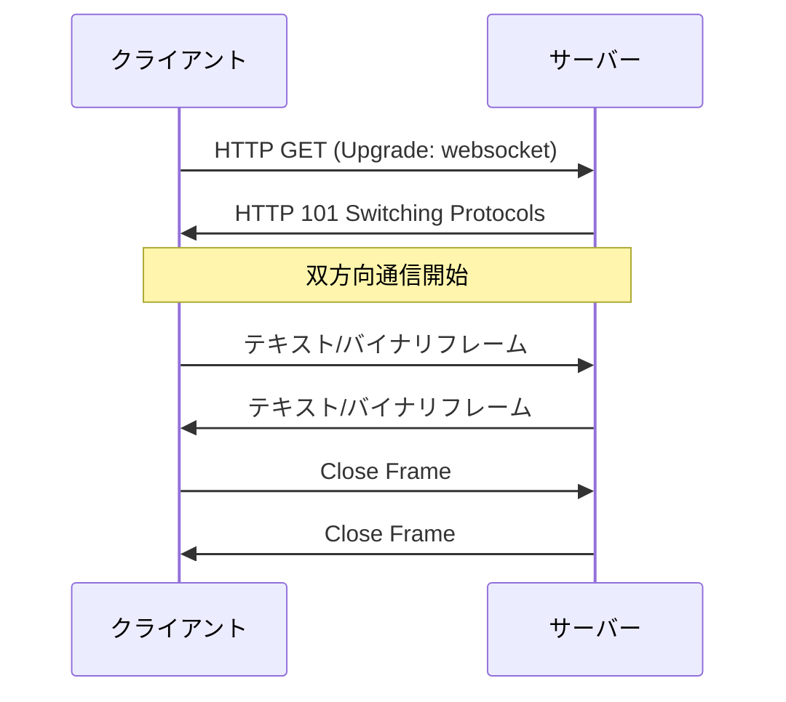
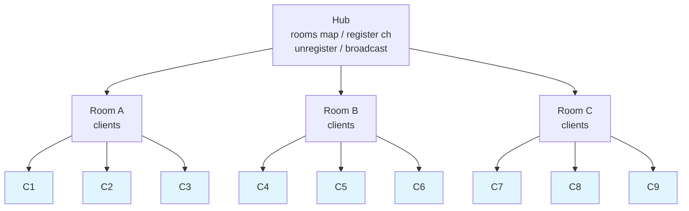
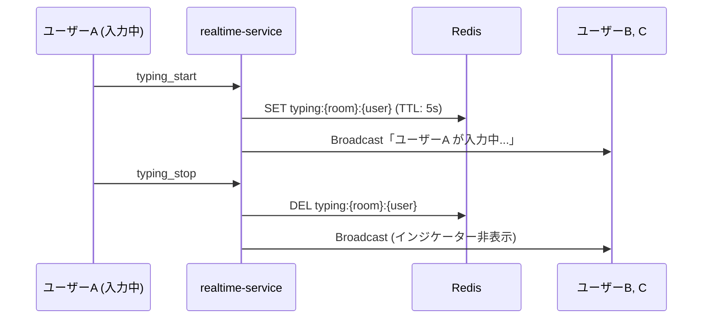
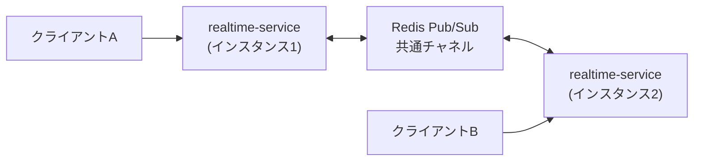
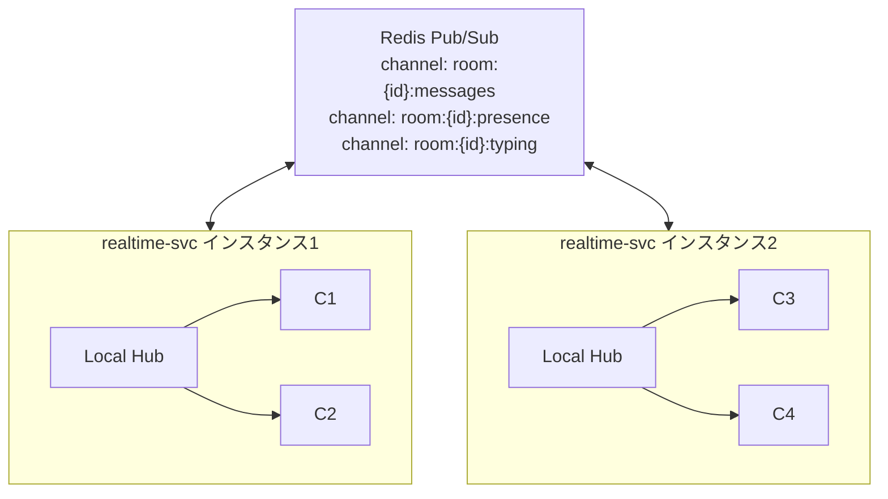
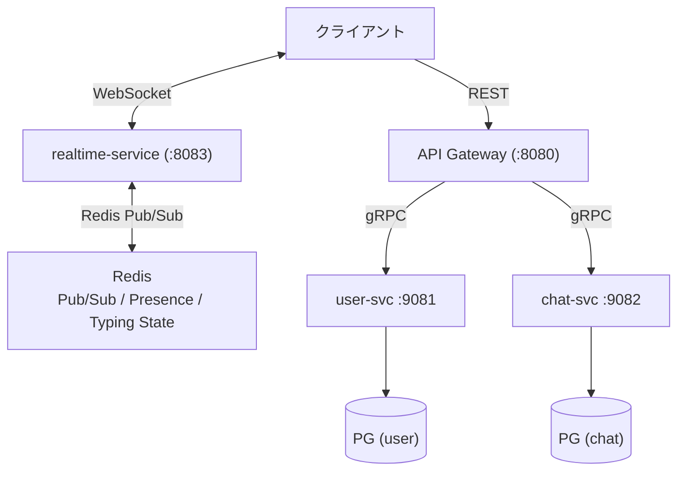

# Phase 3: リアルタイム通信 (WebSocket + gRPC Streaming)

> **期間目安**: 約4-6週間
> **難易度**: ★★★★☆（中級）

---

## 学習目標

本フェーズでは、WebSocket と gRPC Streaming を活用し、リアルタイムチャット機能を実現する。Redis Pub/Sub を用いたマルチインスタンス対応も学ぶ。

| # | 目標 | 詳細 |
|---|------|------|
| 1 | WebSocket を理解し実装できる | プロトコル理解、接続管理、メッセージ配信 |
| 2 | gRPC Streaming を実装できる | Server Streaming, Bidirectional Streaming |
| 3 | Redis Pub/Sub を活用できる | インスタンス間メッセージ同期 |
| 4 | リアルタイムアーキテクチャを設計できる | プレゼンス管理、ブロードキャスト |
| 5 | スケーラブルな通信基盤を構築できる | マルチインスタンス対応 |

---

## 前提知識

- **Phase 2 完了**: user-service と chat-service が gRPC で連携していること
- goroutine と channel の基礎理解
- gRPC の Unary RPC の実装経験
- TCP/IP の基本概念

---

## ステップ

### ステップ 1: WebSocket の基礎

WebSocket プロトコルの仕組みを理解する。

- [ ] WebSocket とは何か（双方向・全二重通信）
- [ ] HTTP との違いと使い分け
- [ ] WebSocket ハンドシェイクの仕組み（HTTP Upgrade）
- [ ] フレーム構造（テキスト、バイナリ、ping/pong、close）
- [ ] WebSocket のライフサイクル（接続 → 通信 → 切断）
- [ ] セキュリティ考慮事項（Origin チェック、WSS）



**確認ポイント**: WebSocket のハンドシェイクと通信フローを説明できること。

---

### ステップ 2: gorilla/websocket でサーバー実装

Go で WebSocket サーバーを構築する。

- [ ] `gorilla/websocket` パッケージの導入
- [ ] `Upgrader` の設定（バッファサイズ、Origin チェック）
- [ ] WebSocket 接続のハンドリング
- [ ] メッセージの読み書き（`ReadMessage`, `WriteMessage`）
- [ ] Ping/Pong によるヘルスチェック
- [ ] 接続のタイムアウト設定
- [ ] 簡易エコーサーバーの実装

```go
// WebSocket ハンドラーの基本構造
var upgrader = websocket.Upgrader{
    ReadBufferSize:  1024,
    WriteBufferSize: 1024,
    CheckOrigin: func(r *http.Request) bool {
        // 本番では適切な Origin チェックを実装
        return true
    },
}

func handleWebSocket(w http.ResponseWriter, r *http.Request) {
    conn, err := upgrader.Upgrade(w, r, nil)
    if err != nil {
        slog.Error("WebSocket upgrade failed", "error", err)
        return
    }
    defer conn.Close()

    for {
        msgType, msg, err := conn.ReadMessage()
        if err != nil {
            break
        }
        // メッセージ処理
        conn.WriteMessage(msgType, msg)
    }
}
```

**確認ポイント**: ブラウザまたは wscat から WebSocket 接続してメッセージをやり取りできること。

---

### ステップ 3: realtime-service の実装

リアルタイム通信専用の新サービスを構築する。

- [ ] realtime-service のプロジェクト作成
- [ ] 接続管理（Connection Manager / Hub パターン）
- [ ] ルームベースのメッセージブロードキャスト
- [ ] メッセージ型の定義:

| メッセージ型 | 方向 | 説明 |
|-------------|------|------|
| `chat_message` | クライアント → サーバー | チャットメッセージ送信 |
| `chat_message` | サーバー → クライアント | チャットメッセージ配信 |
| `join_room` | クライアント → サーバー | ルーム参加 |
| `leave_room` | クライアント → サーバー | ルーム退出 |
| `typing_start` | クライアント → サーバー | タイピング開始通知 |
| `typing_stop` | クライアント → サーバー | タイピング停止通知 |
| `presence_update` | サーバー → クライアント | プレゼンス状態変更通知 |
| `error` | サーバー → クライアント | エラー通知 |

- [ ] goroutine を活用した並行処理（読み取り/書き込みの分離）
- [ ] チャネルベースのメッセージルーティング

### Hub パターンの構造



> C1〜C9 は WebSocket 接続

**確認ポイント**: 複数クライアントがルームに参加し、メッセージがブロードキャストされること。

---

### ステップ 4: gRPC Server Streaming の実装

gRPC の Streaming RPC を活用して、サービス間のリアルタイム通信を実現する。

- [ ] gRPC Streaming の種類:

| 種類 | 説明 | ユースケース |
|------|------|-------------|
| Server Streaming | サーバーがストリームで返す | メッセージフィード、イベント通知 |
| Client Streaming | クライアントがストリームで送る | ファイルアップロード、バッチ処理 |
| Bidirectional Streaming | 双方向ストリーム | チャット、リアルタイム同期 |

- [ ] Server Streaming RPC の proto 定義
- [ ] Server Streaming の実装（chat-service → realtime-service）
- [ ] ストリームのライフサイクル管理
- [ ] コンテキストキャンセルの適切なハンドリング
- [ ] Bidirectional Streaming の基礎実装

```protobuf
// proto/chat/v1/realtime.proto
service RealtimeService {
  // Server Streaming: 新しいメッセージをストリームで受け取る
  rpc SubscribeMessages(SubscribeRequest) returns (stream ChatEvent);

  // Bidirectional Streaming: メッセージの送受信
  rpc Chat(stream ChatMessage) returns (stream ChatEvent);
}
```

**確認ポイント**: gRPC Streaming でメッセージをリアルタイムに受信できること。

---

### ステップ 5: Redis セットアップと Pub/Sub パターン

Redis を導入し、Pub/Sub によるメッセージ配信基盤を構築する。

- [ ] Redis のインストール / Docker での起動
- [ ] Redis の基本コマンド（GET, SET, EXPIRE, DEL）
- [ ] `go-redis` パッケージの導入（`github.com/redis/go-redis/v9`）
- [ ] Redis Pub/Sub の概念理解
- [ ] チャネルの Subscribe / Publish 実装
- [ ] メッセージのシリアライゼーション（JSON or protobuf）

```go
// Redis Pub/Sub の基本実装例
func (s *RealtimeService) publishMessage(ctx context.Context, roomID string, msg *ChatMessage) error {
    data, err := json.Marshal(msg)
    if err != nil {
        return fmt.Errorf("marshal message: %w", err)
    }
    channel := fmt.Sprintf("room:%s:messages", roomID)
    return s.redis.Publish(ctx, channel, data).Err()
}

func (s *RealtimeService) subscribeRoom(ctx context.Context, roomID string) <-chan *ChatMessage {
    channel := fmt.Sprintf("room:%s:messages", roomID)
    sub := s.redis.Subscribe(ctx, channel)
    msgCh := make(chan *ChatMessage)

    go func() {
        defer close(msgCh)
        for msg := range sub.Channel() {
            var chatMsg ChatMessage
            if err := json.Unmarshal([]byte(msg.Payload), &chatMsg); err != nil {
                slog.Error("unmarshal failed", "error", err)
                continue
            }
            msgCh <- &chatMsg
        }
    }()

    return msgCh
}
```

**確認ポイント**: Redis Pub/Sub 経由でメッセージが配信されること。

---

### ステップ 6: プレゼンス管理

ユーザーのオンライン/オフライン状態を管理する。

- [ ] プレゼンス状態の定義:

| 状態 | 説明 |
|------|------|
| `online` | 接続中でアクティブ |
| `away` | 接続中だが非アクティブ（一定時間操作なし） |
| `offline` | 未接続 |

- [ ] Redis を使ったプレゼンス管理（Sorted Set + TTL）
- [ ] WebSocket 接続時にオンライン状態を設定
- [ ] WebSocket 切断時にオフライン状態を設定
- [ ] ハートビート（定期的な状態更新）
- [ ] ルーム内のオンラインメンバー一覧取得
- [ ] プレゼンス変更イベントのブロードキャスト

```
Redis データ構造:

  presence:{user_id}  →  {"status": "online", "last_seen": "..."}  (TTL: 60s)
  room:{room_id}:online  →  Sorted Set (member: user_id, score: timestamp)
```

**確認ポイント**: ユーザーの接続/切断時にプレゼンス状態が正しく更新され、他のユーザーに通知されること。

---

### ステップ 7: タイピングインジケーター

「入力中...」表示のためのタイピングインジケーターを実装する。

- [ ] タイピング開始/停止イベントの設計
- [ ] デバウンス処理（短時間の連続イベントを抑制）
- [ ] タイムアウト処理（一定時間後に自動で停止状態に）
- [ ] ルーム内の他のメンバーへのブロードキャスト
- [ ] Redis を使ったタイピング状態管理（TTL 付き）



**確認ポイント**: ユーザーが入力中のとき、同じルームの他ユーザーに「入力中」が表示されること。

---

### ステップ 8: マルチインスタンス対応

Redis Pub/Sub を使って複数の realtime-service インスタンス間でメッセージを同期する。

- [ ] 単一インスタンスの限界を理解する
- [ ] Redis Pub/Sub によるインスタンス間メッセージ同期
- [ ] アーキテクチャ設計:



- [ ] ローカル Hub + Redis Pub/Sub のハイブリッド構成
- [ ] メッセージの重複排除（冪等性の確保）
- [ ] インスタンス間のプレゼンス情報同期
- [ ] Docker Compose で複数インスタンスを起動してテスト



**確認ポイント**: 異なるインスタンスに接続したクライアント間でメッセージが正しく配信されること。

---

### ステップ 9: WebSocket の再接続とエラーハンドリング

本番運用を見据えた堅牢な WebSocket 接続管理を実装する。

- [ ] サーバーサイドのエラーハンドリング:

| エラー | 対応 |
|--------|------|
| 読み取りエラー | 接続をクリーンに閉じ、リソースを解放 |
| 書き込みエラー | クライアントをルームから除外 |
| パニック | リカバリーミドルウェアでキャッチ |
| 認証エラー | 適切なエラーコードで接続を拒否 |

- [ ] クライアントサイドの再接続戦略:

| 戦略 | 説明 |
|------|------|
| Exponential Backoff | 再試行間隔を指数的に増加（1s, 2s, 4s, 8s...） |
| Jitter | ランダムな揺らぎを追加（サーバー負荷の分散） |
| 最大リトライ回数 | 無限ループ防止 |
| 再接続時の状態復元 | ルーム再参加、未読メッセージ取得 |

- [ ] 接続品質のモニタリング（ping/pong レイテンシ）
- [ ] Graceful な接続終了（Close フレームの適切な送受信）
- [ ] メッセージのバッファリング（一時的な切断時のメッセージ保持）
- [ ] 負荷テストの基礎（複数同時接続のシミュレーション）

**確認ポイント**: サーバー再起動後にクライアントが自動再接続し、通信が復旧すること。

---

## 成果物

Phase 3 完了時に以下が動作していること:

- [x] WebSocket 経由でリアルタイムにメッセージが配信される
- [x] ルームベースのメッセージブロードキャストが機能する
- [x] gRPC Streaming でサービス間のリアルタイム通信ができる
- [x] Redis Pub/Sub でマルチインスタンスに対応している
- [x] プレゼンス管理（オンライン/オフライン状態）が機能する
- [x] タイピングインジケーターが動作する
- [x] WebSocket の再接続が自動で行われる

### サービス構成図（Phase 3 完了時）



---

## 学べる技術

| カテゴリ | 技術 | 用途 |
|----------|------|------|
| リアルタイム通信 | WebSocket | クライアントとの双方向通信 |
| WebSocket ライブラリ | gorilla/websocket | Go WebSocket 実装 |
| gRPC | Server Streaming / Bidirectional Streaming | サービス間リアルタイム通信 |
| インメモリ DB | Redis | Pub/Sub, プレゼンス, キャッシュ |
| メッセージング | Redis Pub/Sub | インスタンス間メッセージ同期 |
| 並行処理 | goroutine, channel | 非同期メッセージ処理 |

---

## 参考リソース

### 公式ドキュメント

| リソース | URL | 説明 |
|----------|-----|------|
| gorilla/websocket | https://github.com/gorilla/websocket | Go WebSocket ライブラリ |
| gRPC Streaming | https://grpc.io/docs/what-is-grpc/core-concepts/#server-streaming-rpc | gRPC Streaming の公式解説 |
| go-redis | https://redis.uptrace.dev/ | Go Redis クライアントのドキュメント |
| Redis Pub/Sub | https://redis.io/docs/interact/pubsub/ | Redis Pub/Sub の公式ドキュメント |

### 書籍・コース

| リソース | 著者 | 説明 |
|----------|------|------|
| Concurrency in Go | Katherine Cox-Buday | Go の並行処理パターンの解説書 |
| Redis in Action | Josiah Carlson | Redis の実践的な活用方法 |
| Go WebSocket Chat Tutorial | 各種ブログ | gorilla/websocket を使ったチャット実装チュートリアル |

### ツール

| ツール | 用途 |
|--------|------|
| wscat | WebSocket のコマンドラインクライアント |
| Redis CLI | Redis の操作と確認 |
| Redis Insight | Redis の GUI 管理ツール |
| k6 / vegeta | WebSocket の負荷テスト |
| Docker Compose | マルチインスタンスのローカル実行 |

---

## 認定試験との関連

Phase 3 ではリアルタイム通信パターンを学ぶ。これは以下の試験トピックの基盤知識となる:

| 試験 | 関連ポイント |
|------|-------------|
| AWS SAA-C03 | ElastiCache (Redis) の概念理解。API Gateway の WebSocket API。リアルタイムアーキテクチャは CloudFront + WebSocket の設計問題で出題される可能性がある |
| CKA/CKAD | ステートフルなワークロード（WebSocket 接続を持つ Pod）のデプロイは、Kubernetes の Service や Ingress の設計に影響する。複数レプリカでの Pub/Sub パターンは Pod 間通信の理解に繋がる |

> **注**: Phase 3 完了時点で、アプリケーション層の主要機能は揃う。Phase 4 以降では Docker/Kubernetes によるコンテナ化・オーケストレーションに進み、本格的な Cloud Native 開発と試験対策が始まる。

---

## 前のフェーズ

[Phase 2: gRPC + マルチサービス](./phase-2.md)

## 次のフェーズ

Phase 3 が完了したら Phase 4: Docker + コンテナ化 に進む。
