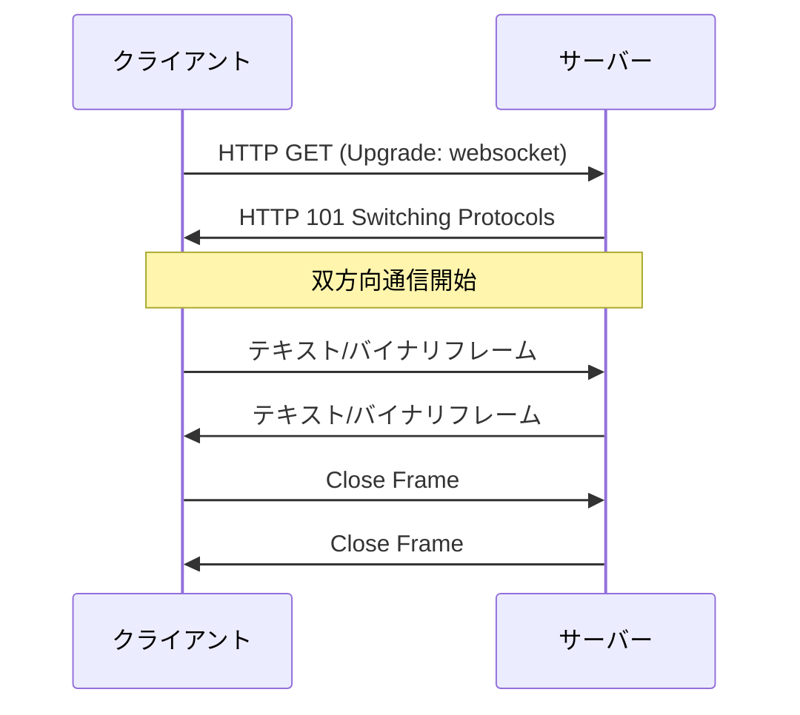

# Phase 3: realtime-service (WebSocket + Redis Pub/Sub)

---

## 学習目標

3 つ目のサービス (realtime-service) を **Go で完結** して実装する。WebSocket と Redis Pub/Sub を組み合わせて **N インスタンス前提のリアルタイムチャット** を実現する。

**K8s・Envoy は Phase 4 まで登場しない**。Phase 3 のゴールは「3 プロセス (user / chat / realtime) が localhost で連携し、ブラウザ から WebSocket でリアルタイム通信できる」まで。realtime-service は Phase 4 で 2+ Pod に並べることを前提に、**最初から Redis Pub/Sub で配信責務を分離** して実装する。

| # | 目標 | 詳細 |
|---|------|------|
| 1 | WebSocket を理解し Go で実装できる | `gorilla/websocket`、Hub パターン |
| 2 | Redis Pub/Sub を活用できる | 受信と配信の責務分離、N インスタンス拡張の土台 |
| 3 | 3 プロセスでの統合を体験できる | user / chat / realtime を並行起動 |

---

## 前提知識

- **Phase 2 完了**: user-service + chat-service が 2 プロセスで連携動作していること
- goroutine と channel の基礎
- gRPC の Unary RPC 実装経験
- TCP/IP の基本概念

---

## 構成 (Phase 3 完了時のローカル環境)

```
[Browser] <──WebSocket──> [go run realtime-service :8081]
                                    │
                                    │ gRPC Unary (SendMessage)
                                    ▼
                          [go run chat-service :50052]
                                    │
                                    │ gRPC (GetUser)
                                    ▼
                          [go run user-service :50051]

                          [docker run redis :6379]
                             ▲
                             │ PUBLISH / SUBSCRIBE
                             │
                          [realtime-service] (起動時から SUBSCRIBE、並行して PUBLISH)

                          [docker run postgres :5432]
```

**ポイント**: chat-service は「メッセージを永続化するサービス」に専念する。**リアルタイム配信の責務は realtime-service + Redis に集約** される。

---

## 設計の要点: なぜ最初から Redis Pub/Sub か

Phase 4 で realtime-service を **2+ Pod** にすることが前提。

1 Pod だけで動かすなら Go の in-process channel (Hub) で完結するが、Pod が 2 つ以上になると **A 接続 (Pod-1) と B 接続 (Pod-2) をまたいで配信する手段** が必要になる。Redis Pub/Sub はこの fan-out を最小構成で解決する。

Phase 3 の時点でこの構造にしておけば、Phase 4 で realtime-service を複数 Pod に展開しても **Go コードは一切変更しない**。

```
Phase 3 (1 プロセスだが Redis 経由):
  realtime-svc ──PUBLISH──→ Redis ──SUBSCRIBE──→ realtime-svc (自分自身)
                                                      ↓
                                                  WebSocket 配信

Phase 4 (2 Pod に展開しても同じコードのまま):
  realtime-svc-1 ──PUBLISH──→ Redis ──SUBSCRIBE──→ realtime-svc-1
                                     └─SUBSCRIBE──→ realtime-svc-2
```

---

## ステップ構成

| 部 | テーマ | ステップ |
|----|--------|----------|
| A | WebSocket の基礎 | 1〜2 |
| B | realtime-service の Hub 実装 | 3 |
| C | Redis Pub/Sub とメッセージ配信 | 4〜6 |
| D | WebSocket のエラーハンドリング | 7 |

---

## A. WebSocket の基礎

### ステップ 1: WebSocket プロトコル

- [ ] WebSocket とは (双方向・全二重)
- [ ] HTTP との違い、HTTP Upgrade ハンドシェイク
- [ ] フレーム構造 (テキスト / バイナリ / ping/pong / close)
- [ ] ライフサイクル (接続 → 通信 → 切断)
- [ ] セキュリティ (Origin チェック、WSS)



**確認ポイント**: ハンドシェイクと通信フローを説明できる。

---

### ステップ 2: gorilla/websocket で最小サーバー

- [ ] `gorilla/websocket` の導入
- [ ] `Upgrader` 設定 (バッファ・Origin チェック)
- [ ] エコーサーバー実装

```go
var upgrader = websocket.Upgrader{
    ReadBufferSize:  1024,
    WriteBufferSize: 1024,
    CheckOrigin:     func(r *http.Request) bool { return true },
}

func handleWS(w http.ResponseWriter, r *http.Request) {
    conn, err := upgrader.Upgrade(w, r, nil)
    if err != nil {
        return
    }
    defer conn.Close()
    for {
        msgType, msg, err := conn.ReadMessage()
        if err != nil {
            break
        }
        conn.WriteMessage(msgType, msg)
    }
}
```

**確認ポイント**: ブラウザまたは `wscat` からエコー動作が確認できる。

---

## B. realtime-service の Hub 実装

### ステップ 3: Hub パターン (プロセス内のルーム管理)

realtime-service の骨格を実装する。垂直分割で `internal/hub/` と `internal/ws/` に分ける。

```
services/realtime-service/
├── cmd/server/main.go
├── go.mod
└── internal/
    ├── config/
    ├── hub/              # ルーム・クライアント管理 (プロセス内)
    │   ├── hub.go
    │   ├── room.go
    │   └── client.go
    └── ws/               # WebSocket ハンドラ
        └── handler.go
```

- [ ] `Hub` 構造体: 1 goroutine で動きチャネル経由でイベントを受ける
- [ ] `Room`: ルームごとのクライアント集合
- [ ] `Client`: 1 接続 = 読み取り goroutine + 書き込み goroutine の 2 つ

```go
// Hub のメインループ (1 goroutine)
func (h *Hub) Run() {
    for {
        select {
        case client := <-h.register:
            h.rooms[client.roomID][client] = true

        case client := <-h.unregister:
            delete(h.rooms[client.roomID], client)
            close(client.send)

        case msg := <-h.broadcast:
            for c := range h.rooms[msg.roomID] {
                c.send <- msg.data
            }
        }
    }
}
```

- [ ] メッセージ型の定義:

| メッセージ型 | 方向 | 説明 |
|-------------|------|------|
| `chat_message` | C→S | メッセージ送信 |
| `chat_message` | S→C | メッセージ配信 |
| `subscribe` | C→S | ルーム購読開始 |
| `unsubscribe` | C→S | ルーム購読解除 |
| `error` | S→C | エラー通知 |

> **注意**: この Hub は **1 プロセス内の WebSocket 接続を管理するだけ**。複数 Pod をまたぐ配信は次のステップで Redis Pub/Sub に任せる。

**確認ポイント**: ブラウザ 2 タブから同じ realtime-service プロセスに接続し、1 タブが送信 → もう 1 タブに届く (同一プロセス内の Hub 配信のみ)。

---

## C. Redis Pub/Sub とメッセージ配信

### ステップ 4: Redis のローカル起動と接続

```bash
docker run -d --name chat-redis -p 6379:6379 redis:7-alpine
```

- [ ] `go-redis` v9 の導入
- [ ] `PING` コマンドでの接続確認
- [ ] `internal/pubsub/` パッケージを作成

```go
// services/realtime-service/internal/pubsub/redis.go
type Client struct {
    rdb *redis.Client
}

func New(addr string) (*Client, error) {
    rdb := redis.NewClient(&redis.Options{Addr: addr})
    if err := rdb.Ping(context.Background()).Err(); err != nil {
        return nil, err
    }
    return &Client{rdb: rdb}, nil
}
```

**確認ポイント**: `docker exec -it chat-redis redis-cli ping` が PONG。realtime-service 起動時に Redis 接続が確立する。

---

### ステップ 5: Publish と Subscribe を実装

メッセージ配信の要となる 2 つの関数を実装する。

- [ ] **Publish**: ルーム単位のチャネルにイベントを流す
- [ ] **Subscribe**: チャネル購読 → 受信イベントを Hub に流し込む

```go
// Publish
func (c *Client) PublishRoomEvent(ctx context.Context, roomID string, payload []byte) error {
    return c.rdb.Publish(ctx, "room:"+roomID, payload).Err()
}

// Subscribe (起動時に 1 回だけ起動する goroutine)
func (c *Client) SubscribeAllRooms(ctx context.Context, onMessage func(channel string, payload []byte)) {
    pubsub := c.rdb.PSubscribe(ctx, "room:*")
    defer pubsub.Close()

    ch := pubsub.Channel()
    for msg := range ch {
        onMessage(msg.Channel, []byte(msg.Payload))
    }
}
```

- [ ] `PSUBSCRIBE room:*` でパターン購読 (全ルームを一括購読)
- [ ] 受信したイベントを Hub の `broadcast` チャネルに流す

**確認ポイント**: 別ターミナルで `redis-cli PUBLISH room:general '{"type":"chat_message", ...}'` を叩くと、realtime-service 経由でブラウザに配信される。

---

### ステップ 6: メッセージ投稿フローの完成

WebSocket 受信 → **永続化 + 配信を並行実行** する構造を組む。

```
ユーザーA が「こんにちは」を送信:

  ブラウザA ──WebSocket──→ realtime-service が受信
                                  │
                  ┌───────────────┴───────────────┐
                  │ (並行)                        │ (並行)
                  ▼                                ▼
          gRPC Unary で                   Redis Pub/Sub で Publish
          chat-service に保存             channel:room:<room_id>
          (永続化)                                │
                  │                                ▼
                  ▼                        全 realtime-service が Subscribe
            DB に保存完了                  → Hub → ルーム内 WebSocket に配信
                                                  │
                                                  ▼
                                          ユーザーB, C のブラウザに届く
```

- [ ] WebSocket 受信ハンドラ内で以下 2 つを **goroutine で並行実行**:
  - `chat-service.SendMessage` (gRPC Unary) → DB 永続化
  - Redis `PUBLISH channel:room:<room_id>` → 配信
- [ ] 起動時から **同じ channel を SUBSCRIBE** しているので、自インスタンスも含め全ての realtime-service に届く
- [ ] Subscribe 側 → Hub → `conn.WriteMessage()` でルーム内の WebSocket に書き込み

```go
// 擬似コード: ws ハンドラ内
func (h *wsHandler) onChatMessage(ctx context.Context, userID, roomID, content string) {
    payload := encodeJSON(chatMessageEvent{...})

    // 永続化 (並行)
    go func() {
        _, _ = h.chatClient.SendMessage(ctx, &chatv1.SendMessageRequest{
            RoomId: roomID, SenderId: userID, Content: content,
        })
    }()

    // 配信 (並行)
    go func() {
        _ = h.pubsub.PublishRoomEvent(ctx, roomID, payload)
    }()
}
```

**なぜ永続化と配信を並行に分けるか**:

- 配信を **永続化の完了を待たずに** 流せる → 遅延最小化
- どちらか一方が失敗しても他方は動く (保存は成功して画面には出なかった、など運用上のトレードオフは後で考える)
- **Phase 4 で realtime-service を N 台にしても同じ Go コードで動く** (Redis が自動的に全インスタンスに配信する)

**確認ポイント**:
- メッセージ送信で永続化と配信の両方が動く
- `redis-cli PSUBSCRIBE 'room:*'` でパブリッシュを直接観察できる
- ブラウザ 2 タブで相互にリアルタイムチャット

---

## D. WebSocket のエラーハンドリング

### ステップ 7: 堅牢な接続管理

- [ ] サーバーサイド:

| エラー | 対応 |
|--------|------|
| 読み取りエラー | 接続クリーン close + リソース解放 |
| 書き込みエラー | クライアントをルームから除外 |
| パニック | recover + ログ |
| 認証エラー | 適切な Close フレームで拒否 |

- [ ] クライアントサイド (参考):

| 戦略 | 説明 |
|------|------|
| Exponential Backoff | 1s → 2s → 4s → ... |
| Jitter | ランダム揺らぎ |
| 最大リトライ回数 | 無限ループ防止 |
| 再接続時の状態復元 | ルーム再参加、未読取得 |

- [ ] Ping/Pong によるヘルスチェック
- [ ] Graceful Shutdown (既存接続を閉じてからプロセス終了)

**確認ポイント**: realtime-service を再起動しても、クライアントが自動再接続して復旧する (クライアント側を用意できるなら)。

---

## 成果物

Phase 3 完了時に以下が動作していること (すべてローカル):

- [ ] realtime-service が `go run` で起動、`:8081` で WebSocket 受付
- [ ] Hub パターンで同一プロセス内の WebSocket 管理が機能
- [ ] Redis Pub/Sub で「永続化」と「配信」の責務が分離されている
- [ ] WebSocket 投稿 → chat-service に保存 + Redis で全インスタンスへ配信
- [ ] 3 プロセス (user / chat / realtime) + 2 コンテナ (postgres / redis) でローカル完結
- [ ] ブラウザ 2 タブでリアルタイムチャットが動作

> **まだ無いもの** (Phase 4 で追加): kind クラスタ、Gateway API、Envoy Gateway、SecurityPolicy、Dockerfile、K8s マニフェスト、REST 公開、realtime-service の複数 Pod 展開。

### ローカル起動フロー (Phase 3 完了時)

```bash
# ターミナル 1: ミドルウェア
make db-up           # docker run postgres
make redis-up        # docker run redis
make db-migrate

# ターミナル 2: user-service
make run-user

# ターミナル 3: chat-service
make run-chat

# ターミナル 4: realtime-service
make run-realtime

# ターミナル 5: ブラウザ / wscat で WebSocket 接続
wscat -c "ws://localhost:8081/ws?x-user-id=alice-uuid"
```

### ディレクトリ構成 (Phase 3 完了時)

```
services/
├── user-service/       # Phase 1 完了
├── chat-service/       # Phase 2 完了
└── realtime-service/   # Phase 3 で新規
    ├── cmd/server/main.go
    ├── internal/
    │   ├── config/
    │   ├── hub/          # プロセス内の WebSocket 管理
    │   ├── pubsub/       # Redis Pub/Sub クライアント
    │   └── ws/           # WebSocket ハンドラ
    └── go.mod
```

---

## 学べる技術

| カテゴリ | 技術 | 用途 |
|----------|------|------|
| リアルタイム通信 | WebSocket / gorilla/websocket | ブラウザとの双方向通信 |
| 並行処理 | goroutine / channel / Hub パターン | 1 Hub で複数接続を管理 |
| メッセージング | Redis Pub/Sub | サービス間 fan-out の標準解 |
| 配信責務分離 | 永続化 と 配信 を並行実行 | 一方が詰まっても他方が止まらない |
| 水平スケール前提 | N インスタンスでも同じコード | Phase 4 で Pod 数を増やすだけ |
| インメモリ DB | Redis | Pub/Sub |

---

## 参考リソース

| リソース | URL |
|----------|-----|
| gorilla/websocket | https://github.com/gorilla/websocket |
| go-redis | https://redis.uptrace.dev/ |
| Redis Pub/Sub | https://redis.io/docs/interact/pubsub/ |
| Redis `PSUBSCRIBE` | https://redis.io/commands/psubscribe/ |

---

## 前のフェーズ

[Phase 2: chat-service 追加](./phase-2.md)

## 次のフェーズ

Phase 3 が完了したら [Phase 4: K8s + Envoy Gateway で全サービスをデプロイ](./phase-4.md) に進む。ここで **初めて K8s と Envoy Gateway に触れ**、Phase 1〜3 で作った 3 サービスを全部 kind クラスタに載せる。**realtime-service は 2+ Pod で起動** し、Redis Pub/Sub が自動的に横連携するため **Go コードは一切変更なし**。
