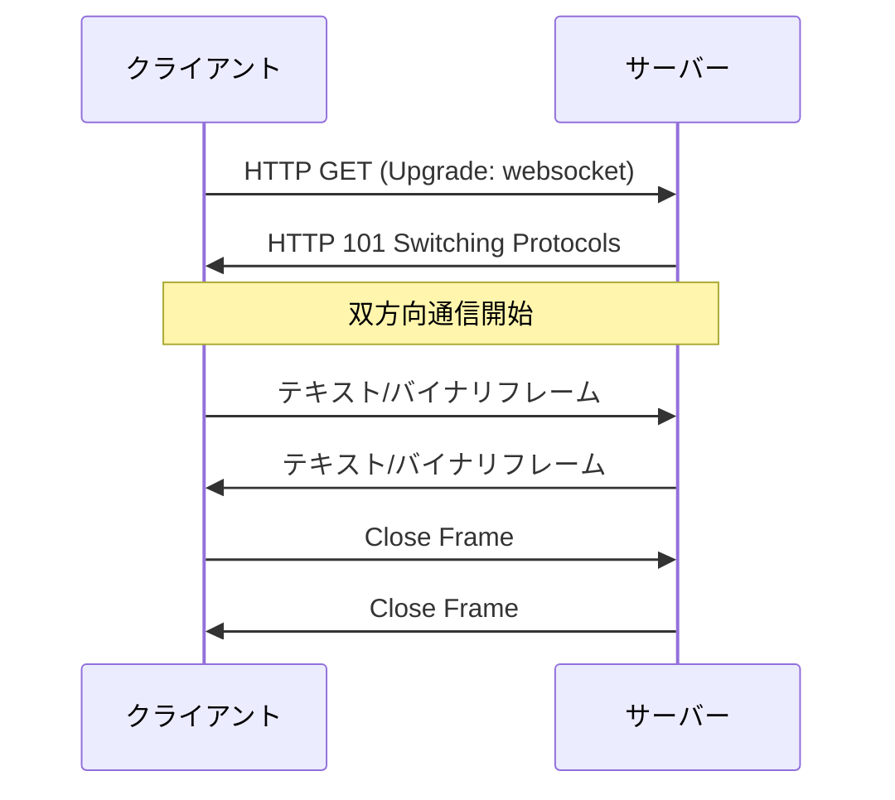
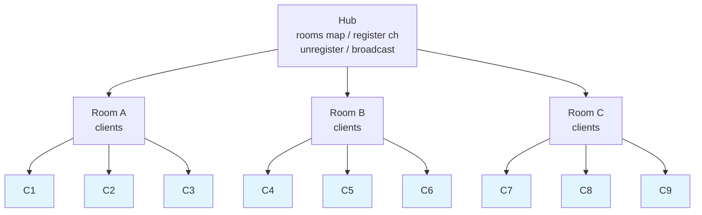
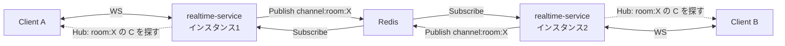
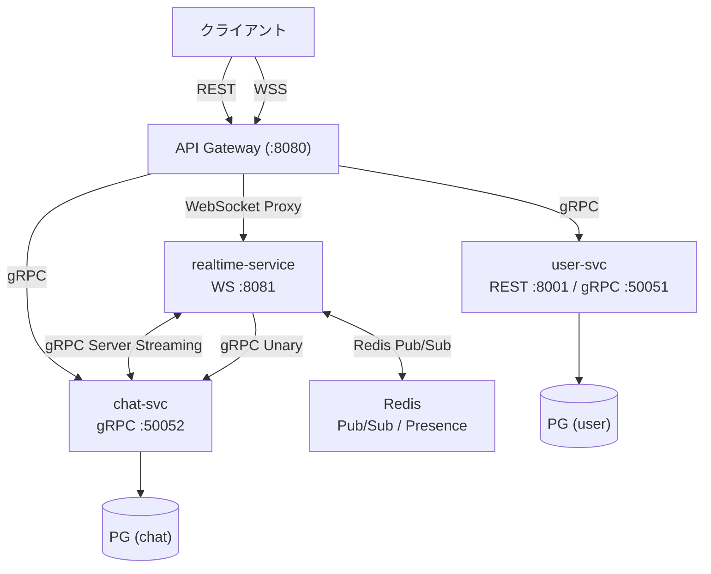

# Phase 4: リアルタイム通信 (WebSocket + gRPC Server Streaming)

---

## 学習目標

本フェーズでは、WebSocket と gRPC Server Streaming を活用し、リアルタイムチャット機能を実現する。realtime-service は **1 インスタンス構成** で動かすが、メッセージ配信は Redis Pub/Sub を経由させ、**N インスタンスに拡張しても同じコードで動く設計** を身につける。

| # | 目標 | 詳細 |
|---|------|------|
| 1 | WebSocket を理解し実装できる | プロトコル理解、接続管理、メッセージ配信 |
| 2 | gRPC Server Streaming を実装できる | サービス間のリアルタイム配信 |
| 3 | Redis Pub/Sub を活用できる | 責務分離 (受信 vs 配信) とスケール拡張の土台 |
| 4 | リアルタイムアーキテクチャを設計できる | プレゼンス管理、ブロードキャスト、Hub パターン |
| 5 | N インスタンスに拡張可能な設計を理解できる | 1 インスタンスで動きつつ、拡張時に変更不要な構造 |

---

## 前提知識

- **Phase 3 完了**: user-service と chat-service が gRPC で連携し、API Gateway 経由で JWT 認証付きアクセスができること
- goroutine と channel の基礎理解
- gRPC の Unary RPC の実装経験
- TCP/IP の基本概念

---

## ステップ

### ステップ 1: WebSocket の基礎

WebSocket プロトコルの仕組みを理解する。

- [ ] WebSocket とは何か（双方向・全二重通信）
- [ ] HTTP との違いと使い分け
- [ ] WebSocket ハンドシェイクの仕組み（HTTP Upgrade）
- [ ] フレーム構造（テキスト、バイナリ、ping/pong、close）
- [ ] WebSocket のライフサイクル（接続 → 通信 → 切断）
- [ ] セキュリティ考慮事項（Origin チェック、WSS）



**確認ポイント**: WebSocket のハンドシェイクと通信フローを説明できること。

---

### ステップ 2: gorilla/websocket でサーバー実装

Go で WebSocket サーバーを構築する。

- [ ] `gorilla/websocket` パッケージの導入
- [ ] `Upgrader` の設定（バッファサイズ、Origin チェック）
- [ ] WebSocket 接続のハンドリング
- [ ] メッセージの読み書き（`ReadMessage`, `WriteMessage`）
- [ ] Ping/Pong によるヘルスチェック
- [ ] 接続のタイムアウト設定
- [ ] 簡易エコーサーバーの実装

```go
// WebSocket ハンドラーの基本構造
var upgrader = websocket.Upgrader{
    // ReadBufferSize: 受信用バッファ（クライアント→サーバー方向）
    // WriteBufferSize: 送信用バッファ（サーバー→クライアント方向）
    // 接続ごとに確保されるため、同時接続数 × バッファサイズ がメモリ消費に直結する。
    // チャットのような短いメッセージが中心なら 1024 で十分。
    // 送受信で特性が異なる場合（例: 受信は小さく送信は大きい）は別々の値を設定できる。
    ReadBufferSize:  1024,
    WriteBufferSize: 1024,
    CheckOrigin: func(r *http.Request) bool {
        // 本番では適切な Origin チェックを実装
        return true
    },
}

func handleWebSocket(w http.ResponseWriter, r *http.Request) {
    // Upgrade() で HTTP → WebSocket に切り替え、WebSocket 接続オブジェクト (conn) を取得する。
    // conn (*websocket.Conn) は WebSocket 接続そのもので、以降の全送受信はこれを通じて行う。
    conn, err := upgrader.Upgrade(w, r, nil)
    if err != nil {
        slog.Error("WebSocket upgrade failed", "error", err)
        return
    }
    // 関数終了時に必ず接続を閉じる（忘れるとコネクションリーク）
    defer conn.Close()

    for {
        // ReadMessage() はメッセージが届くまでブロックする。
        // エラー（切断含む）が返ったらループを抜けて接続を閉じる。
        msgType, msg, err := conn.ReadMessage()
        if err != nil {
            break
        }
        // WriteMessage() でクライアントにメッセージを送信する。
        // 注意: 同時に1つの goroutine からしか呼べない。
        // 複数 goroutine から送信したい場合はチャネルで1つの書き込み goroutine に集約する。
        conn.WriteMessage(msgType, msg)
    }
}
```

**確認ポイント**: ブラウザまたは wscat から WebSocket 接続してメッセージをやり取りできること。

---

### ステップ 3: realtime-service の実装

リアルタイム通信専用の新サービスを構築する。

- [ ] realtime-service のプロジェクト作成
- [ ] 接続管理（Connection Manager / Hub パターン）
- [ ] ルームベースのメッセージブロードキャスト
- [ ] メッセージ型の定義:

| メッセージ型 | 方向 | 説明 |
|-------------|------|------|
| `chat_message` | クライアント → サーバー | チャットメッセージ送信 |
| `chat_message` | サーバー → クライアント | チャットメッセージ配信 |
| `join_room` | クライアント → サーバー | ルーム参加 |
| `leave_room` | クライアント → サーバー | ルーム退出 |
| `presence_update` | サーバー → クライアント | プレゼンス状態変更通知 |
| `error` | サーバー → クライアント | エラー通知 |

- [ ] goroutine を活用した並行処理（読み取り/書き込みの分離）
- [ ] チャネルベースのメッセージルーティング

### Hub パターンの構造



> C1〜C9 は WebSocket 接続

#### Hub パターンとは

WebSocket の **接続管理とメッセージ配信を一元的に行う中央管理パターン**。
gorilla/websocket の公式チャットサンプルでも採用されている定番の設計。

接続数やルーム数が増えると「誰がどのルームにいるか」「切断時にどこから消すか」「メッセージをどの接続に配信するか」の管理が煩雑になる。Hub がこれらを一手に引き受ける。

#### コンポーネントの役割

| コンポーネント | 役割 |
|---|---|
| **Hub** | 全体の管理者。チャネル経由でイベントを受け取り、ルームとクライアントを管理する |
| **Room** | ルームごとのクライアント集合。ブロードキャスト対象を決める |
| **Client** | 1つの WebSocket 接続に対応。読み取り/書き込み goroutine を持つ |

#### 処理フロー

```
1. クライアント接続
   conn を Upgrade → Client を作成 → Hub の register チャネルに送る → Hub がルームに追加

2. メッセージ送信
   Client の読み取り goroutine が ReadMessage() → Hub の broadcast チャネルに送る
   → Hub が同じルームの全 Client に配信

3. クライアント切断
   ReadMessage() がエラーを返す → Hub の unregister チャネルに送る
   → Hub がルームから削除、conn を Close
```

#### なぜチャネルを使うのか

Hub は **1つの goroutine** で動き、チャネル経由でリクエストを受ける。
`select` で1つずつ順番に処理するため、map への同時アクセスが起きず **mutex が不要** になる（Go らしい設計）。

```go
// Hub のメインループ（1 goroutine で実行）
func (h *Hub) Run() {
    for {
        select {
        case client := <-h.register:
            // ルームにクライアントを追加（ロック不要）
            h.rooms[client.roomID][client] = true

        case client := <-h.unregister:
            // ルームからクライアントを削除
            delete(h.rooms[client.roomID], client)
            close(client.send)

        case msg := <-h.broadcast:
            // ルーム内の全クライアントに配信
            for client := range h.rooms[msg.roomID] {
                client.send <- msg.data
            }
        }
    }
}
```

#### Client の goroutine 構造

各 Client は **2つの goroutine** を持つ。これにより `conn.WriteMessage()` が常に1つの goroutine から呼ばれる制約を自然に満たせる。

```go
type Client struct {
    hub    *Hub
    conn   *websocket.Conn
    roomID string
    send   chan []byte  // Hub → Client へのメッセージ配信用
}

// 読み取り goroutine: conn.ReadMessage() → Hub に転送
// 書き込み goroutine: send チャネルから受信 → conn.WriteMessage()
```

**確認ポイント**: 複数クライアントがルームに参加し、メッセージがブロードキャストされること。

---

### ステップ 4: gRPC Server Streaming の実装

gRPC の Streaming RPC を活用して、サービス間のリアルタイム通信を実現する。

#### なぜ Redis Pub/Sub 統一ではなく gRPC Server Streaming を使うのか

chat-service から realtime-service へリアルタイム配信する方法は2つある。

```
案A: chat-service が直接 Redis に Publish（シンプルだが結合が増える）
  chat-service ──Redis Publish──→ 全 realtime-service
  ❌ chat-service が Redis に依存 → サービス間の結合が増える
  ❌ Redis は realtime-service の内部実装。他サービスが直接触るのは越境。

案B: gRPC Server Streaming で realtime-service に流す（採用）
  chat-service ──gRPC Server Streaming──→ realtime-service ──Redis Pub/Sub──→ Hub → WebSocket
  ✅ chat-service は Redis の存在を知らない（疎結合）
  ✅ 各サービスのデータストアは他サービスから直接触らない（マイクロサービスの原則）
  ✅ realtime-service 内でも Pub/Sub を経由させることで N インスタンス拡張が無改修で可能
```

| | Redis Pub/Sub 統一 | gRPC Server Streaming（採用） |
|---|---|---|
| **シンプルさ** | シンプル | やや複雑 |
| **サービス間の結合** | chat-service が Redis に依存 | 疎結合を維持 |
| **マイクロサービス原則** | 違反（データストアの共有） | 準拠 |
| **インフラ変更時の影響** | Redis を変えたら両サービスに影響 | realtime-service だけで済む |

> **学習プロジェクトとしての判断**: シンプルさだけで言えば Redis Pub/Sub 統一の方が楽だが、
> ベストプラクティスを学ぶことが本リポジトリの目的なので gRPC Server Streaming を採用する。

#### 各技術の担当区間

```
ブラウザ ←──WebSocket──→ realtime-service ←──gRPC Server Streaming──→ chat-service
                              ↕
                        Redis Pub/Sub
              (配信責務の分離 / N インスタンス拡張の土台)
```

| 技術 | 区間 | 用途 |
|---|---|---|
| **WebSocket** | クライアント ⇄ realtime-service | ブラウザとの双方向通信（ブラウザは gRPC を直接扱えないため） |
| **gRPC Server Streaming** | chat-service → realtime-service | サービス間のリアルタイム配信（疎結合を維持） |
| **gRPC Unary** | realtime-service → chat-service | メッセージの保存（Phase 3 と同じ方式） |
| **Redis Pub/Sub** | realtime-service 内部 (将来は他インスタンスとも) | 受信と配信の責務分離。1 インスタンスで完結しつつ N 対応 |

#### Server Streaming が使われる場面

realtime-service は起動時に chat-service の `SubscribeMessages` に接続し、ストリームを開いたまま待機する。
chat-service 側で新しいイベントが発生すると、このストリームを通じて realtime-service にプッシュされる。

| ユースケース | 起点 | 流れ |
|---|---|---|
| **REST API 経由のメッセージ投稿** | 管理画面やモバイルアプリが REST で chat-service に投稿 | chat-service → Server Streaming → realtime-service → Hub → クライアント |
| **システムメッセージ** | 「ユーザーAがルームに参加しました」等を chat-service が自動生成 | chat-service → Server Streaming → realtime-service → Hub → クライアント |
| **メッセージの編集・削除通知** | REST API 経由でメッセージを編集/削除 | chat-service → Server Streaming → realtime-service → Hub → クライアント |

共通点: **realtime-service が WebSocket で直接受け取っていないイベント** を、chat-service から教えてもらう必要がある。

```
realtime-service の起動時:

  realtime-service ──SubscribeMessages()──→ chat-service
                                             │
  以降、chat-service 側でイベントが起きるたびに │
                                             │
  realtime-service ←── ChatEvent (メッセージ1) ←┤
  realtime-service ←── ChatEvent (メッセージ2) ←┤
  realtime-service ←── ChatEvent (編集通知)    ←┤
                   ...（ストリームは開きっぱなし）
```

一方、**WebSocket 経由のメッセージ送信**（ユーザーがチャットで発言）では Server Streaming は使わない。
realtime-service がすでにメッセージを持っているので、chat-service から教えてもらう必要がないため。

#### メッセージ送信時の処理フロー

realtime-service はメッセージを受け取ったら、**DB保存とブロードキャストを並行（goroutine）で実行する**。
保存完了を待ってからブロードキャストすると遅延が大きくなるため、ユーザー体感を優先する設計。

```
ユーザーA が「こんにちは」を送信:

  ブラウザA ──WebSocket──→ realtime-service が受信
                                  │
                  ┌───────────────┼───────────────┐
                  │ (並行)        │               │ (並行)
                  ▼               │               ▼
          gRPC Unary で           │     Redis Pub/Sub で Publish
          chat-service に保存      │     (channel:room:<room_id>)
          (永続化)                │               │
                  │               │               ▼
                  ▼               │     同じ realtime-service が Subscribe
            DB に保存完了          │     → Hub → ルーム内の WebSocket に書き込み
                                  │               │
                                  │               ▼
                                  │     ユーザーB, C のブラウザに届く
```

> **1 インスタンス構成なのになぜ Redis を経由させるか**: 「WebSocket で受信する責務」と「Hub にブロードキャストする責務」をコード上で分離するため。同じプロセス内で publish → subscribe が往復するので冗長に見えるが、この構造により N インスタンスに増やしてもコード変更なしで動く。

> **補足**: 保存に失敗した場合のリトライや整合性の担保は別途考慮が必要（Phase 4 ではまず基本形を実装）。

#### Unary RPC と Server Streaming の違い

Phase 3 で実装した gRPC は **Unary RPC**（1リクエスト → 1レスポンスで完結）。
Server Streaming は同じ gRPC の上で動く別の通信パターンで、**1リクエスト → 複数レスポンスが次々と返ってくる**。

「Server Streaming」の **Server は「ストリームを流す側」** を指す。このプロジェクトでは:

- **chat-service（gRPC サーバー）**: レスポンスをN回送る（ストリームする側）
- **realtime-service（gRPC クライアント）**: リクエストを1回送り、レスポンスをN回受け取る

```
Unary RPC（Phase 3 で実装済み）:
  realtime-service ──リクエスト──→ chat-service
  realtime-service ←──レスポンス── chat-service
  （完了）
  例: SaveMessage("こんにちは") → { id: "msg-1", ... }

Server Streaming（Phase 4 で実装）:
  realtime-service ──リクエスト──→ chat-service（gRPC サーバーがストリームを流す）
  realtime-service ←── ChatEvent 1 ── chat-service
  realtime-service ←── ChatEvent 2 ── chat-service
  realtime-service ←── ChatEvent 3 ── chat-service
              ...（chat-service が閉じるまで続く）
  例: SubscribeMessages("room-456") → イベントが発生するたびに流れてくる
```

| | Unary RPC | Server Streaming |
|---|---|---|
| **レスポンス** | 1回 | 複数回（ストリーム） |
| **接続** | リクエストごとに完結 | 開いたまま維持 |
| **用途** | CRUD 操作（取得・作成・更新・削除） | リアルタイム通知、フィード配信 |
| **Phase 3 の例** | `GetUser`, `CreateUser` | — |
| **Phase 4 の例** | — | `SubscribeMessages` |

#### gRPC の4つの通信パターン

「Server」「Client」はストリームを **流す側** を指す名前。

- [ ] gRPC Server Streaming の種類:

| 種類 | 説明 | ユースケース |
|------|------|-------------|
| Unary | 1リクエスト → 1レスポンス（Phase 3 で実装済み） | CRUD 操作 |
| Server Streaming | サーバーがストリームで返す（1リクエスト → レスポンス N個） | メッセージフィード、イベント通知 |
| Client Streaming | クライアントがストリームで送る（リクエスト N個 → 1レスポンス） | ファイルアップロード、バッチ処理 |
| Bidirectional Streaming | 双方がストリーム（リクエスト N個 ⇄ レスポンス N個） | チャット、リアルタイム同期 |

- [ ] Server Streaming RPC の proto 定義
- [ ] Server Streaming の実装（chat-service → realtime-service）
- [ ] ストリームのライフサイクル管理
- [ ] コンテキストキャンセルの適切なハンドリング
- [ ] Bidirectional Streaming の基礎実装

```protobuf
// proto/chat/v1/realtime.proto
service RealtimeService {
  // Server Streaming: 新しいメッセージをストリームで受け取る
  // returns の前に stream キーワードが付く
  rpc SubscribeMessages(SubscribeRequest) returns (stream ChatEvent);

  // Bidirectional Streaming: メッセージの送受信
  // 引数と返り値の両方に stream が付く
  rpc Chat(stream ChatMessage) returns (stream ChatEvent);
}
```

**確認ポイント**: gRPC Server Streaming でメッセージをリアルタイムに受信できること。

---

### ステップ 5: Redis セットアップと Pub/Sub パターン

Redis を導入し、Pub/Sub によるメッセージ配信基盤を構築する。

- [ ] Redis のインストール / Docker での起動
- [ ] Redis の基本コマンド（GET, SET, EXPIRE, DEL）
- [ ] `go-redis` パッケージの導入（`github.com/redis/go-redis/v9`）
- [ ] Redis Pub/Sub の概念理解
- [ ] チャネルの Subscribe / Publish 実装
- [ ] メッセージのシリアライゼーション（JSON or protobuf）

```go
// Redis Pub/Sub の基本実装例
func (s *RealtimeService) publishMessage(ctx context.Context, roomID string, msg *ChatMessage) error {
    data, err := json.Marshal(msg)
    if err != nil {
        return fmt.Errorf("marshal message: %w", err)
    }
    channel := fmt.Sprintf("room:%s:messages", roomID)
    return s.redis.Publish(ctx, channel, data).Err()
}

func (s *RealtimeService) subscribeRoom(ctx context.Context, roomID string) <-chan *ChatMessage {
    channel := fmt.Sprintf("room:%s:messages", roomID)
    sub := s.redis.Subscribe(ctx, channel)
    msgCh := make(chan *ChatMessage)

    go func() {
        defer close(msgCh)
        for msg := range sub.Channel() {
            var chatMsg ChatMessage
            if err := json.Unmarshal([]byte(msg.Payload), &chatMsg); err != nil {
                slog.Error("unmarshal failed", "error", err)
                continue
            }
            msgCh <- &chatMsg
        }
    }()

    return msgCh
}
```

**確認ポイント**: Redis Pub/Sub 経由でメッセージが配信されること。

---

### ステップ 6: プレゼンス管理

ユーザーのオンライン/オフライン状態を管理する。

- [ ] プレゼンス状態の定義:

| 状態 | 説明 |
|------|------|
| `online` | 接続中でアクティブ |
| `away` | 接続中だが非アクティブ（一定時間操作なし） |
| `offline` | 未接続 |

- [ ] Redis を使ったプレゼンス管理（Sorted Set + TTL）
- [ ] WebSocket 接続時にオンライン状態を設定
- [ ] WebSocket 切断時にオフライン状態を設定
- [ ] ハートビート（定期的な状態更新）
- [ ] ルーム内のオンラインメンバー一覧取得
- [ ] プレゼンス変更イベントのブロードキャスト

```
Redis データ構造:

  presence:{user_id}  →  {"status": "online", "last_seen": "..."}  (TTL: 60s)
  room:{room_id}:online  →  Sorted Set (member: user_id, score: timestamp)
```

**確認ポイント**: ユーザーの接続/切断時にプレゼンス状態が正しく更新され、他のユーザーに通知されること。

---

### ステップ 7: N インスタンス拡張性の確認 (設計レビュー)

本プロジェクトの realtime-service は **1 インスタンスで動かす** (Docker Compose、学習目的)。このステップでは実際にスケールアウトはしないが、**作ったコードが N インスタンスに増やしても動くか** を設計レビューとして確認する。

#### Redis Pub/Sub を経由させた意図の再確認

Step 3〜6 で「WebSocket 受信 → Redis Publish → Redis Subscribe → Hub → WebSocket 書き込み」という流れで実装した。1 インスタンスなら明らかに冗長だが、以下の 2 つの責務が分離されている:

| 責務 | 担当 |
|------|------|
| WebSocket で受信する | `conn.ReadMessage()` ループ → Redis に Publish |
| ルーム宛のメッセージを配信する | Redis Subscribe ループ → Hub → `conn.WriteMessage()` |

この分離により、publish 側と subscribe 側が **別インスタンスでも成立する** コードになっている。

#### N インスタンス化した場合の動作



Client A が room:X に発言:
1. RS1 が WebSocket で受信 → `channel:room:X` に Publish
2. Redis が RS1 と RS2 両方の subscriber にメッセージを配信
3. RS1 の Hub: room:X に所属する Client A に書き込み (自分の発言のエコー)
4. RS2 の Hub: room:X に所属する Client B に書き込み

**コード変更なしで動作する** 点が重要。

#### Redis Pub/Sub と Hub の役割分担

配信には 2 段階の「範囲選び」がある。両方あって初めて「正しい相手にだけ届く」が実現する。

```
Redis Pub/Sub: どのインスタンスに届けるか (channel 単位)
Hub:           そのインスタンス内のどの WebSocket に届けるか (room 単位)
```

Hub がないと、Redis から受信したメッセージをインスタンス内の **全クライアント** に送ってしまう。

```
Hub なし（❌ 関係ない人にも届く）:
  realtime-service
  ┌──────────────────────────────────────────┐
  │  Client B (room:123) ← 届く ✅ 正しい     │
  │  Client C (room:123) ← 届く ✅ 正しい     │
  │  Client X (room:999) ← 届く ❌ 関係ない   │
  └──────────────────────────────────────────┘

Hub あり（✅ 正しい相手だけに届く）:
  realtime-service
  ┌──────────────────────────────────────────┐
  │  Hub                                     │
  │   rooms["room:123"] → B, C              │
  │   rooms["room:999"] → X                 │
  │                                          │
  │  room:123 宛て → B, C だけに送信 ✅       │
  │  X には送らない ✅                        │
  └──────────────────────────────────────────┘
```

| | Redis Pub/Sub | Hub |
|---|---|---|
| **範囲** | 該当 channel を subscribe しているインスタンス全て | 自インスタンス内の該当ルームのクライアントだけ |
| **対象** | realtime-service プロセス同士 | WebSocket 接続（Client） |
| **1 インスタンスでの役割** | 「受信」と「配信」の責務分離 | ルーム別のクライアント絞り込み |
| **N インスタンス時の役割** | インスタンス間のメッセージ伝播 | 各インスタンス内のクライアント絞り込み |

#### チェックリスト (1 インスタンスのまま確認)

- [ ] publish 側と subscribe 側が別々の goroutine/コードに分離されているか
- [ ] 全 realtime-service インスタンスで同じ channel 名 (`channel:room:<room_id>`) を購読しているか
- [ ] 自分が publish したメッセージが自分に戻ってきても問題ないか (自分のクライアントにもエコーされる設計)
- [ ] プレゼンス情報を Redis に持っているか (インメモリだとインスタンス間で共有できない)

**確認ポイント**: 上記チェックリストが全て YES なら、docker compose で `--scale realtime-service=2` しても動くはず。実際のスケールアウト検証は本プロジェクトのスコープ外。

---

### ステップ 8: WebSocket の再接続とエラーハンドリング

本番運用を見据えた堅牢な WebSocket 接続管理を実装する。

- [ ] サーバーサイドのエラーハンドリング:

| エラー | 対応 |
|--------|------|
| 読み取りエラー | 接続をクリーンに閉じ、リソースを解放 |
| 書き込みエラー | クライアントをルームから除外 |
| パニック | リカバリーミドルウェアでキャッチ |
| 認証エラー | 適切なエラーコードで接続を拒否 |

- [ ] クライアントサイドの再接続戦略:

| 戦略 | 説明 |
|------|------|
| Exponential Backoff | 再試行間隔を指数的に増加（1s, 2s, 4s, 8s...） |
| Jitter | ランダムな揺らぎを追加（サーバー負荷の分散） |
| 最大リトライ回数 | 無限ループ防止 |
| 再接続時の状態復元 | ルーム再参加、未読メッセージ取得 |

- [ ] 接続品質のモニタリング（ping/pong レイテンシ）
- [ ] Graceful な接続終了（Close フレームの適切な送受信）
- [ ] メッセージのバッファリング（一時的な切断時のメッセージ保持）
- [ ] 負荷テストの基礎（複数同時接続のシミュレーション）

**確認ポイント**: サーバー再起動後にクライアントが自動再接続し、通信が復旧すること。

---

## 成果物

Phase 4 完了時に以下が動作していること:

- [x] WebSocket 経由でリアルタイムにメッセージが配信される
- [x] ルームベースのメッセージブロードキャストが機能する
- [x] gRPC Server Streaming でサービス間のリアルタイム通信ができる
- [x] Redis Pub/Sub を経由した配信で受信と配信の責務が分離されている (N インスタンス拡張可能な設計)
- [x] プレゼンス管理（オンライン/オフライン状態）が機能する
- [x] WebSocket の再接続が自動で行われる

### サービス構成図（Phase 4 完了時）



---

## 学べる技術

| カテゴリ | 技術 | 用途 |
|----------|------|------|
| リアルタイム通信 | WebSocket | クライアントとの双方向通信 |
| WebSocket ライブラリ | gorilla/websocket | Go WebSocket 実装 |
| gRPC | Server Streaming | サービス間リアルタイム通信 |
| インメモリ DB | Redis | Pub/Sub, プレゼンス, キャッシュ |
| メッセージング | Redis Pub/Sub | 受信と配信の責務分離 + N インスタンス拡張の土台 |
| 並行処理 | goroutine, channel | 非同期メッセージ処理、Hub パターン |
| 拡張性 | Pub/Sub + Hub の 2 段階配信 | 1 インスタンスで動かしつつ N に拡張可能な設計 |

---

## 参考リソース

### 公式ドキュメント

| リソース | URL | 説明 |
|----------|-----|------|
| gorilla/websocket | https://github.com/gorilla/websocket | Go WebSocket ライブラリ |
| gRPC Server Streaming | https://grpc.io/docs/what-is-grpc/core-concepts/#server-streaming-rpc | gRPC Server Streaming の公式解説 |
| go-redis | https://redis.uptrace.dev/ | Go Redis クライアントのドキュメント |
| Redis Pub/Sub | https://redis.io/docs/interact/pubsub/ | Redis Pub/Sub の公式ドキュメント |

### 書籍・コース

| リソース | 著者 | 説明 |
|----------|------|------|
| Concurrency in Go | Katherine Cox-Buday | Go の並行処理パターンの解説書 |
| Redis in Action | Josiah Carlson | Redis の実践的な活用方法 |
| Go WebSocket Chat Tutorial | 各種ブログ | gorilla/websocket を使ったチャット実装チュートリアル |

### ツール

| ツール | 用途 |
|--------|------|
| wscat | WebSocket のコマンドラインクライアント |
| Redis CLI | Redis の操作と確認 |
| Redis Insight | Redis の GUI 管理ツール |
| Docker Compose | 全サービスのローカル起動 |

---

## 前のフェーズ

[Phase 3: gRPC + マルチサービス + API Gateway](./phase-3.md)

## 次のフェーズ

Phase 4 が最終フェーズ。ここまで完了した時点で、マイクロサービスの主要な構造 (REST + gRPC + WebSocket + 認証 + 複数サービス連携) が一通り揃った状態になる。
