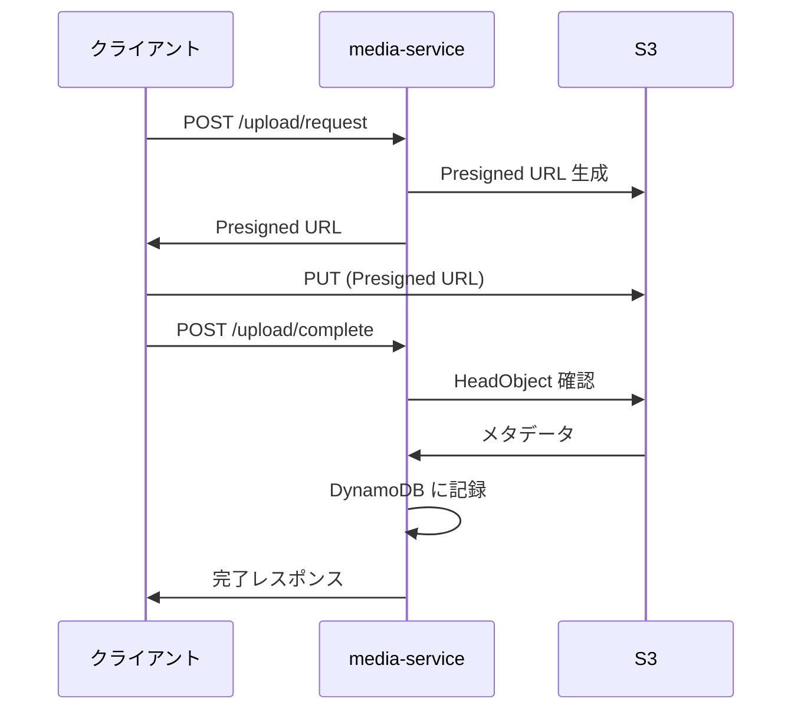
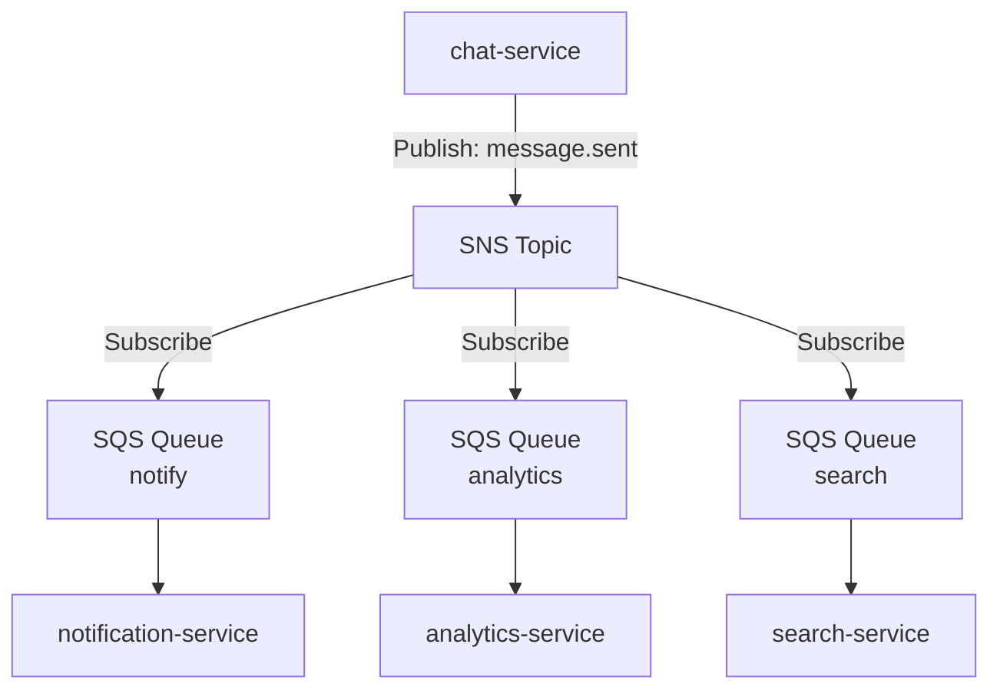
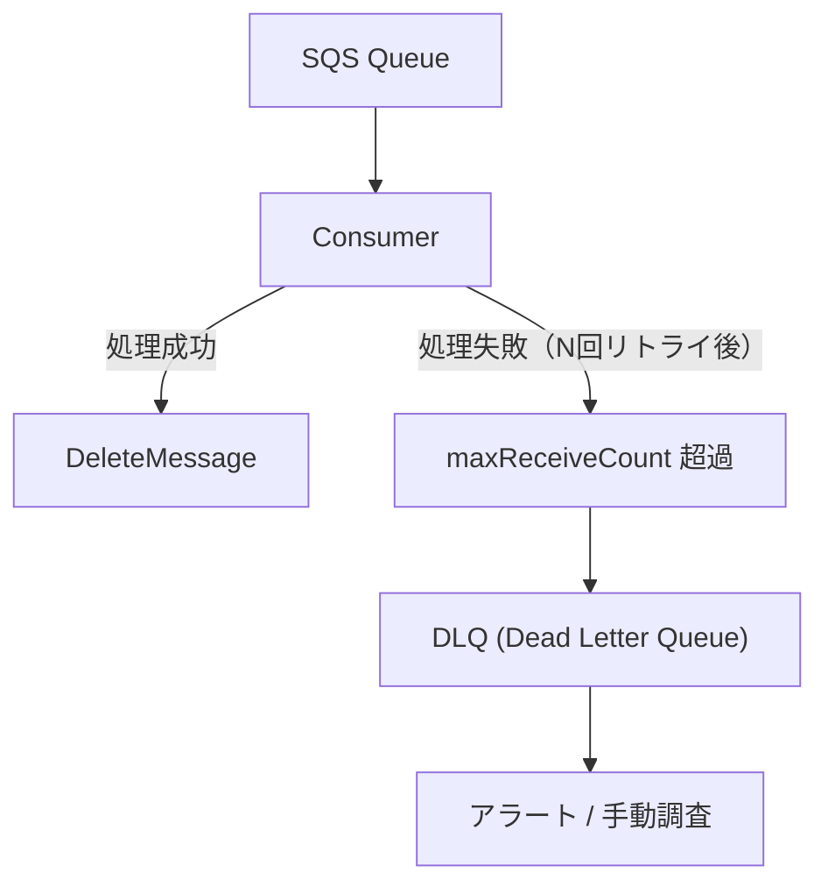
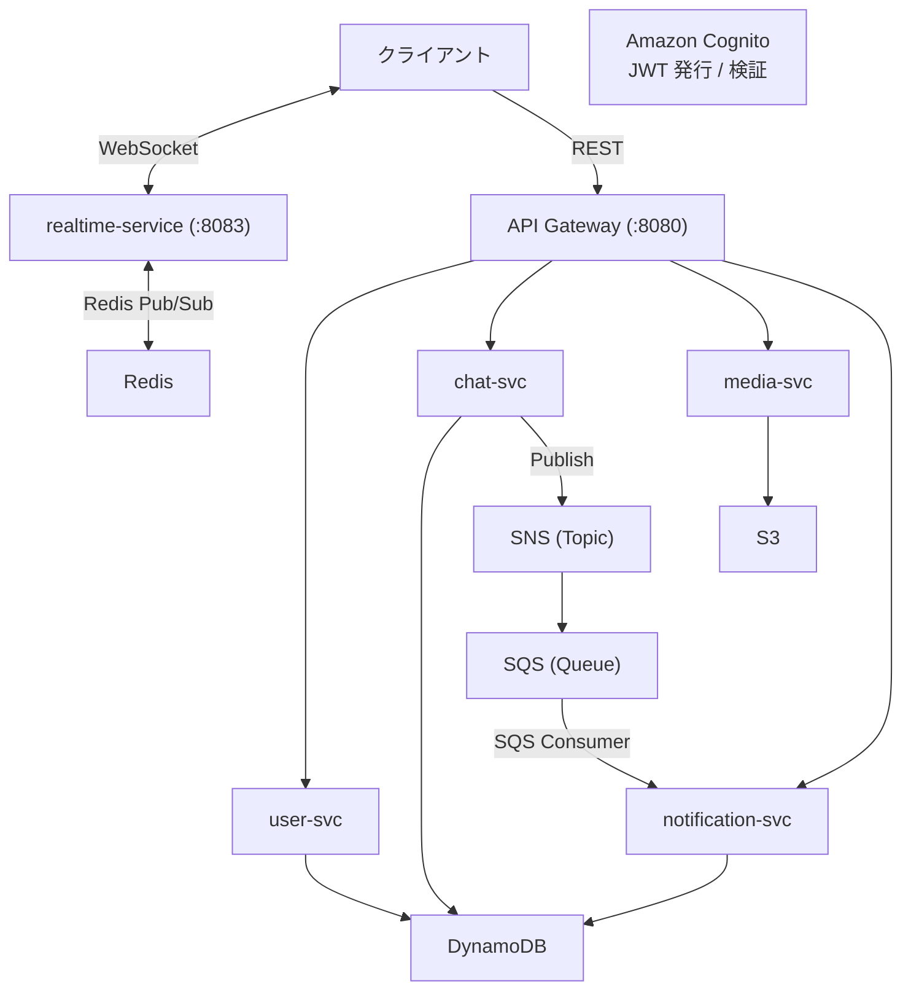

# Phase 4: AWS 統合 (DynamoDB, S3, SQS/SNS, Cognito)

> **期間目安**: 約6-8週間
> **難易度**: ★★★★☆（中級〜上級）

---

## 学習目標

本フェーズでは、AWS マネージドサービスと Go アプリケーションを統合し、クラウドネイティブなバックエンドを構築する。AWS SDK for Go v2 を使って DynamoDB, S3, SQS/SNS, Cognito を実装し、非同期メッセージングアーキテクチャを実現する。

| # | 目標 | 詳細 |
|---|------|------|
| 1 | AWS SDK for Go v2 を使いこなせる | credentials 管理、config ロード、サービスクライアント |
| 2 | Amazon Cognito でユーザー認証を実装できる | ユーザープール、JWT 検証、トークンフロー |
| 3 | DynamoDB でデータモデリングできる | シングルテーブル設計、GSI、クエリパターン |
| 4 | S3 でファイル管理を実装できる | Presigned URL、アップロード/ダウンロード |
| 5 | SQS/SNS で非同期メッセージングを構築できる | イベント駆動、ファンアウト、DLQ |
| 6 | LocalStack でローカルテストができる | AWS サービスのローカルエミュレーション |

---

## 前提知識

- **Phase 3 完了**: user-service, chat-service, realtime-service が連携して動作していること
- **AWS アカウント**: AWS Free Tier での利用が可能であること
- Go のインターフェースと依存性注入パターンの理解
- REST API と gRPC の実装経験
- 非同期処理（goroutine, channel）の基礎

---

## ステップ

### ステップ 1: AWS SDK for Go v2 セットアップ

AWS SDK for Go v2 の基本設定と認証情報の管理を学ぶ。

- [ ] AWS SDK for Go v2 の概要（v1 との違い、モジュール構成）
- [ ] SDK のインストール（`github.com/aws/aws-sdk-go-v2`）
- [ ] AWS credentials の管理方法:

| 方法 | 用途 | 優先度 |
|------|------|--------|
| 環境変数 (`AWS_ACCESS_KEY_ID`, `AWS_SECRET_ACCESS_KEY`) | ローカル開発 | 1 |
| 共有認証情報ファイル (`~/.aws/credentials`) | ローカル開発 | 2 |
| IAM Role (EC2/ECS/EKS) | 本番環境 | 推奨 |
| IRSA (IAM Roles for Service Accounts) | EKS 環境 | 推奨 |

- [ ] `config.LoadDefaultConfig()` による設定読み込み
- [ ] リージョン設定とエンドポイント解決
- [ ] カスタムエンドポイント設定（LocalStack 接続用）
- [ ] リトライポリシーの設定（`retry.StandardRetryer`）

```go
// AWS SDK v2 の基本設定例
package aws

import (
    "context"
    "fmt"

    "github.com/aws/aws-sdk-go-v2/aws"
    "github.com/aws/aws-sdk-go-v2/config"
)

type AWSConfig struct {
    Region       string
    EndpointURL  string // LocalStack 用
    Profile      string
}

func NewAWSConfig(ctx context.Context, cfg AWSConfig) (aws.Config, error) {
    opts := []func(*config.LoadOptions) error{
        config.WithRegion(cfg.Region),
    }

    if cfg.EndpointURL != "" {
        // LocalStack やローカル開発用のカスタムエンドポイント
        customResolver := aws.EndpointResolverWithOptionsFunc(
            func(service, region string, options ...interface{}) (aws.Endpoint, error) {
                return aws.Endpoint{
                    URL:               cfg.EndpointURL,
                    HostnameImmutable: true,
                }, nil
            },
        )
        opts = append(opts, config.WithEndpointResolverWithOptions(customResolver))
    }

    if cfg.Profile != "" {
        opts = append(opts, config.WithSharedConfigProfile(cfg.Profile))
    }

    awsCfg, err := config.LoadDefaultConfig(ctx, opts...)
    if err != nil {
        return aws.Config{}, fmt.Errorf("load AWS config: %w", err)
    }

    return awsCfg, nil
}
```

**確認ポイント**: AWS SDK v2 で STS `GetCallerIdentity` を呼び出し、認証情報が正しく設定されていることを確認できること。

---

### ステップ 2: Amazon Cognito 統合

ユーザー認証基盤を Amazon Cognito に移行し、JWT ベースの認証フローを実装する。

- [ ] Amazon Cognito の概念理解:

| 概念 | 説明 |
|------|------|
| User Pool | ユーザーディレクトリ（サインアップ、サインイン、トークン発行） |
| App Client | アプリケーションからの認証リクエストの受け口 |
| ID Token | ユーザー属性を含む JWT |
| Access Token | API アクセス権限を含む JWT |
| Refresh Token | トークン更新用（長寿命） |

- [ ] Cognito User Pool の作成と設定
- [ ] App Client の設定（シークレットなし、SRP 認証）
- [ ] Go での Cognito 認証フロー実装:

```go
// Cognito 認証サービスの例
package auth

import (
    "context"
    "fmt"

    "github.com/aws/aws-sdk-go-v2/aws"
    "github.com/aws/aws-sdk-go-v2/service/cognitoidentityprovider"
    "github.com/aws/aws-sdk-go-v2/service/cognitoidentityprovider/types"
)

type CognitoAuthService struct {
    client     *cognitoidentityprovider.Client
    userPoolID string
    clientID   string
}

func (s *CognitoAuthService) SignUp(ctx context.Context, email, password string) error {
    _, err := s.client.SignUp(ctx, &cognitoidentityprovider.SignUpInput{
        ClientId: aws.String(s.clientID),
        Username: aws.String(email),
        Password: aws.String(password),
        UserAttributes: []types.AttributeType{
            {Name: aws.String("email"), Value: aws.String(email)},
        },
    })
    if err != nil {
        return fmt.Errorf("cognito sign up: %w", err)
    }
    return nil
}

func (s *CognitoAuthService) SignIn(ctx context.Context, email, password string) (*AuthTokens, error) {
    result, err := s.client.InitiateAuth(ctx, &cognitoidentityprovider.InitiateAuthInput{
        AuthFlow: types.AuthFlowTypeUserPasswordAuth,
        ClientId: aws.String(s.clientID),
        AuthParameters: map[string]string{
            "USERNAME": email,
            "PASSWORD": password,
        },
    })
    if err != nil {
        return nil, fmt.Errorf("cognito sign in: %w", err)
    }

    return &AuthTokens{
        IDToken:      *result.AuthenticationResult.IdToken,
        AccessToken:  *result.AuthenticationResult.AccessToken,
        RefreshToken: *result.AuthenticationResult.RefreshToken,
        ExpiresIn:    result.AuthenticationResult.ExpiresIn,
    }, nil
}
```

- [ ] JWT 検証ミドルウェアの実装（JWKS エンドポイントから公開鍵取得）
- [ ] API Gateway 層でのトークン検証
- [ ] Cognito トリガー関数の概念理解（Pre/Post 認証フック）
- [ ] user-service との連携（Cognito ユーザーと内部ユーザーの紐付け）

**確認ポイント**: Cognito でユーザー登録・ログインし、取得した JWT で API にアクセスできること。

---

### ステップ 3: PostgreSQL → DynamoDB 移行

データストアを PostgreSQL から DynamoDB に移行し、NoSQL データモデリングを学ぶ。

- [ ] DynamoDB の基礎概念:

| 概念 | 説明 |
|------|------|
| テーブル | データの格納先 |
| パーティションキー (PK) | データの分散を決定するキー |
| ソートキー (SK) | PK 内でのデータの並び順 |
| GSI (Global Secondary Index) | 代替のアクセスパターンを提供するインデックス |
| LSI (Local Secondary Index) | 同一パーティション内の代替ソート |

- [ ] シングルテーブル設計の考え方:

```
┌──────────────────────────────────────────────────────────────────┐
│ PK                  │ SK                    │ 属性              │
├──────────────────────────────────────────────────────────────────┤
│ USER#<user_id>      │ PROFILE               │ name, email, ...  │
│ ROOM#<room_id>      │ METADATA              │ name, created_at  │
│ ROOM#<room_id>      │ MEMBER#<user_id>      │ role, joined_at   │
│ ROOM#<room_id>      │ MSG#<timestamp>#<id>  │ content, sender   │
│ USER#<user_id>      │ ROOM#<room_id>        │ last_read_at      │
└──────────────────────────────────────────────────────────────────┘

GSI1:
  PK: GSI1PK (例: user_id)  SK: GSI1SK (例: room_id)
  → ユーザーの所属ルーム一覧を取得
```

- [ ] Repository パターンで DB 実装を切り替える:

```go
// Repository インターフェースは変更なし
type UserRepository interface {
    Create(ctx context.Context, user *User) error
    GetByID(ctx context.Context, id string) (*User, error)
    List(ctx context.Context, limit, offset int) ([]*User, error)
    Update(ctx context.Context, user *User) error
    Delete(ctx context.Context, id string) error
}

// DynamoDB 実装を追加
type dynamoDBUserRepository struct {
    client    *dynamodb.Client
    tableName string
}

func (r *dynamoDBUserRepository) Create(ctx context.Context, user *User) error {
    item, err := attributevalue.MarshalMap(dynamoUser{
        PK:        fmt.Sprintf("USER#%s", user.ID),
        SK:        "PROFILE",
        Name:      user.Name,
        Email:     user.Email,
        CreatedAt: user.CreatedAt.Format(time.RFC3339),
    })
    if err != nil {
        return fmt.Errorf("marshal user: %w", err)
    }

    _, err = r.client.PutItem(ctx, &dynamodb.PutItemInput{
        TableName:           aws.String(r.tableName),
        Item:                item,
        ConditionExpression: aws.String("attribute_not_exists(PK)"),
    })
    if err != nil {
        return fmt.Errorf("put item: %w", err)
    }
    return nil
}
```

- [ ] デュアルライト戦略（PostgreSQL と DynamoDB の両方に書き込み）
- [ ] データ移行スクリプトの作成（既存データの DynamoDB への移行）
- [ ] 移行の検証とロールバック戦略
- [ ] DynamoDB Streams の概念理解（Change Data Capture）

**確認ポイント**: Repository インターフェースの実装を PostgreSQL から DynamoDB に切り替えても、API の動作が変わらないこと。

---

### ステップ 4: Amazon S3 統合

media-service を新規実装し、S3 を使ったファイルアップロード機能を構築する。

- [ ] Amazon S3 の基礎概念:

| 概念 | 説明 |
|------|------|
| Bucket | オブジェクトの格納コンテナ |
| Object | ファイル本体（Key + Value + Metadata） |
| Presigned URL | 一時的なアクセスURLの発行 |
| Storage Class | ストレージ階層（Standard, IA, Glacier） |
| Lifecycle Policy | オブジェクトの自動移行/削除ルール |

- [ ] media-service のプロジェクト作成
- [ ] S3 バケットの作成と設定（CORS, バケットポリシー）
- [ ] Presigned URL によるファイルアップロード:

```go
// Presigned URL 生成の例
package storage

import (
    "context"
    "fmt"
    "time"

    "github.com/aws/aws-sdk-go-v2/aws"
    "github.com/aws/aws-sdk-go-v2/service/s3"
    "github.com/aws/aws-sdk-go-v2/service/s3/types"
)

type S3Storage struct {
    client     *s3.Client
    presigner  *s3.PresignClient
    bucketName string
}

func (s *S3Storage) GenerateUploadURL(ctx context.Context, key string, contentType string) (string, error) {
    presignResult, err := s.presigner.PresignPutObject(ctx, &s3.PutObjectInput{
        Bucket:      aws.String(s.bucketName),
        Key:         aws.String(key),
        ContentType: aws.String(contentType),
    }, s3.WithPresignExpires(15*time.Minute))
    if err != nil {
        return "", fmt.Errorf("presign put object: %w", err)
    }
    return presignResult.URL, nil
}

func (s *S3Storage) GenerateDownloadURL(ctx context.Context, key string) (string, error) {
    presignResult, err := s.presigner.PresignGetObject(ctx, &s3.GetObjectInput{
        Bucket: aws.String(s.bucketName),
        Key:    aws.String(key),
    }, s3.WithPresignExpires(1*time.Hour))
    if err != nil {
        return "", fmt.Errorf("presign get object: %w", err)
    }
    return presignResult.URL, nil
}
```

- [ ] 画像アップロードフロー:



- [ ] ファイルメタデータの管理（DynamoDB に保存）
- [ ] 画像リサイズ/サムネイル生成（概念理解、Lambda 連携は後のフェーズ）
- [ ] S3 イベント通知の概念理解

**確認ポイント**: Presigned URL を使って画像をアップロードし、ダウンロード URL で取得できること。

---

### ステップ 5: Amazon SQS/SNS 統合

イベント駆動アーキテクチャを構築し、サービス間の疎結合な非同期通信を実現する。

- [ ] SQS と SNS の概念理解:

| サービス | 種類 | 特徴 | ユースケース |
|----------|------|------|-------------|
| SQS | Queue | ポイントツーポイント、プル型 | ワーカー処理、非同期タスク |
| SNS | Topic | Pub/Sub、プッシュ型 | イベント通知、ファンアウト |
| SQS FIFO | Queue | 順序保証、重複排除 | 順序が重要な処理 |

- [ ] イベント駆動アーキテクチャの設計:



- [ ] SNS Topic の作成とメッセージ発行:

```go
// SNS パブリッシャーの例
package messaging

import (
    "context"
    "encoding/json"
    "fmt"

    "github.com/aws/aws-sdk-go-v2/aws"
    "github.com/aws/aws-sdk-go-v2/service/sns"
)

type Event struct {
    Type      string          `json:"type"`
    Source    string          `json:"source"`
    Timestamp string         `json:"timestamp"`
    Data      json.RawMessage `json:"data"`
}

type SNSPublisher struct {
    client   *sns.Client
    topicARN string
}

func (p *SNSPublisher) Publish(ctx context.Context, event Event) error {
    data, err := json.Marshal(event)
    if err != nil {
        return fmt.Errorf("marshal event: %w", err)
    }

    _, err = p.client.Publish(ctx, &sns.PublishInput{
        TopicArn: aws.String(p.topicARN),
        Message:  aws.String(string(data)),
        MessageAttributes: map[string]snstypes.MessageAttributeValue{
            "event_type": {
                DataType:    aws.String("String"),
                StringValue: aws.String(event.Type),
            },
        },
    })
    if err != nil {
        return fmt.Errorf("publish to SNS: %w", err)
    }
    return nil
}
```

- [ ] SQS キューの作成とメッセージ受信（Long Polling）:

```go
// SQS コンシューマーの例
package messaging

import (
    "context"
    "encoding/json"
    "fmt"
    "log/slog"

    "github.com/aws/aws-sdk-go-v2/aws"
    "github.com/aws/aws-sdk-go-v2/service/sqs"
)

type SQSConsumer struct {
    client   *sqs.Client
    queueURL string
    handler  func(ctx context.Context, event Event) error
}

func (c *SQSConsumer) Start(ctx context.Context) error {
    for {
        select {
        case <-ctx.Done():
            slog.Info("SQS consumer stopping")
            return nil
        default:
            output, err := c.client.ReceiveMessage(ctx, &sqs.ReceiveMessageInput{
                QueueUrl:            aws.String(c.queueURL),
                MaxNumberOfMessages: 10,
                WaitTimeSeconds:     20, // Long Polling
                VisibilityTimeout:   30,
            })
            if err != nil {
                slog.Error("receive message failed", "error", err)
                continue
            }

            for _, msg := range output.Messages {
                var event Event
                if err := json.Unmarshal([]byte(*msg.Body), &event); err != nil {
                    slog.Error("unmarshal event failed", "error", err)
                    continue
                }

                if err := c.handler(ctx, event); err != nil {
                    slog.Error("handle event failed", "error", err, "event_type", event.Type)
                    continue
                }

                // 正常処理後にメッセージを削除
                _, _ = c.client.DeleteMessage(ctx, &sqs.DeleteMessageInput{
                    QueueUrl:      aws.String(c.queueURL),
                    ReceiptHandle: msg.ReceiptHandle,
                })
            }
        }
    }
}
```

- [ ] SNS → SQS サブスクリプションの設定（ファンアウトパターン）
- [ ] メッセージフィルタリング（メッセージ属性によるフィルター）
- [ ] `message.sent` イベントの実装（chat-service → SNS → SQS → 各サービス）

**確認ポイント**: chat-service でメッセージを送信すると、SNS/SQS 経由で他のサービスにイベントが配信されること。

---

### ステップ 6: notification-service の実装

通知管理専用のサービスを新規実装する。DynamoDB でデータを管理し、SQS からイベントを受信する。

- [ ] notification-service のプロジェクト作成
- [ ] DynamoDB テーブル設計:

```
┌──────────────────────────────────────────────────────────────────┐
│ PK                       │ SK                  │ 属性            │
├──────────────────────────────────────────────────────────────────┤
│ USER#<user_id>           │ NOTIF#<timestamp>   │ type, title,    │
│                          │                     │ body, read,     │
│                          │                     │ source_id       │
├──────────────────────────────────────────────────────────────────┤
│ GSI1PK: USER#<user_id>  │ GSI1SK: UNREAD      │ 未読通知の取得  │
└──────────────────────────────────────────────────────────────────┘
```

- [ ] 通知の種類:

| 通知タイプ | トリガー | 説明 |
|-----------|---------|------|
| `new_message` | `message.sent` イベント | 新しいメッセージの通知 |
| `room_invite` | `member.added` イベント | ルームへの招待通知 |
| `mention` | `message.sent` + メンション検出 | メンション通知 |

- [ ] SQS Consumer の実装（ステップ 5 の `SQSConsumer` を活用）
- [ ] 通知の CRUD API（REST）:

| メソッド | パス | 説明 |
|----------|------|------|
| `GET` | `/api/v1/notifications` | 通知一覧取得 |
| `PUT` | `/api/v1/notifications/{id}/read` | 既読にする |
| `PUT` | `/api/v1/notifications/read-all` | 全て既読にする |
| `GET` | `/api/v1/notifications/unread-count` | 未読数取得 |

- [ ] realtime-service との連携（WebSocket でリアルタイム通知プッシュ）

**確認ポイント**: メッセージ送信時に受信者の通知一覧に新しい通知が作成され、WebSocket で即座にプッシュされること。

---

### ステップ 7: デッドレターキュー (DLQ) の設定とエラーハンドリング

メッセージ処理の信頼性を高めるための DLQ とエラーハンドリング戦略を実装する。

- [ ] デッドレターキュー (DLQ) の概念:



- [ ] DLQ の設定:

```go
// SQS キュー作成時の DLQ 設定例
// RedrivePolicy を設定して最大受信回数を超えたメッセージを DLQ に移動
redrivePolicy := map[string]string{
    "deadLetterTargetArn": dlqARN,
    "maxReceiveCount":     "3",
}
```

- [ ] DLQ のリトライ戦略:

| 戦略 | 説明 |
|------|------|
| Exponential Backoff | Visibility Timeout を段階的に延長 |
| maxReceiveCount | 最大リトライ回数（推奨: 3-5回） |
| DLQ モニタリング | CloudWatch メトリクスでアラート |
| 手動リドライブ | DLQ からメインキューへの再投入 |

- [ ] メッセージの冪等性保証:

```go
// 冪等性キーによる重複処理の防止
type IdempotencyStore interface {
    IsProcessed(ctx context.Context, messageID string) (bool, error)
    MarkProcessed(ctx context.Context, messageID string, ttl time.Duration) error
}

// DynamoDB を使った冪等性ストア
type dynamoDBIdempotencyStore struct {
    client    *dynamodb.Client
    tableName string
}
```

- [ ] Visibility Timeout の適切な設定
- [ ] メッセージの順序保証が必要な場合の FIFO キューの利用
- [ ] DLQ メッセージの調査とリドライブ手順の整備

**確認ポイント**: 処理失敗したメッセージが DLQ に移動し、同一メッセージの重複処理が防止されること。

---

### ステップ 8: LocalStack を使ったローカルテスト

AWS サービスをローカルでエミュレートし、効率的な開発・テスト環境を構築する。

- [ ] LocalStack の概要と対応サービス
- [ ] Docker Compose で LocalStack を起動:

```yaml
# docker-compose.yml (LocalStack 部分)
services:
  localstack:
    image: localstack/localstack:latest
    ports:
      - "4566:4566"       # 統合エンドポイント
    environment:
      - SERVICES=dynamodb,s3,sqs,sns,cognito
      - DEFAULT_REGION=ap-northeast-1
      - DEBUG=1
    volumes:
      - "./scripts/localstack:/etc/localstack/init/ready.d"
      - "localstack-data:/var/lib/localstack"

volumes:
  localstack-data:
```

- [ ] 初期化スクリプトの作成（テーブル、キュー、トピック、バケットの自動作成）:

```bash
#!/bin/bash
# scripts/localstack/init.sh

# DynamoDB テーブル作成
awslocal dynamodb create-table \
  --table-name chat-platform \
  --attribute-definitions \
    AttributeName=PK,AttributeType=S \
    AttributeName=SK,AttributeType=S \
    AttributeName=GSI1PK,AttributeType=S \
    AttributeName=GSI1SK,AttributeType=S \
  --key-schema \
    AttributeName=PK,KeyType=HASH \
    AttributeName=SK,KeyType=RANGE \
  --global-secondary-indexes \
    '[{"IndexName":"GSI1","KeySchema":[{"AttributeName":"GSI1PK","KeyType":"HASH"},{"AttributeName":"GSI1SK","KeyType":"RANGE"}],"Projection":{"ProjectionType":"ALL"}}]' \
  --billing-mode PAY_PER_REQUEST

# S3 バケット作成
awslocal s3 mb s3://chat-platform-media

# SNS トピック作成
awslocal sns create-topic --name chat-events

# SQS キュー作成
awslocal sqs create-queue --queue-name notification-queue
awslocal sqs create-queue --queue-name notification-dlq

echo "LocalStack initialization complete!"
```

- [ ] テスト用の AWS クライアント設定:

```go
// テスト用設定の切り替え
func NewTestAWSConfig(ctx context.Context) (aws.Config, error) {
    return NewAWSConfig(ctx, AWSConfig{
        Region:      "ap-northeast-1",
        EndpointURL: "http://localhost:4566",
    })
}
```

- [ ] インテグレーションテストの実装（LocalStack を使った E2E テスト）
- [ ] CI パイプラインでの LocalStack 活用（GitHub Actions での利用）
- [ ] LocalStack の制限事項と本番環境との差異の理解

**確認ポイント**: LocalStack 上で全 AWS サービスとの統合テストが PASS すること。

---

## 成果物

Phase 4 完了時に以下が動作していること:

- [x] Amazon Cognito でユーザー認証（サインアップ、サインイン、JWT 検証）ができる
- [x] DynamoDB にデータが永続化され、Repository パターンで切り替え可能
- [x] media-service が S3 Presigned URL でファイルアップロード/ダウンロードを提供する
- [x] SNS/SQS でイベント駆動アーキテクチャが動作する（ファンアウトパターン）
- [x] notification-service が SQS からイベントを受信し通知を生成する
- [x] DLQ による失敗メッセージのハンドリングが機能する
- [x] LocalStack でローカルテストが実行できる

### サービス構成図（Phase 4 完了時）



---

## 学べる技術

| カテゴリ | 技術 | 用途 |
|----------|------|------|
| SDK | AWS SDK for Go v2 | AWS サービスとの統合 |
| 認証 | Amazon Cognito | ユーザー認証、JWT トークン管理 |
| NoSQL DB | Amazon DynamoDB | データ永続化、シングルテーブル設計 |
| ストレージ | Amazon S3 | ファイルストレージ、Presigned URL |
| メッセージキュー | Amazon SQS | 非同期メッセージ処理、DLQ |
| Pub/Sub | Amazon SNS | イベント通知、ファンアウト |
| ローカル開発 | LocalStack | AWS サービスのローカルエミュレーション |
| テスト | Integration Tests | LocalStack を使った統合テスト |

---

## 参考リソース

### 公式ドキュメント

| リソース | URL | 説明 |
|----------|-----|------|
| AWS SDK for Go v2 | https://aws.github.io/aws-sdk-go-v2/docs/ | SDK 公式ドキュメント |
| DynamoDB Developer Guide | https://docs.aws.amazon.com/amazondynamodb/latest/developerguide/ | DynamoDB 開発者ガイド |
| S3 User Guide | https://docs.aws.amazon.com/AmazonS3/latest/userguide/ | S3 ユーザーガイド |
| SQS Developer Guide | https://docs.aws.amazon.com/AWSSimpleQueueService/latest/SQSDeveloperGuide/ | SQS 開発者ガイド |
| Cognito Developer Guide | https://docs.aws.amazon.com/cognito/latest/developerguide/ | Cognito 開発者ガイド |
| LocalStack Docs | https://docs.localstack.cloud/ | LocalStack 公式ドキュメント |

### 書籍・コース

| リソース | 著者 | 説明 |
|----------|------|------|
| The DynamoDB Book | Alex DeBrie | DynamoDB データモデリングの決定版 |
| AWS Certified Solutions Architect Study Guide | Ben Piper, David Clinton | SAA-C03 対策書 |
| Designing Data-Intensive Applications | Martin Kleppmann | 分散システム設計の名著 |

### ツール

| ツール | 用途 |
|--------|------|
| AWS CLI | AWS サービスのコマンドライン操作 |
| NoSQL Workbench | DynamoDB のデータモデリングとクエリ可視化 |
| LocalStack | AWS サービスのローカルエミュレーション |
| awslocal | LocalStack 用の AWS CLI ラッパー |

---

## 認定試験との関連

Phase 4 は AWS マネージドサービスを実際に構築するため、**AWS SAA-C03 試験** との関連が非常に強い。また、CKA/CKAD の前提知識としてクラウドサービスの理解が深まる。

### AWS SAA-C03 との対応

| 試験ドメイン | 配点 | Phase 4 の対応トピック |
|-------------|------|----------------------|
| **ドメイン 1: セキュアなアーキテクチャの設計** | 30% | Cognito（認証/認可）、S3 バケットポリシー、IAM ロール、暗号化 |
| **ドメイン 2: 弾力性の高いアーキテクチャの設計** | 26% | DynamoDB（マルチ AZ 自動レプリケーション）、SQS/SNS（疎結合アーキテクチャ）、DLQ（障害耐性） |
| **ドメイン 3: 高性能アーキテクチャの設計** | 24% | DynamoDB（パーティション設計、GSI）、S3（Transfer Acceleration, Presigned URL）、SQS（スループット最適化） |
| **ドメイン 4: コスト最適化アーキテクチャの設計** | 20% | DynamoDB（オンデマンド vs プロビジョンドキャパシティ）、S3（ストレージクラス、ライフサイクル）、SQS（Long Polling） |

### 具体的な試験トピックとの対応表

| Phase 4 トピック | SAA-C03 試験での出題ポイント |
|-----------------|---------------------------|
| DynamoDB シングルテーブル設計 | パーティションキー設計、GSI の使い分け、キャパシティモードの選択 |
| S3 Presigned URL | セキュアなファイルアクセス、バケットポリシーとの違い |
| SQS/SNS ファンアウト | 疎結合アーキテクチャの設計、同期 vs 非同期の使い分け |
| DLQ | メッセージ処理の信頼性設計、障害復旧パターン |
| Cognito | サーバーレス認証、フェデレーション、MFA |
| SQS FIFO | 順序保証が必要なユースケースの識別 |

### CKA/CKAD との関連

| 関連ポイント | 説明 |
|-------------|------|
| AWS サービスの理解 | EKS 上でのアプリケーションが接続する先の AWS サービスを理解する |
| IAM / IRSA の概念 | Phase 5 で EKS + IRSA を構成する際の前提知識 |
| 環境変数管理 | Kubernetes の ConfigMap/Secret で AWS 設定を管理する前提知識 |

> **注**: Phase 4 完了時点で AWS SAA-C03 の主要サービス（DynamoDB, S3, SQS, SNS, Cognito）を実際に使った経験が得られる。試験勉強と並行して取り組むと効果的。

---

## 前のフェーズ

[Phase 3: リアルタイム通信](./phase-3.md)

## 次のフェーズ

Phase 4 が完了したら [Phase 5: コンテナ化 + Kubernetes](./phase-5.md) に進む。
