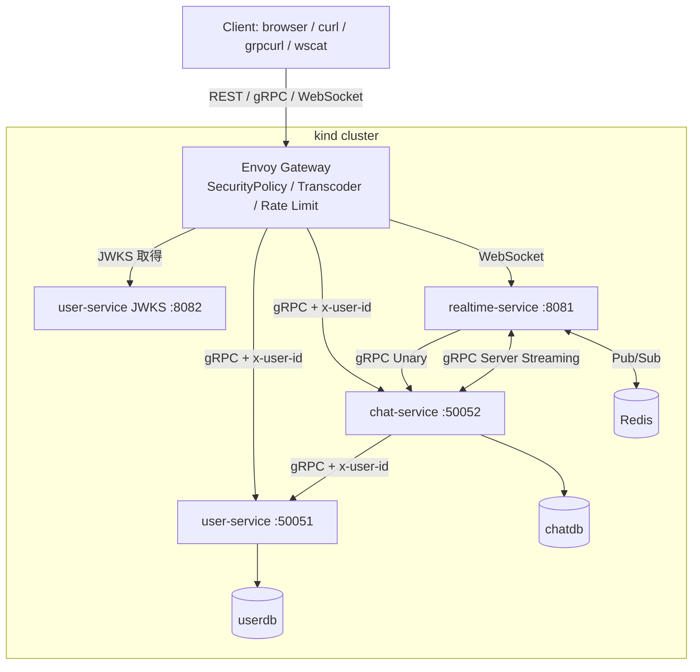

# Phase 4: K8s + Envoy Gateway + 全サービスデプロイ

---

## 学習目標

Phase 1〜3 で Go で完成させた 3 サービスを、**K8s (kind) + Envoy Gateway に載せ替える**。インフラに集中する Phase。

**サービス側の Go コードは一切変更しない**。Envoy Gateway が JWT 検証・REST 公開・ルーティングを担当し、Phase 1〜3 で設計した `TrustedUserID` Interceptor に対して `x-user-id` を供給する役割を担う。

| # | 目標 | 詳細 |
|---|------|------|
| 1 | kind でローカル K8s クラスタを運用できる | cluster-up / down / ログ確認 |
| 2 | Gateway API を理解して書ける | Gateway / GRPCRoute / HTTPRoute / SecurityPolicy / BackendTrafficPolicy |
| 3 | Envoy Gateway で JWT 検証を集約できる | SecurityPolicy + JWKS |
| 4 | gRPC-JSON Transcoder で REST を自動公開できる | proto から REST API がブラウザ向けに |
| 5 | 複数サービスを一気に K8s にデプロイできる | 3 サービス + PostgreSQL + Redis |
| 6 | 信頼境界を NetworkPolicy で物理担保できる | Envoy 以外からの直接アクセス拒否 |

---

## 前提知識

- **Phase 1〜3 完了**: user / chat / realtime の 3 サービスが `go run` で動き、localhost で連携できている
- **K8s の基礎** (既知扱い): Pod / Deployment / Service / ConfigMap / Secret / Namespace
- Docker と `kubectl` の基本操作

---

## 設計原則

### サービスのコードは変わらない

Phase 1 で `TrustedUserID` Interceptor が **`x-user-id` メタデータを読むだけ** の設計になっている。Phase 4 で Envoy がその metadata を供給する側になる。

```
Phase 1-3 (開発中):            Phase 4 (K8s 運用):
  テスト / grpcurl が             Envoy Gateway が JWT 検証して
  x-user-id を手動注入             x-user-id を自動付与
         │                                │
         └──────────┬─────────────────────┘
                    ▼
          (どちらも)
          user-service: x-user-id を読んで Context に
          ※サービス側コードは同一
```

### auth-first デプロイ

初回デプロイの瞬間から **SecurityPolicy と NetworkPolicy が貼られた** 状態にする。「先に保護なしでデプロイして後から追加」はしない。

---

## ステップ構成

| 部 | テーマ | ステップ |
|----|--------|----------|
| A | K8s クラスタと Gateway 基盤 | 1〜3 |
| B | ミドルウェアのデプロイ (PostgreSQL / Redis) | 4 |
| C | アプリケーションのデプロイ (3 サービス) | 5〜7 |
| D | Envoy で JWT 検証 + REST 公開 | 8〜10 |
| E | 信頼境界とレートリミット | 11〜12 |
| F | end-to-end 検証 | 13 |

---

## A. K8s クラスタと Gateway 基盤

### ステップ 1: kind クラスタの構築

- [ ] kind のインストール
- [ ] `deploy/kind-config.yaml` でクラスタ設定

```yaml
kind: Cluster
apiVersion: kind.x-k8s.io/v1alpha4
nodes:
  - role: control-plane
    extraPortMappings:
      - containerPort: 30080
        hostPort: 8080
      - containerPort: 30050
        hostPort: 50051
```

```bash
kind create cluster --name chat --config deploy/kind-config.yaml
```

**確認ポイント**: `kubectl get nodes` で `Ready`。

---

### ステップ 2: Gateway API + Envoy Gateway のインストール

```bash
# Gateway API CRD
kubectl apply -f https://github.com/kubernetes-sigs/gateway-api/releases/download/v1.0.0/standard-install.yaml

# Envoy Gateway (Helm)
helm install envoy-gateway oci://docker.io/envoyproxy/gateway-helm \
  --version v1.2.0 -n envoy-gateway-system --create-namespace

# アプリ namespace
kubectl create namespace chat-app
```

**確認ポイント**: `kubectl get pods -n envoy-gateway-system` で Running。

---

### ステップ 3: Gateway リソース

```yaml
# deploy/gateway/gateway.yaml
apiVersion: gateway.networking.k8s.io/v1
kind: Gateway
metadata: {name: chat-gateway, namespace: chat-app}
spec:
  gatewayClassName: eg
  listeners:
    - {name: http,  protocol: HTTP, port: 80,    allowedRoutes: {namespaces: {from: Same}}}
    - {name: grpc,  protocol: HTTP, port: 50051, allowedRoutes: {namespaces: {from: Same}, kinds: [{kind: GRPCRoute}]}}
```

**確認ポイント**: `kubectl get gateway -n chat-app` で `Programmed: True`。

---

## B. ミドルウェアのデプロイ

### ステップ 4: PostgreSQL + Redis を K8s 上に

Phase 1〜3 で `docker run` していた PostgreSQL と Redis を K8s 上に移す。

- [ ] `deploy/postgres/statefulset.yaml` + `service.yaml` + `secret.yaml`
- [ ] `deploy/redis/deployment.yaml` + `service.yaml`
- [ ] `chatdb` を作る init script or Job

```bash
kubectl apply -f deploy/postgres/
kubectl apply -f deploy/redis/
```

**確認ポイント**: `kubectl exec` で PostgreSQL / Redis に接続できる。

---

## C. アプリケーションのデプロイ

### ステップ 5: Dockerfile 作成 (3 サービス)

- [ ] `services/user-service/Dockerfile` (multi-stage)
- [ ] `services/chat-service/Dockerfile`
- [ ] `services/realtime-service/Dockerfile`

```dockerfile
# 例: services/user-service/Dockerfile
FROM golang:1.22-alpine AS builder
WORKDIR /src
COPY go.work go.work.sum ./
COPY gen/go ./gen/go
COPY pkg ./pkg
COPY services/user-service ./services/user-service
WORKDIR /src/services/user-service
RUN CGO_ENABLED=0 go build -o /app/user-service ./cmd/server

FROM gcr.io/distroless/static
COPY --from=builder /app/user-service /app/user-service
EXPOSE 50051 8082
ENTRYPOINT ["/app/user-service"]
```

```bash
docker build -t user-service:0.1.0 -f services/user-service/Dockerfile .
docker build -t chat-service:0.1.0 -f services/chat-service/Dockerfile .
docker build -t realtime-service:0.1.0 -f services/realtime-service/Dockerfile .

kind load docker-image user-service:0.1.0 chat-service:0.1.0 realtime-service:0.1.0 --name chat
```

**確認ポイント**: `docker image ls` でビルド成功、`kind` ノード上にロード済み。

---

### ステップ 6: マイグレーション Job

Phase 1〜3 の `migrations/` SQL を K8s Job で流す。

- [ ] SQL を ConfigMap として投入 (`kubectl create configmap --from-file`)
- [ ] `migrate/migrate:4` イメージを使う Job

```yaml
apiVersion: batch/v1
kind: Job
metadata: {name: user-service-migrate, namespace: chat-app}
spec:
  template:
    spec:
      restartPolicy: Never
      containers:
        - name: migrate
          image: migrate/migrate:4
          command: [migrate, -path, /migrations, -database, "$(DATABASE_URL)", up]
          env:
            - {name: DATABASE_URL, valueFrom: {secretKeyRef: {name: user-service-secret, key: database-url}}}
          volumeMounts: [{name: migrations, mountPath: /migrations}]
      volumes:
        - {name: migrations, configMap: {name: user-service-migrations}}
```

**確認ポイント**: Job が `Completed`、テーブルが作成されている。

---

### ステップ 7: 3 サービスの Deployment / Service

```yaml
# deploy/services/user-service/deployment.yaml (抜粋)
apiVersion: apps/v1
kind: Deployment
metadata: {name: user-service, namespace: chat-app}
spec:
  replicas: 1
  selector: {matchLabels: {app: user-service}}
  template:
    metadata: {labels: {app: user-service}}
    spec:
      containers:
        - name: user-service
          image: user-service:0.1.0
          ports:
            - {containerPort: 50051, name: grpc}
            - {containerPort: 8082, name: jwks-http}
          env:
            - {name: DATABASE_URL, valueFrom: {secretKeyRef: {name: user-service-secret, key: database-url}}}
            - {name: JWT_PRIVATE_KEY, valueFrom: {secretKeyRef: {name: user-service-secret, key: jwt-private-key}}}
          livenessProbe: {grpc: {port: 50051}}
          readinessProbe: {grpc: {port: 50051}}
```

- [ ] user-service: gRPC :50051 + JWKS HTTP :8082
- [ ] chat-service: gRPC :50052、環境変数に `USER_SERVICE_ADDR=user-service:50051`
- [ ] realtime-service: WebSocket :8081、`CHAT_SERVICE_ADDR=chat-service:50052`、`REDIS_ADDR=redis:6379`

**確認ポイント**: `kubectl get pods -n chat-app` で 3 サービス + PostgreSQL + Redis が Running。

---

## D. Envoy で JWT 検証 + REST 公開

### ステップ 8: 公開 / 保護 Route の分離

```yaml
# deploy/gateway/user-public.yaml (JWT 不要)
apiVersion: gateway.networking.k8s.io/v1
kind: GRPCRoute
metadata: {name: user-public, namespace: chat-app}
spec:
  parentRefs: [{name: chat-gateway, sectionName: grpc}]
  rules:
    - matches:
        - method: {service: user.v1.UserService, method: Login}
        - method: {service: user.v1.UserService, method: Register}
        - method: {service: user.v1.UserService, method: Refresh}
        - method: {service: grpc.health.v1.Health}
      backendRefs: [{name: user-service, port: 50051}]
---
# deploy/gateway/user-protected.yaml
apiVersion: gateway.networking.k8s.io/v1
kind: GRPCRoute
metadata: {name: user-protected, namespace: chat-app}
spec:
  parentRefs: [{name: chat-gateway, sectionName: grpc}]
  rules:
    - matches: [{method: {service: user.v1.UserService}}]
      backendRefs: [{name: user-service, port: 50051}]
---
# deploy/gateway/chat-protected.yaml
apiVersion: gateway.networking.k8s.io/v1
kind: GRPCRoute
metadata: {name: chat-protected, namespace: chat-app}
spec:
  parentRefs: [{name: chat-gateway, sectionName: grpc}]
  rules:
    - matches: [{method: {service: chat.v1.ChatService}}]
      backendRefs: [{name: chat-service, port: 50052}]
---
# deploy/gateway/realtime-ws.yaml
apiVersion: gateway.networking.k8s.io/v1
kind: HTTPRoute
metadata: {name: realtime-ws, namespace: chat-app}
spec:
  parentRefs: [{name: chat-gateway, sectionName: http}]
  rules:
    - matches: [{path: {type: PathPrefix, value: /ws}}]
      backendRefs: [{name: realtime-service, port: 8081}]
```

**確認ポイント**: すべての Route が `Accepted: True`。

---

### ステップ 9: SecurityPolicy で JWT 検証

各保護 Route に SecurityPolicy を貼る。Envoy が user-service の JWKS から公開鍵を取得して JWT を検証する。

```yaml
# deploy/gateway/jwt-auth-user.yaml
apiVersion: gateway.envoyproxy.io/v1alpha1
kind: SecurityPolicy
metadata: {name: jwt-auth-user, namespace: chat-app}
spec:
  targetRef:
    group: gateway.networking.k8s.io
    kind: GRPCRoute
    name: user-protected
  jwt:
    providers:
      - name: chat-app
        issuer: chat-app
        remoteJWKS: {uri: http://user-service:8082/.well-known/jwks.json}
        claimToHeaders:
          - {claim: sub, header: x-user-id}
          - {claim: preferred_username, header: x-username}
---
# deploy/gateway/jwt-auth-chat.yaml (同じ provider を chat-protected にも)
apiVersion: gateway.envoyproxy.io/v1alpha1
kind: SecurityPolicy
metadata: {name: jwt-auth-chat, namespace: chat-app}
spec:
  targetRef:
    group: gateway.networking.k8s.io
    kind: GRPCRoute
    name: chat-protected
  jwt:
    providers:
      - name: chat-app
        issuer: chat-app
        remoteJWKS: {uri: http://user-service:8082/.well-known/jwks.json}
        claimToHeaders:
          - {claim: sub, header: x-user-id}
```

**確認ポイント**:
- `SecurityPolicy` が `Accepted: True`
- トークンなしで保護 RPC → Envoy が `Unauthenticated` を返す
- 有効 JWT 付き → 成功、サービス側の `ctx` に `UserID` が入る

---

### ステップ 10: gRPC-JSON Transcoder で REST 公開

proto の `google.api.http` アノテーション (Phase 1-2 で書いた) を使って REST API を自動公開する。Go で REST ハンドラは書かない。

- [ ] `buf build -o descriptor.pb proto/` で proto descriptor set 生成
- [ ] descriptor を ConfigMap に投入
- [ ] `EnvoyPatchPolicy` で Transcoder Filter を Gateway に適用

```yaml
apiVersion: gateway.envoyproxy.io/v1alpha1
kind: EnvoyPatchPolicy
metadata: {name: grpc-json-transcoder, namespace: chat-app}
spec:
  targetRef:
    group: gateway.networking.k8s.io
    kind: Gateway
    name: chat-gateway
  type: JSONPatch
  jsonPatches:
    - type: type.googleapis.com/envoy.config.listener.v3.Listener
      name: chat-app/chat-gateway/http
      operation:
        op: add
        path: /default_filter_chain/filters/0/typed_config/http_filters/0
        value:
          name: envoy.filters.http.grpc_json_transcoder
          typed_config:
            "@type": type.googleapis.com/envoy.extensions.filters.http.grpc_json_transcoder.v3.GrpcJsonTranscoder
            proto_descriptor: /etc/envoy/descriptor.pb
            services: [user.v1.UserService, chat.v1.ChatService]
            convert_grpc_status: true
```

**確認ポイント**: `curl -X POST localhost:8080/api/v1/auth/login ...` で REST として叩ける。

---

## E. 信頼境界とレートリミット

### ステップ 11: NetworkPolicy で直接アクセスを拒否

```yaml
apiVersion: networking.k8s.io/v1
kind: NetworkPolicy
metadata: {name: user-service-ingress, namespace: chat-app}
spec:
  podSelector: {matchLabels: {app: user-service}}
  policyTypes: [Ingress]
  ingress:
    - from:
        - namespaceSelector: {matchLabels: {kubernetes.io/metadata.name: envoy-gateway-system}}
        - podSelector: {matchLabels: {app: chat-service}}
      ports:
        - {protocol: TCP, port: 50051}
        - {protocol: TCP, port: 8082}
```

同様の NetworkPolicy を chat-service と realtime-service にも。

**確認ポイント**: 適当な Pod を立てて user-service に直接 Dial すると接続拒否される。

---

### ステップ 12: レートリミット

```yaml
apiVersion: gateway.envoyproxy.io/v1alpha1
kind: BackendTrafficPolicy
metadata: {name: rate-limit, namespace: chat-app}
spec:
  targetRef:
    group: gateway.networking.k8s.io
    kind: GRPCRoute
    name: user-protected
  rateLimit:
    type: Global
    global:
      rules:
        - limit: {requests: 100, unit: Minute}
          clientSelectors:
            - headers: [{name: x-user-id, type: Distinct}]
```

**確認ポイント**: 100 req/min を超えると `RESOURCE_EXHAUSTED`。

---

## F. end-to-end 検証

### ステップ 13: フルフロー動作確認

```bash
# port-forward
kubectl -n envoy-gateway-system port-forward svc/<gateway-svc-name> 8080:80 50051:50051

# REST で Register + Login
curl -X POST http://localhost:8080/api/v1/auth/register \
  -H "Content-Type: application/json" \
  -d '{"email":"alice@example.com","password":"password123",...}'

ACCESS=$(curl -s -X POST http://localhost:8080/api/v1/auth/login \
  -d '{"email":"alice@example.com","password":"password123"}' | jq -r .access_token)

# 保護 REST (JWT 必須)
curl -X POST http://localhost:8080/api/v1/rooms \
  -H "Authorization: Bearer $ACCESS" \
  -d '{"name":"general","type":"GROUP"}'

# 保護 gRPC (JWT 必須)
grpcurl -plaintext -H "authorization: Bearer $ACCESS" \
  localhost:50051 user.v1.UserService/GetUser

# WebSocket
wscat -c "ws://localhost:8080/ws?access_token=$ACCESS"
```

**確認ポイント**: REST / gRPC / WebSocket すべてが Envoy 経由で動き、認証が効いている。

---

## 成果物

Phase 4 完了時 (= プロジェクト完了時) に以下が動作していること:

- [ ] kind クラスタ上で 3 サービス + PostgreSQL + Redis + Envoy Gateway が稼働
- [ ] Envoy Gateway が JWT 検証・REST 変換・ルーティングを YAML だけで実現
- [ ] サービスの Go コードは Phase 3 から一切変更なし
- [ ] REST / gRPC / WebSocket の 3 つの入口すべてで認証が効く
- [ ] NetworkPolicy で Envoy 以外からの直接アクセスを物理的に拒否
- [ ] レートリミット (100 req/min/user) が機能

### サービス構成図 (Phase 4 = プロジェクト完了時)



---

## 学べる技術

| カテゴリ | 技術 | 用途 |
|----------|------|------|
| オーケストレーション | Kubernetes (kind) | ローカル完結の実行基盤 |
| エッジ | Envoy Gateway | JWT / REST 変換 / Rate Limit |
| 標準 | Gateway API | Ingress の後継 |
| Helm | Envoy Gateway のインストール | |
| 認証集約 | SecurityPolicy + JWKS | YAML だけで JWT 検証 |
| REST 自動公開 | gRPC-JSON Transcoder | proto → REST |
| 信頼境界 | NetworkPolicy | Envoy 以外からの直接アクセス拒否 |
| レートリミット | BackendTrafficPolicy | YAML 宣言 |
| マイグレーション | K8s Job | 本番風のスキーマ管理 |

---

## 参考リソース

| リソース | URL |
|----------|-----|
| kind | https://kind.sigs.k8s.io/ |
| Gateway API | https://gateway-api.sigs.k8s.io/ |
| Envoy Gateway | https://gateway.envoyproxy.io/ |
| SecurityPolicy | https://gateway.envoyproxy.io/docs/tasks/security/jwt-authentication/ |
| gRPC-JSON Transcoder | https://www.envoyproxy.io/docs/envoy/latest/configuration/http/http_filters/grpc_json_transcoder_filter |

---

## 前のフェーズ

[Phase 3: realtime-service](./phase-3.md)

## 完了後

Phase 4 が最終フェーズ。ここまで完了した時点で、マイクロサービスの主要な構造 (gRPC + REST Gateway + WebSocket + 認証 + 複数サービス連携 + Pub/Sub + K8s) が一通り揃う。Phase 1〜3 で Go に集中し、Phase 4 で K8s / Envoy に集中するという **技術軸で分離された学習フロー** が完結する。
