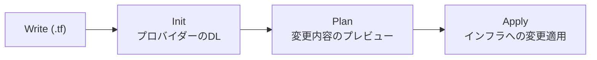
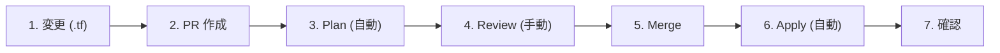
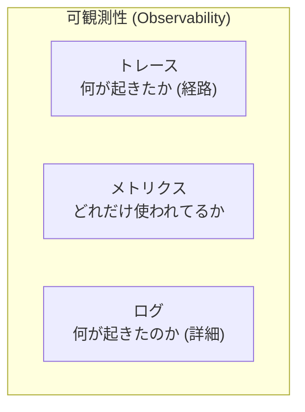
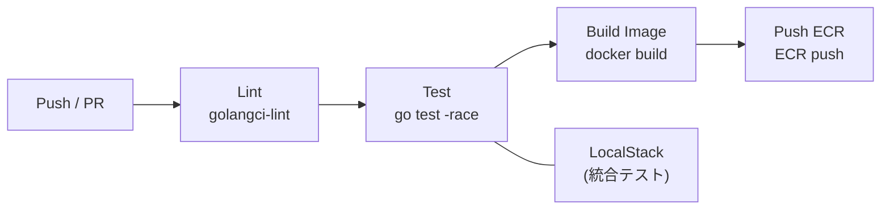
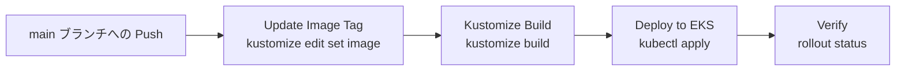
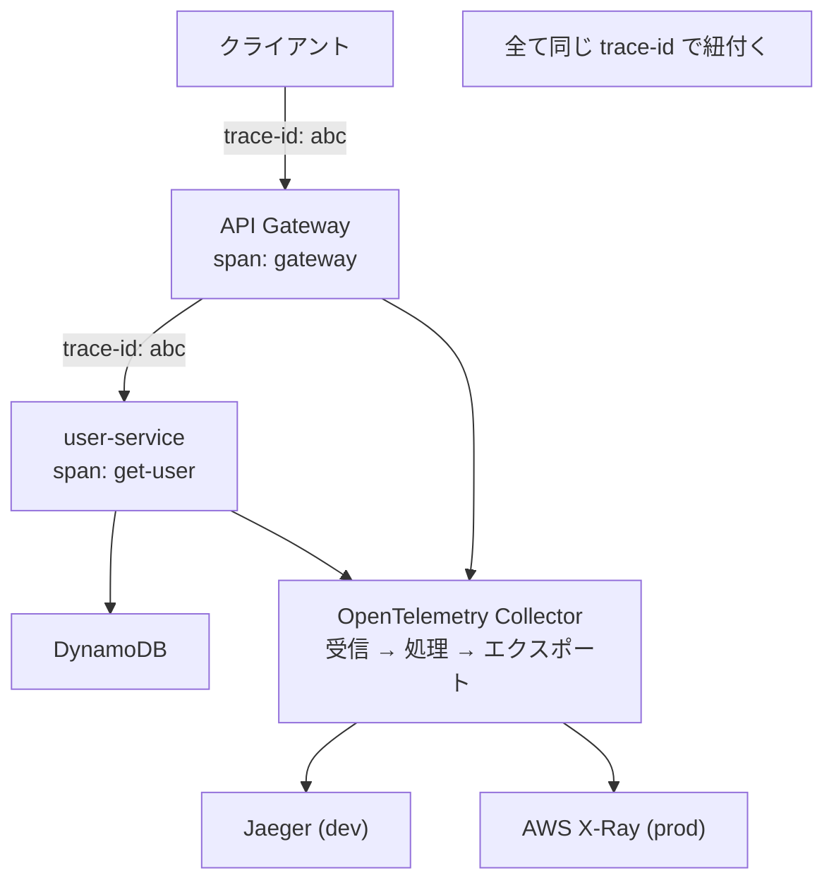
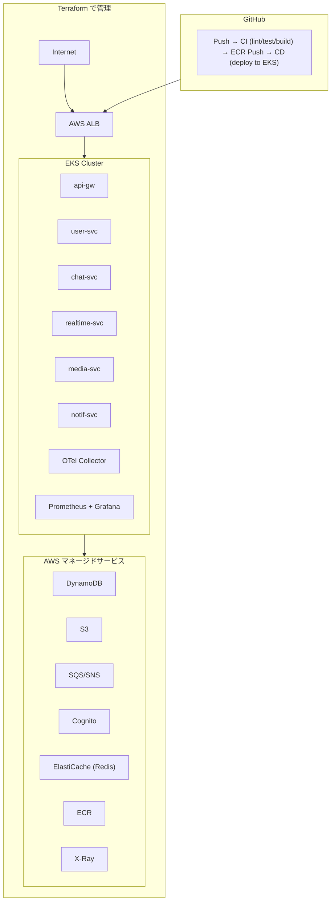

# Phase 6: Terraform + 可観測性 + CI/CD

> **期間目安**: 約6-8週間
> **難易度**: ★★★★★（上級）

---

## 学習目標

本フェーズでは、Terraform によるインフラのコード化（IaC）、OpenTelemetry + Prometheus + Grafana による可観測性の構築、GitHub Actions による CI/CD パイプラインの自動化を実現する。Cloud Native Chat Platform の最終フェーズとして、本番運用に必要な全てのインフラと運用基盤を完成させる。

| # | 目標 | 詳細 |
|---|------|------|
| 1 | Terraform でインフラをコード管理できる | HCL 構文、モジュール、状態管理、環境分離 |
| 2 | OpenTelemetry でテレメトリーデータを収集できる | トレース、メトリクス、ログの統合 |
| 3 | Prometheus + Grafana で監視基盤を構築できる | メトリクス収集、ダッシュボード、アラート |
| 4 | 分散トレーシングを実装できる | リクエストのエンドツーエンド追跡 |
| 5 | GitHub Actions で CI/CD を自動化できる | lint, test, build, deploy の自動化 |

---

## 前提知識

- **Phase 5 完了**: 全サービスが EKS 上で稼働していること
- Kubernetes のマニフェスト管理と Kustomize の理解
- AWS の基本サービス（VPC, IAM, EKS, DynamoDB, S3, SQS/SNS）の理解
- YAML と JSON の構文
- Git のブランチ戦略（feature branch, main branch）

---

## ステップ

### ステップ 1: Terraform の基礎

Terraform の基本概念と HCL (HashiCorp Configuration Language) 構文を学ぶ。

- [ ] Terraform とは何か（Infrastructure as Code, 宣言的インフラ管理）
- [ ] Terraform のワークフロー:



- [ ] HCL 構文の基礎:

| 要素 | 説明 | 例 |
|------|------|-----|
| provider | クラウドプロバイダーの設定 | `provider "aws" { region = "ap-northeast-1" }` |
| resource | インフラリソースの定義 | `resource "aws_instance" "web" { ... }` |
| data | 既存リソースの参照 | `data "aws_vpc" "main" { ... }` |
| variable | 入力変数 | `variable "region" { type = string }` |
| output | 出力値 | `output "vpc_id" { value = aws_vpc.main.id }` |
| locals | ローカル変数 | `locals { env = "prod" }` |

- [ ] 基本的な Terraform 設定:

```hcl
# terraform/main.tf
terraform {
  required_version = ">= 1.6.0"

  required_providers {
    aws = {
      source  = "hashicorp/aws"
      version = "~> 5.0"
    }
  }
}

provider "aws" {
  region = var.aws_region

  default_tags {
    tags = {
      Project     = "chat-platform"
      Environment = var.environment
      ManagedBy   = "terraform"
    }
  }
}
```

- [ ] `terraform init`, `terraform plan`, `terraform apply`, `terraform destroy` の基本操作
- [ ] Terraform State の概念（状態ファイルの役割と重要性）
- [ ] `terraform fmt`, `terraform validate` による品質管理

**確認ポイント**: Terraform で AWS リソース（VPC など）を作成・変更・削除できること。

---

### ステップ 2: Terraform モジュールの作成

Chat Platform に必要な全インフラをモジュール化して管理する。

- [ ] モジュールの概念（再利用可能なインフラコンポーネント）
- [ ] ディレクトリ構成:

```
terraform/
├── main.tf
├── variables.tf
├── outputs.tf
├── terraform.tfvars       # デフォルト値
├── environments/
│   ├── dev.tfvars
│   ├── staging.tfvars
│   └── prod.tfvars
└── modules/
    ├── networking/        # VPC, Subnet, NAT Gateway, Security Group
    │   ├── main.tf
    │   ├── variables.tf
    │   └── outputs.tf
    ├── eks/               # EKS Cluster, Node Group, IRSA
    │   ├── main.tf
    │   ├── variables.tf
    │   └── outputs.tf
    ├── database/          # DynamoDB Tables, GSI
    │   ├── main.tf
    │   ├── variables.tf
    │   └── outputs.tf
    ├── messaging/         # SQS Queues, SNS Topics, DLQ
    │   ├── main.tf
    │   ├── variables.tf
    │   └── outputs.tf
    ├── storage/           # S3 Buckets, Lifecycle, ECR
    │   ├── main.tf
    │   ├── variables.tf
    │   └── outputs.tf
    ├── auth/              # Cognito User Pool, App Client
    │   ├── main.tf
    │   ├── variables.tf
    │   └── outputs.tf
    ├── cache/             # ElastiCache (Redis)
    │   ├── main.tf
    │   ├── variables.tf
    │   └── outputs.tf
    └── observability/     # CloudWatch, X-Ray, Prometheus workspace
        ├── main.tf
        ├── variables.tf
        └── outputs.tf
```

- [ ] networking モジュールの例:

```hcl
# terraform/modules/networking/main.tf
resource "aws_vpc" "main" {
  cidr_block           = var.vpc_cidr
  enable_dns_hostnames = true
  enable_dns_support   = true

  tags = {
    Name = "${var.project}-${var.environment}-vpc"
  }
}

resource "aws_subnet" "public" {
  count             = length(var.availability_zones)
  vpc_id            = aws_vpc.main.id
  cidr_block        = cidrsubnet(var.vpc_cidr, 4, count.index)
  availability_zone = var.availability_zones[count.index]

  map_public_ip_on_launch = true

  tags = {
    Name                     = "${var.project}-${var.environment}-public-${count.index + 1}"
    "kubernetes.io/role/elb" = "1"
  }
}

resource "aws_subnet" "private" {
  count             = length(var.availability_zones)
  vpc_id            = aws_vpc.main.id
  cidr_block        = cidrsubnet(var.vpc_cidr, 4, count.index + length(var.availability_zones))
  availability_zone = var.availability_zones[count.index]

  tags = {
    Name                              = "${var.project}-${var.environment}-private-${count.index + 1}"
    "kubernetes.io/role/internal-elb" = "1"
  }
}
```

- [ ] database モジュール（DynamoDB テーブル）:

```hcl
# terraform/modules/database/main.tf
resource "aws_dynamodb_table" "main" {
  name         = "${var.project}-${var.environment}"
  billing_mode = var.billing_mode  # PAY_PER_REQUEST or PROVISIONED
  hash_key     = "PK"
  range_key    = "SK"

  attribute {
    name = "PK"
    type = "S"
  }

  attribute {
    name = "SK"
    type = "S"
  }

  attribute {
    name = "GSI1PK"
    type = "S"
  }

  attribute {
    name = "GSI1SK"
    type = "S"
  }

  global_secondary_index {
    name            = "GSI1"
    hash_key        = "GSI1PK"
    range_key       = "GSI1SK"
    projection_type = "ALL"
  }

  point_in_time_recovery {
    enabled = var.environment == "prod" ? true : false
  }

  tags = {
    Name = "${var.project}-${var.environment}-table"
  }
}
```

- [ ] messaging モジュール（SQS + SNS + DLQ）
- [ ] storage モジュール（S3 + ECR）
- [ ] auth モジュール（Cognito）
- [ ] cache モジュール（ElastiCache Redis）
- [ ] モジュール間の依存関係管理

**確認ポイント**: 各モジュールが独立してテスト可能で、組み合わせて全インフラが構築できること。

---

### ステップ 3: S3 バックエンド + DynamoDB ロック設定

Terraform の状態管理をリモートバックエンドで行い、チーム開発に対応する。

- [ ] リモートバックエンドの必要性（チーム開発、状態の共有、ロック）
- [ ] S3 バックエンドの設定:

```hcl
# terraform/backend.tf
terraform {
  backend "s3" {
    bucket         = "chat-platform-terraform-state"
    key            = "terraform.tfstate"
    region         = "ap-northeast-1"
    encrypt        = true
    dynamodb_table = "chat-platform-terraform-lock"
  }
}
```

- [ ] 状態管理用リソースの作成（Bootstrap）:

```hcl
# terraform/bootstrap/main.tf
# 注: この部分は手動で初回のみ実行
resource "aws_s3_bucket" "terraform_state" {
  bucket = "chat-platform-terraform-state"

  lifecycle {
    prevent_destroy = true
  }
}

resource "aws_s3_bucket_versioning" "terraform_state" {
  bucket = aws_s3_bucket.terraform_state.id
  versioning_configuration {
    status = "Enabled"
  }
}

resource "aws_s3_bucket_server_side_encryption_configuration" "terraform_state" {
  bucket = aws_s3_bucket.terraform_state.id
  rule {
    apply_server_side_encryption_by_default {
      sse_algorithm = "aws:kms"
    }
  }
}

resource "aws_dynamodb_table" "terraform_lock" {
  name         = "chat-platform-terraform-lock"
  billing_mode = "PAY_PER_REQUEST"
  hash_key     = "LockID"

  attribute {
    name = "LockID"
    type = "S"
  }
}
```

- [ ] 状態ファイルの分割戦略（モノリシック vs 分割）
- [ ] `terraform state` コマンドの基本操作

**確認ポイント**: 複数の開発者が同時に `terraform apply` を実行しても状態の競合が発生しないこと。

---

### ステップ 4: 環境分離

dev/staging/prod の環境ごとに異なるパラメータで Terraform を実行する。

- [ ] `terraform.tfvars` による環境分離:

```hcl
# terraform/environments/dev.tfvars
environment         = "dev"
aws_region          = "ap-northeast-1"
vpc_cidr            = "10.0.0.0/16"
eks_node_type       = "t3.medium"
eks_node_count      = 2
eks_node_max        = 3
dynamodb_billing    = "PAY_PER_REQUEST"
redis_node_type     = "cache.t3.micro"
redis_num_nodes     = 1
enable_monitoring   = false
enable_backup       = false
```

```hcl
# terraform/environments/prod.tfvars
environment         = "prod"
aws_region          = "ap-northeast-1"
vpc_cidr            = "10.1.0.0/16"
eks_node_type       = "t3.large"
eks_node_count      = 3
eks_node_max        = 10
dynamodb_billing    = "PAY_PER_REQUEST"
redis_node_type     = "cache.r6g.large"
redis_num_nodes     = 3
enable_monitoring   = true
enable_backup       = true
```

- [ ] 環境ごとの差分:

| 設定項目 | dev | staging | prod |
|----------|-----|---------|------|
| EKS ノードタイプ | t3.medium | t3.large | t3.large |
| EKS ノード数 | 2 | 3 | 3-10 |
| Redis | t3.micro x1 | r6g.large x2 | r6g.large x3 |
| DynamoDB バックアップ | 無効 | 有効 | 有効 (PITR) |
| 監視 | 基本のみ | 詳細 | 詳細 + アラート |
| マルチ AZ | 無効 | 有効 | 有効 |

- [ ] Workspace の活用（`terraform workspace`）
- [ ] 実行コマンドの例:

```bash
# dev 環境
terraform plan -var-file="environments/dev.tfvars"
terraform apply -var-file="environments/dev.tfvars"

# prod 環境
terraform plan -var-file="environments/prod.tfvars"
terraform apply -var-file="environments/prod.tfvars"
```

**確認ポイント**: 環境ごとに異なるパラメータでインフラが構築され、相互に影響しないこと。

---

### ステップ 5: terraform plan / apply のワークフロー

安全にインフラを変更するための運用ワークフローを確立する。

- [ ] 変更管理のフロー:



- [ ] `terraform plan` の出力の読み方:

| 記号 | 意味 | 注意点 |
|------|------|--------|
| `+` | リソースの作成 | 新規作成 |
| `-` | リソースの削除 | データ消失に注意 |
| `~` | リソースの更新 (in-place) | 中断の可能性を確認 |
| `-/+` | 削除して再作成 | ダウンタイムに注意 |

- [ ] `lifecycle` ブロックによる保護:

```hcl
resource "aws_dynamodb_table" "main" {
  # ...
  lifecycle {
    prevent_destroy = true  # 誤削除防止
    ignore_changes  = [     # 特定属性の変更を無視
      tags["LastModified"],
    ]
  }
}
```

- [ ] `terraform import` による既存リソースの取り込み
- [ ] `terraform taint` と `terraform untaint` の使い方
- [ ] 安全な `terraform destroy` の手順

**確認ポイント**: PR ベースで Terraform の変更がレビューされ、安全に適用されるワークフローが機能すること。

---

### ステップ 6: OpenTelemetry の導入

OpenTelemetry を使って、トレース、メトリクス、ログを統合的に収集する。

- [ ] OpenTelemetry の概念:

| 概念 | 説明 |
|------|------|
| トレース (Trace) | リクエストのエンドツーエンドの経路追跡 |
| スパン (Span) | トレース内の個々の操作単位 |
| メトリクス (Metrics) | 数値的な測定値（カウンター、ゲージ、ヒストグラム） |
| ログ (Logs) | 構造化されたイベントログ |
| コンテキスト伝搬 | サービス間でのトレースコンテキストの受け渡し |

- [ ] 可観測性の3本柱:



- [ ] Go アプリケーションへの OpenTelemetry SDK 導入:

```go
// OpenTelemetry の初期化例
package telemetry

import (
    "context"
    "fmt"

    "go.opentelemetry.io/otel"
    "go.opentelemetry.io/otel/exporters/otlp/otlptrace/otlptracegrpc"
    "go.opentelemetry.io/otel/propagation"
    "go.opentelemetry.io/otel/sdk/resource"
    sdktrace "go.opentelemetry.io/otel/sdk/trace"
    semconv "go.opentelemetry.io/otel/semconv/v1.24.0"
)

func InitTracer(ctx context.Context, serviceName, collectorEndpoint string) (*sdktrace.TracerProvider, error) {
    exporter, err := otlptracegrpc.New(ctx,
        otlptracegrpc.WithEndpoint(collectorEndpoint),
        otlptracegrpc.WithInsecure(),
    )
    if err != nil {
        return nil, fmt.Errorf("create OTLP exporter: %w", err)
    }

    res, err := resource.Merge(
        resource.Default(),
        resource.NewWithAttributes(
            semconv.SchemaURL,
            semconv.ServiceName(serviceName),
            semconv.ServiceVersion("1.0.0"),
        ),
    )
    if err != nil {
        return nil, fmt.Errorf("create resource: %w", err)
    }

    tp := sdktrace.NewTracerProvider(
        sdktrace.WithBatcher(exporter),
        sdktrace.WithResource(res),
        sdktrace.WithSampler(sdktrace.AlwaysSample()),
    )

    otel.SetTracerProvider(tp)
    otel.SetTextMapPropagator(propagation.NewCompositeTextMapPropagator(
        propagation.TraceContext{},
        propagation.Baggage{},
    ))

    return tp, nil
}
```

- [ ] HTTP ミドルウェアでのトレース自動計装:

```go
// otelhttp ミドルウェアの例
import "go.opentelemetry.io/contrib/instrumentation/net/http/otelhttp"

// HTTP ハンドラーのラップ
handler := otelhttp.NewHandler(router, "api-gateway")

// HTTP クライアントのラップ
client := &http.Client{
    Transport: otelhttp.NewTransport(http.DefaultTransport),
}
```

- [ ] gRPC インターセプターでのトレース自動計装:

```go
// otelgrpc インターセプターの例
import "go.opentelemetry.io/contrib/instrumentation/google.golang.org/grpc/otelgrpc"

// gRPC サーバー
srv := grpc.NewServer(
    grpc.StatsHandler(otelgrpc.NewServerHandler()),
)

// gRPC クライアント
conn, err := grpc.Dial(addr,
    grpc.WithStatsHandler(otelgrpc.NewClientHandler()),
)
```

- [ ] カスタムスパンの作成
- [ ] コンテキスト伝搬の実装（HTTP ヘッダー、gRPC メタデータ）

**確認ポイント**: リクエストが複数サービスを経由する際にトレースが一貫して追跡できること。

---

### ステップ 7: Prometheus + Grafana のセットアップ

Kubernetes 上に Prometheus と Grafana を構築し、メトリクス収集と可視化を行う。

- [ ] Prometheus の概念（プルベースのメトリクス収集）
- [ ] kube-prometheus-stack（Helm チャート）のインストール:

```bash
# Helm リポジトリの追加
helm repo add prometheus-community https://prometheus-community.github.io/helm-charts
helm repo update

# kube-prometheus-stack のインストール
helm install monitoring prometheus-community/kube-prometheus-stack \
  --namespace monitoring \
  --create-namespace \
  --values monitoring-values.yaml
```

- [ ] Prometheus のメトリクスタイプ:

| タイプ | 説明 | 例 |
|--------|------|-----|
| Counter | 単調増加する値 | リクエスト数、エラー数 |
| Gauge | 増減する値 | 現在の接続数、メモリ使用量 |
| Histogram | 分布を記録 | レスポンスタイム |
| Summary | パーセンタイル | レイテンシの p50, p95, p99 |

- [ ] Go アプリケーションでの `/metrics` エンドポイント公開:

```go
// Prometheus メトリクスの公開
import (
    "github.com/prometheus/client_golang/prometheus/promhttp"
)

// メトリクスエンドポイント
router.Handle("/metrics", promhttp.Handler())
```

- [ ] Grafana ダッシュボードの作成:

| ダッシュボード | 表示内容 |
|---------------|---------|
| Cluster Overview | ノードの CPU/Memory、Pod 数、ネットワーク |
| Service Health | 各サービスの RPS、エラーレート、レイテンシ |
| DynamoDB | 読み書きキャパシティ、スロットリング |
| SQS | キュー深度、処理レート、DLQ メッセージ数 |
| Redis | メモリ使用量、接続数、コマンドレート |

- [ ] ServiceMonitor リソースの作成（Prometheus Operator）:

```yaml
# k8s/base/monitoring/servicemonitor.yaml
apiVersion: monitoring.coreos.com/v1
kind: ServiceMonitor
metadata:
  name: chat-platform-services
  namespace: monitoring
  labels:
    release: monitoring
spec:
  namespaceSelector:
    matchNames:
      - chat-platform
  selector:
    matchLabels:
      project: chat-platform
  endpoints:
    - port: http
      path: /metrics
      interval: 15s
```

**確認ポイント**: Grafana ダッシュボードで全サービスのメトリクスがリアルタイムに可視化されること。

---

### ステップ 8: カスタムメトリクスの実装

アプリケーション固有のメトリクスを定義し、ビジネスレベルの監視を実現する。

- [ ] カスタムメトリクスの設計:

| メトリクス名 | タイプ | ラベル | 説明 |
|-------------|--------|--------|------|
| `http_requests_total` | Counter | method, path, status | HTTP リクエスト総数 |
| `http_request_duration_seconds` | Histogram | method, path | リクエスト処理時間 |
| `grpc_requests_total` | Counter | method, service, status | gRPC リクエスト総数 |
| `grpc_request_duration_seconds` | Histogram | method, service | gRPC 処理時間 |
| `websocket_connections_active` | Gauge | service | アクティブな WebSocket 接続数 |
| `messages_sent_total` | Counter | room_type | 送信されたメッセージ総数 |
| `sqs_messages_processed_total` | Counter | queue, status | 処理された SQS メッセージ数 |
| `dynamodb_operation_duration_seconds` | Histogram | table, operation | DynamoDB 操作時間 |

- [ ] Go でのカスタムメトリクス実装:

```go
// カスタムメトリクスの定義例
package metrics

import (
    "github.com/prometheus/client_golang/prometheus"
    "github.com/prometheus/client_golang/prometheus/promauto"
)

var (
    HTTPRequestsTotal = promauto.NewCounterVec(
        prometheus.CounterOpts{
            Name: "http_requests_total",
            Help: "Total number of HTTP requests",
        },
        []string{"method", "path", "status"},
    )

    HTTPRequestDuration = promauto.NewHistogramVec(
        prometheus.HistogramOpts{
            Name:    "http_request_duration_seconds",
            Help:    "HTTP request duration in seconds",
            Buckets: []float64{0.001, 0.005, 0.01, 0.025, 0.05, 0.1, 0.25, 0.5, 1.0, 2.5, 5.0},
        },
        []string{"method", "path"},
    )

    WebSocketConnections = promauto.NewGauge(
        prometheus.GaugeOpts{
            Name: "websocket_connections_active",
            Help: "Number of active WebSocket connections",
        },
    )

    MessagesSentTotal = promauto.NewCounterVec(
        prometheus.CounterOpts{
            Name: "messages_sent_total",
            Help: "Total number of messages sent",
        },
        []string{"room_type"},
    )
)
```

- [ ] メトリクスミドルウェアの実装:

```go
// HTTP メトリクスミドルウェア
func MetricsMiddleware(next http.Handler) http.Handler {
    return http.HandlerFunc(func(w http.ResponseWriter, r *http.Request) {
        start := time.Now()
        ww := middleware.NewWrapResponseWriter(w, r.ProtoMajor)

        next.ServeHTTP(ww, r)

        duration := time.Since(start).Seconds()
        status := strconv.Itoa(ww.Status())
        path := chi.RouteContext(r.Context()).RoutePattern()

        metrics.HTTPRequestsTotal.WithLabelValues(r.Method, path, status).Inc()
        metrics.HTTPRequestDuration.WithLabelValues(r.Method, path).Observe(duration)
    })
}
```

- [ ] RED メソッド（Rate, Errors, Duration）の実装
- [ ] USE メソッド（Utilization, Saturation, Errors）の理解

**確認ポイント**: カスタムメトリクスが Prometheus に収集され、Grafana で可視化できること。

---

### ステップ 9: アラート設定

Grafana Alerting を使って異常検知時の通知を設定する。

- [ ] アラートルールの設計:

| アラート名 | 条件 | 重要度 | 通知先 |
|-----------|------|--------|--------|
| High Error Rate | 5xx エラーレート > 5% (5分間) | Critical | Slack + PagerDuty |
| High Latency | p95 レイテンシ > 1s (5分間) | Warning | Slack |
| Pod CrashLoopBackOff | restart count > 3 (10分間) | Critical | Slack + PagerDuty |
| DLQ Messages | DLQ メッセージ数 > 0 | Warning | Slack |
| High Memory Usage | メモリ使用率 > 85% | Warning | Slack |
| WebSocket Drop | 接続数が急激に減少 (50%以上, 5分間) | Critical | Slack |
| SQS Queue Depth | キュー深度 > 1000 (10分間) | Warning | Slack |

- [ ] Grafana Alerting の設定:

```yaml
# Grafana アラートルールの例 (Provisioning 用)
apiVersion: 1
groups:
  - orgId: 1
    name: chat-platform-alerts
    folder: Chat Platform
    interval: 1m
    rules:
      - uid: high-error-rate
        title: High Error Rate
        condition: C
        data:
          - refId: A
            queryType: ""
            model:
              expr: |
                sum(rate(http_requests_total{status=~"5.."}[5m]))
                /
                sum(rate(http_requests_total[5m]))
              intervalMs: 1000
              maxDataPoints: 43200
          - refId: C
            queryType: ""
            model:
              conditions:
                - evaluator:
                    params: [0.05]
                    type: gt
                  operator:
                    type: and
                  reducer:
                    type: last
        for: 5m
        labels:
          severity: critical
        annotations:
          summary: "High error rate detected (> 5%)"
```

- [ ] 通知チャネルの設定（Slack, Email）
- [ ] アラートの抑制とグルーピング
- [ ] オンコール対応フローの設計（概念理解）

**確認ポイント**: 意図的にエラーを発生させ、設定したアラートが通知されること。

---

### ステップ 10: GitHub Actions CI パイプライン

コードの品質を自動的に検証する CI パイプラインを構築する。

- [ ] GitHub Actions の基礎概念（Workflow, Job, Step, Action）
- [ ] CI パイプラインの設計:



- [ ] CI ワークフローの実装:

```yaml
# .github/workflows/ci.yml
name: CI

on:
  push:
    branches: [main]
  pull_request:
    branches: [main]

env:
  GO_VERSION: "1.23"
  AWS_REGION: ap-northeast-1

jobs:
  lint:
    name: Lint
    runs-on: ubuntu-latest
    steps:
      - uses: actions/checkout@v4
      - uses: actions/setup-go@v5
        with:
          go-version: ${{ env.GO_VERSION }}
      - name: golangci-lint
        uses: golangci/golangci-lint-action@v6
        with:
          version: latest

  test:
    name: Test
    runs-on: ubuntu-latest
    services:
      localstack:
        image: localstack/localstack:latest
        ports:
          - 4566:4566
        env:
          SERVICES: dynamodb,s3,sqs,sns
          DEFAULT_REGION: ap-northeast-1
      redis:
        image: redis:7-alpine
        ports:
          - 6379:6379
    steps:
      - uses: actions/checkout@v4
      - uses: actions/setup-go@v5
        with:
          go-version: ${{ env.GO_VERSION }}
      - name: Run tests
        run: go test -race -coverprofile=coverage.out ./...
        env:
          AWS_ENDPOINT: http://localhost:4566
          REDIS_URL: redis://localhost:6379
      - name: Upload coverage
        uses: codecov/codecov-action@v4
        with:
          file: ./coverage.out

  build:
    name: Build and Push
    needs: [lint, test]
    runs-on: ubuntu-latest
    if: github.ref == 'refs/heads/main'
    strategy:
      matrix:
        service:
          - user-service
          - chat-service
          - realtime-service
          - media-service
          - notification-service
          - api-gateway
    steps:
      - uses: actions/checkout@v4
      - uses: aws-actions/configure-aws-credentials@v4
        with:
          role-to-assume: ${{ secrets.AWS_ROLE_ARN }}
          aws-region: ${{ env.AWS_REGION }}
      - uses: aws-actions/amazon-ecr-login@v2
        id: ecr-login
      - name: Build and push image
        env:
          REGISTRY: ${{ steps.ecr-login.outputs.registry }}
          IMAGE_TAG: ${{ github.sha }}
        run: |
          docker build \
            -t $REGISTRY/${{ matrix.service }}:$IMAGE_TAG \
            -t $REGISTRY/${{ matrix.service }}:latest \
            ./services/${{ matrix.service }}
          docker push $REGISTRY/${{ matrix.service }}:$IMAGE_TAG
          docker push $REGISTRY/${{ matrix.service }}:latest
```

- [ ] テストカバレッジの管理
- [ ] proto ファイルの lint（Buf CLI）
- [ ] Terraform の lint と plan（`terraform fmt -check`, `terraform plan`）

**確認ポイント**: PR 作成時に自動で lint, test が実行され、main マージ時にイメージが ECR にプッシュされること。

---

### ステップ 11: GitHub Actions CD パイプライン

EKS へのデプロイを自動化する CD パイプラインを構築する。

- [ ] CD パイプラインの設計:



- [ ] CD ワークフローの実装:

```yaml
# .github/workflows/cd.yml
name: CD

on:
  workflow_run:
    workflows: ["CI"]
    types: [completed]
    branches: [main]

env:
  AWS_REGION: ap-northeast-1
  EKS_CLUSTER: chat-platform
  KUSTOMIZE_OVERLAY: k8s/overlays/prod

jobs:
  deploy:
    name: Deploy to EKS
    runs-on: ubuntu-latest
    if: ${{ github.event.workflow_run.conclusion == 'success' }}
    steps:
      - uses: actions/checkout@v4

      - uses: aws-actions/configure-aws-credentials@v4
        with:
          role-to-assume: ${{ secrets.AWS_DEPLOY_ROLE_ARN }}
          aws-region: ${{ env.AWS_REGION }}

      - uses: aws-actions/amazon-ecr-login@v2
        id: ecr-login

      - name: Setup kubectl
        uses: azure/setup-kubectl@v4

      - name: Configure kubectl
        run: |
          aws eks update-kubeconfig --name ${{ env.EKS_CLUSTER }} --region ${{ env.AWS_REGION }}

      - name: Update image tags
        env:
          REGISTRY: ${{ steps.ecr-login.outputs.registry }}
          IMAGE_TAG: ${{ github.sha }}
        run: |
          cd ${{ env.KUSTOMIZE_OVERLAY }}
          kustomize edit set image \
            user-service=$REGISTRY/user-service:$IMAGE_TAG \
            chat-service=$REGISTRY/chat-service:$IMAGE_TAG \
            realtime-service=$REGISTRY/realtime-service:$IMAGE_TAG \
            media-service=$REGISTRY/media-service:$IMAGE_TAG \
            notification-service=$REGISTRY/notification-service:$IMAGE_TAG \
            api-gateway=$REGISTRY/api-gateway:$IMAGE_TAG

      - name: Deploy
        run: |
          kustomize build ${{ env.KUSTOMIZE_OVERLAY }} | kubectl apply -f -

      - name: Verify deployment
        run: |
          kubectl rollout status deployment/user-service -n chat-platform --timeout=300s
          kubectl rollout status deployment/chat-service -n chat-platform --timeout=300s
          kubectl rollout status deployment/realtime-service -n chat-platform --timeout=300s
          kubectl rollout status deployment/api-gateway -n chat-platform --timeout=300s

      - name: Notify on failure
        if: failure()
        uses: slackapi/slack-github-action@v1
        with:
          payload: |
            {"text": "Deployment failed: ${{ github.sha }}"}
        env:
          SLACK_WEBHOOK_URL: ${{ secrets.SLACK_WEBHOOK_URL }}
```

- [ ] ロールバック戦略:

```bash
# Kubernetes でのロールバック
kubectl rollout undo deployment/user-service -n chat-platform

# 特定のリビジョンにロールバック
kubectl rollout undo deployment/user-service --to-revision=3 -n chat-platform
```

- [ ] ブルー/グリーンデプロイメントの概念理解
- [ ] カナリアリリースの概念理解
- [ ] デプロイ通知（Slack）

**確認ポイント**: main ブランチへのマージで自動的に EKS にデプロイされ、ロールバックが可能なこと。

---

### ステップ 12: 分散トレーシング

OpenTelemetry を活用して、リクエストのエンドツーエンド追跡を実現する。

- [ ] 分散トレーシングのアーキテクチャ:



- [ ] OpenTelemetry Collector の設定:

```yaml
# otel-collector-config.yaml
receivers:
  otlp:
    protocols:
      grpc:
        endpoint: 0.0.0.0:4317
      http:
        endpoint: 0.0.0.0:4318

processors:
  batch:
    timeout: 5s
    send_batch_size: 1000

exporters:
  # 開発環境: Jaeger
  otlp/jaeger:
    endpoint: jaeger:4317
    tls:
      insecure: true
  # 本番環境: AWS X-Ray
  awsxray:
    region: ap-northeast-1
  # Prometheus (メトリクス)
  prometheus:
    endpoint: 0.0.0.0:8889

service:
  pipelines:
    traces:
      receivers: [otlp]
      processors: [batch]
      exporters: [otlp/jaeger, awsxray]
    metrics:
      receivers: [otlp]
      processors: [batch]
      exporters: [prometheus]
```

- [ ] Kubernetes 上での OpenTelemetry Collector のデプロイ:

```yaml
# k8s/base/monitoring/otel-collector.yaml
apiVersion: apps/v1
kind: Deployment
metadata:
  name: otel-collector
  namespace: monitoring
spec:
  replicas: 2
  selector:
    matchLabels:
      app: otel-collector
  template:
    metadata:
      labels:
        app: otel-collector
    spec:
      containers:
        - name: otel-collector
          image: otel/opentelemetry-collector-contrib:latest
          ports:
            - containerPort: 4317  # OTLP gRPC
            - containerPort: 4318  # OTLP HTTP
            - containerPort: 8889  # Prometheus metrics
          volumeMounts:
            - name: config
              mountPath: /etc/otelcol-contrib
      volumes:
        - name: config
          configMap:
            name: otel-collector-config
```

- [ ] Jaeger UI でのトレース可視化（開発環境）
- [ ] AWS X-Ray でのトレース可視化（本番環境）
- [ ] DynamoDB, SQS, Redis 操作へのカスタムスパンの追加
- [ ] エラートレースの追跡と分析

**確認ポイント**: リクエストが API Gateway → chat-service → user-service → DynamoDB と経由する際に、全てのスパンが1つのトレースとして可視化できること。

---

## 成果物

Phase 6 完了時に以下が動作していること:

- [x] Terraform で全インフラがコード管理されている（VPC, EKS, DynamoDB, S3, SQS/SNS, Redis, Cognito）
- [x] S3 + DynamoDB バックエンドで Terraform 状態が安全に管理されている
- [x] dev/staging/prod の環境分離が Terraform で実現されている
- [x] OpenTelemetry で全サービスのトレース、メトリクス、ログが収集されている
- [x] Prometheus + Grafana でメトリクスが可視化されている
- [x] カスタムメトリクス（RED メソッド）が実装されている
- [x] Grafana Alerting でアラートが設定されている
- [x] GitHub Actions CI パイプライン（lint, test, build, push）が動作している
- [x] GitHub Actions CD パイプライン（deploy to EKS）が動作している
- [x] 分散トレーシングでエンドツーエンドのリクエスト追跡ができる

### 最終アーキテクチャ図（Phase 6 完了時）



---

## 学べる技術

| カテゴリ | 技術 | 用途 |
|----------|------|------|
| IaC | Terraform | インフラのコード管理 |
| 設定言語 | HCL | Terraform の記述言語 |
| テレメトリー | OpenTelemetry | トレース、メトリクス、ログの統合収集 |
| メトリクス | Prometheus | メトリクスの収集と保存 |
| 可視化 | Grafana | ダッシュボードとアラート |
| CI/CD | GitHub Actions | ビルド、テスト、デプロイの自動化 |
| 分散トレーシング | AWS X-Ray / Jaeger | リクエストのエンドツーエンド追跡 |
| コード品質 | golangci-lint | Go コードの静的解析 |

---

## 参考リソース

### 公式ドキュメント

| リソース | URL | 説明 |
|----------|-----|------|
| Terraform Documentation | https://developer.hashicorp.com/terraform/docs | Terraform 公式ドキュメント |
| Terraform AWS Provider | https://registry.terraform.io/providers/hashicorp/aws/latest/docs | AWS プロバイダーリファレンス |
| OpenTelemetry | https://opentelemetry.io/docs/ | OpenTelemetry 公式ドキュメント |
| Prometheus | https://prometheus.io/docs/ | Prometheus 公式ドキュメント |
| Grafana | https://grafana.com/docs/ | Grafana 公式ドキュメント |
| GitHub Actions | https://docs.github.com/en/actions | GitHub Actions 公式ドキュメント |

### 書籍・コース

| リソース | 著者 | 説明 |
|----------|------|------|
| Terraform: Up & Running | Yevgeniy Brikman | Terraform の定番入門・実践書 |
| Observability Engineering | Charity Majors 他 | 可観測性エンジニアリングの名著 |
| Distributed Systems Observability | Cindy Sridharan | 分散システムの可観測性 |
| Learning GitHub Actions | Brent Laster | GitHub Actions の包括的ガイド |

### ツール

| ツール | 用途 |
|--------|------|
| terraform | インフラのコード管理 |
| tflint | Terraform の lint ツール |
| tfsec | Terraform のセキュリティスキャン |
| infracost | Terraform のコスト見積もり |
| Jaeger | 分散トレーシング UI（開発環境） |
| promtool | Prometheus ルールの検証 |
| act | GitHub Actions のローカル実行 |

---

## 認定試験との関連

Phase 6 は全学習フェーズの集大成であり、**AWS SAA-C03**, **CKA**, **CKAD** の全試験範囲をカバーする。特に Terraform による AWS インフラ管理は SAA-C03 の理解を深め、可観測性と CI/CD は CKA/CKAD の実践的なスキルを強化する。

### AWS SAA-C03 との最終対応

| 試験ドメイン | 配点 | Phase 6 の対応トピック | 過去フェーズとの累積カバレッジ |
|-------------|------|----------------------|---------------------------|
| **ドメイン 1: セキュアなアーキテクチャの設計** | 30% | IAM ロール (Terraform), GitHub Actions OIDC, 暗号化設定 | Phase 4 (Cognito) + Phase 5 (IRSA) + Phase 6 ≈ 90% |
| **ドメイン 2: 弾力性の高いアーキテクチャの設計** | 26% | マルチ AZ 設計 (Terraform), 監視/アラート, 自動復旧 | Phase 4 (SQS/DLQ) + Phase 5 (HPA/PDB) + Phase 6 ≈ 85% |
| **ドメイン 3: 高性能アーキテクチャの設計** | 24% | ElastiCache, Auto Scaling, メトリクス監視 | Phase 3 (Redis) + Phase 4 (DynamoDB) + Phase 6 ≈ 80% |
| **ドメイン 4: コスト最適化アーキテクチャの設計** | 20% | infracost, リソースの適切なサイジング, Spot Instance | Phase 4 (課金モデル) + Phase 6 ≈ 70% |

### CKA との最終対応

| CKA 試験ドメイン | 配点 | Phase 6 の対応トピック | 累積カバレッジ |
|-----------------|------|----------------------|--------------|
| **ストレージ (10%)** | 10% | PV/PVC の Terraform 管理 | Phase 5 + Phase 6 ≈ 70% |
| **トラブルシューティング (30%)** | 30% | 可観測性 (ログ, トレース, メトリクス), Grafana ダッシュボード | Phase 5 + Phase 6 ≈ 85% |
| **ワークロードとスケジューリング (15%)** | 15% | CI/CD パイプラインでのデプロイ | Phase 5 + Phase 6 ≈ 80% |
| **クラスターアーキテクチャ (25%)** | 25% | Terraform での EKS 構築, RBAC | Phase 5 + Phase 6 ≈ 75% |
| **サービスとネットワーキング (20%)** | 20% | Ingress 設定, NetworkPolicy | Phase 5 ≈ 80% |

### CKAD との最終対応

| CKAD 試験ドメイン | 配点 | Phase 6 の対応トピック | 累積カバレッジ |
|------------------|------|----------------------|--------------|
| **アプリケーション設計とビルド (20%)** | 20% | CI パイプラインでのビルド | Phase 5 + Phase 6 ≈ 85% |
| **アプリケーションのデプロイ (20%)** | 20% | CD パイプライン, Kustomize | Phase 5 + Phase 6 ≈ 90% |
| **アプリケーションの可観測性とメンテナンス (15%)** | 15% | OpenTelemetry, Prometheus, Grafana, Probe | Phase 5 + Phase 6 ≈ 95% |
| **アプリケーション環境、設定、セキュリティ (25%)** | 25% | Terraform での Secret 管理, IRSA | Phase 5 + Phase 6 ≈ 80% |
| **サービスとネットワーキング (20%)** | 20% | Ingress, Service | Phase 5 ≈ 80% |

### 全フェーズの認定試験カバレッジまとめ

| フェーズ | AWS SAA-C03 | CKA | CKAD |
|---------|-------------|-----|------|
| Phase 1: Go 基礎 | ★☆☆☆☆ | ☆☆☆☆☆ | ☆☆☆☆☆ |
| Phase 2: gRPC + マルチサービス | ★☆☆☆☆ | ☆☆☆☆☆ | ★☆☆☆☆ |
| Phase 3: リアルタイム通信 | ★★☆☆☆ | ★☆☆☆☆ | ★☆☆☆☆ |
| Phase 4: AWS 統合 | ★★★★☆ | ★☆☆☆☆ | ★☆☆☆☆ |
| Phase 5: コンテナ化 + K8s | ★★★★☆ | ★★★★☆ | ★★★★☆ |
| **Phase 6: Terraform + 可観測性 + CI/CD** | **★★★★★** | **★★★★★** | **★★★★★** |
| **累積** | **約 80-85%** | **約 75-80%** | **約 80-85%** |

> **注**: 上記のカバレッジは実践的な理解度を示している。各試験には本プロジェクトでカバーしきれない座学的な知識（サービスの料金体系の詳細、試験特有の問題形式への慣れなど）が含まれるため、別途模擬試験や問題集での対策を推奨する。

---

## 前のフェーズ

[Phase 5: コンテナ化 + Kubernetes](./phase-5.md)

## プロジェクト完了

Phase 6 の完了をもって、Cloud Native Chat Platform の学習プロジェクトは完了となる。

### 習得した技術スタック（全フェーズ）

| カテゴリ | 技術 |
|----------|------|
| 言語 | Go |
| API | REST (Chi), gRPC, Protocol Buffers, WebSocket |
| データベース | PostgreSQL, DynamoDB, Redis |
| AWS | Cognito, DynamoDB, S3, SQS, SNS, EKS, ECR, ALB, ElastiCache, X-Ray |
| コンテナ | Docker, Kubernetes, Kustomize, Helm |
| IaC | Terraform (HCL) |
| 可観測性 | OpenTelemetry, Prometheus, Grafana, Jaeger |
| CI/CD | GitHub Actions |
| テスト | go test, httptest, bufconn, LocalStack |

### 次のステップ（推奨）

1. **AWS SAA-C03 受験**: 模擬試験を繰り返し、弱点を補強して受験
2. **CKA / CKAD 受験**: killer.sh 等の模擬環境で実技練習を行い受験
3. **プロジェクトの発展**: 機能追加（音声/ビデオ通話、ファイル共有、検索機能）
4. **パフォーマンス最適化**: 負荷テスト、ボトルネック分析、チューニング
5. **セキュリティ強化**: OWASP Top 10 対策、ペネトレーションテスト
