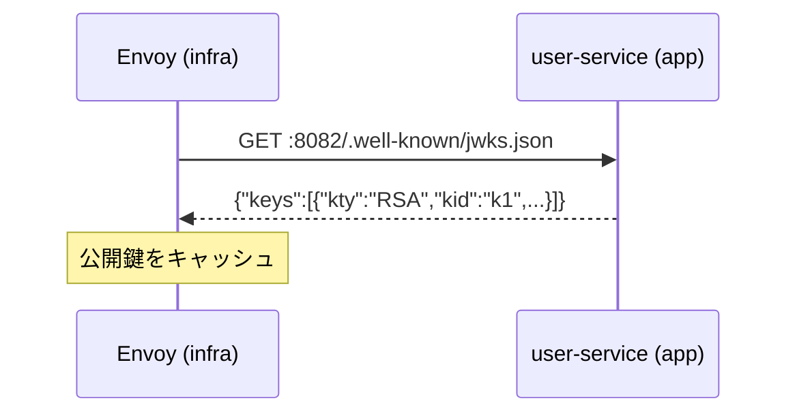
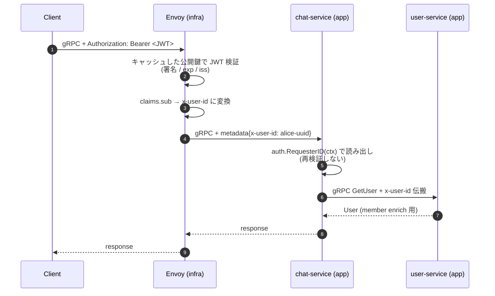

# Phase 1: user-service + chat-service (Room) 実装

---

## ディレクトリ構成 (Phase 1 完了時)

```
go-microservices-chat/
├── docs/
├── proto/                              # ★ Phase 1 で新規
│   ├── buf.yaml
│   ├── buf.gen.yaml
│   ├── user/v1/user.proto              # Register/Login/Refresh/GetUser/UpdateUser
│   └── chat/v1/chat.proto              # Room 系 RPC のみ (Message は Phase 2)
├── gen/go/                             # buf generate 出力
│   ├── user/v1/
│   └── chat/v1/
├── pkg/                                # ★ Phase 1 で新規
│   ├── auth/
│   │   ├── issuer.go                   # RS256 JWT Issuer (秘密鍵で署名、発行専用)
│   │   ├── jwks.go                     # JWKS HTTP Handler (公開鍵を JSON で配る)
│   │   └── context.go                  # auth.RequesterID(ctx) helper
│   └── interceptor/
│       └── logging.go                  # gRPC Logging Interceptor (リクエスト ID 注入)
├── services/
│   ├── user-service/                   # ★ Phase 1 で新規
│   │   ├── cmd/server/main.go          # gRPC :50051 + JWKS HTTP :8082
│   │   ├── internal/
│   │   │   ├── config/config.go
│   │   │   └── user/
│   │   │       ├── user.go             # エンティティ + ドメインエラー
│   │   │       ├── service.go          # Register/Login/Refresh/GetUser/UpdateUser
│   │   │       ├── repository.go       # Repository interface + PostgreSQL 実装
│   │   │       ├── repository_inmem.go # インメモリ実装 (テスト用)
│   │   │       ├── grpc_server.go      # proto↔domain 変換 + RPC ハンドラ
│   │   │       └── *_test.go
│   │   ├── migrations/
│   │   │   ├── 001_create_users.up.sql / down.sql
│   │   │   └── 002_create_refresh_tokens.up.sql / down.sql
│   │   └── go.mod
│   └── chat-service/                   # ★ Phase 1 で新規 (Room 部分のみ)
│       ├── cmd/server/main.go          # gRPC :50052
│       ├── internal/
│       │   ├── config/config.go
│       │   ├── room/
│       │   │   ├── room.go             # Room + RoomMember エンティティ
│       │   │   ├── service.go          # Create/Get/List/Search/Join/Leave/EnsureMember
│       │   │   ├── repository.go       # Repository interface + PostgreSQL 実装
│       │   │   ├── repository_inmem.go
│       │   │   └── *_test.go
│       │   ├── userclient/
│       │   │   ├── client.go           # user-service 呼び出し (member enrich)
│       │   │   └── fake.go             # テスト用 fake
│       │   └── grpc/
│       │       └── server.go           # ChatServiceServer (Room 部分のみ)
│       ├── migrations/
│       │   ├── 001_create_rooms.up.sql / down.sql
│       │   └── 002_create_room_members.up.sql / down.sql
│       └── go.mod
├── Makefile                            # ★ proto-gen / test
├── go.work                             # ★ 新規
└── README.md
```

> Phase 2 で realtime-service と Message 機能が追加される。Dockerfile は Phase 3 でまとめて書く。

---

## スコープ

Go Workspace 骨組みから始め、`pkg/auth/` (JWT **発行** + JWKS 配信 + RequesterID) → user-service (Register/Login/Refresh/GetUser/UpdateUser) → chat-service (Room CRUD + Join/Leave) まで実装する。**アプリ側で JWT 検証は行わない** — `x-user-id` メタデータを信じて読むだけ。テストは metadata を直接注入して行う。

### JWT に関する責務の切り分け

| 責務 | このフェーズでの扱い |
|------|-------------------|
| JWT **発行** (Login の返り値) | ✅ user-service `pkg/auth/issuer.go` で実装 |
| JWKS **配信** (公開鍵を HTTP で公開) | ✅ user-service `pkg/auth/jwks.go` で実装 |
| JWT **検証** (署名・期限・iss/aud) | ❌ 実装しない (infra リポジトリ側ゲートウェイの責務) |
| `x-user-id` を読む | ✅ `pkg/auth/context.go` の `RequesterID(ctx)` |

> bufconn テストでは `metadata.AppendToOutgoingContext(ctx, "x-user-id", "alice-uuid")` で直接注入する。実環境では infra 側 Envoyが Authorization ヘッダを検証して `x-user-id` を注入する。

---

## ステップ構成

| 部 | テーマ | ステップ |
|----|--------|----------|
| A | Go Workspace / Buf / proto 骨組み | 1〜2 |
| B | 共通パッケージ (`pkg/auth/` + `pkg/interceptor/`) | 3〜5 |
| C | user-service 実装 | 6〜8 |
| D | chat-service Room 部分の実装 | 9〜11 |

---

## A. Go Workspace / Buf / proto 骨組み

### ステップ 1: Go Workspace + Buf

- [ ] `go.work` 作成 (`use ./gen/go ./pkg ./services/user-service ./services/chat-service`)
- [ ] `pkg/` で `go mod init go-microservices-chat/pkg`
- [ ] `gen/go/` で `go mod init go-microservices-chat/gen/go`
- [ ] `proto/buf.yaml` / `proto/buf.gen.yaml`

**確認ポイント**: `go work sync` が通る、`buf lint` が通る。

---

### ステップ 2: proto 定義

- [ ] `proto/user/v1/user.proto`: Register / Login / Refresh / GetUser / UpdateUser (+ `google.api.http` アノテーション)
- [ ] `proto/chat/v1/chat.proto`: CreateRoom / GetRoom / ListRooms / SearchRooms / JoinRoom / LeaveRoom (Message 系はまだ書かない)
- [ ] `buf generate` で `gen/go/user/v1/` と `gen/go/chat/v1/`

**確認ポイント**: `user.pb.go` / `user_grpc.pb.go` / `chat.pb.go` / `chat_grpc.pb.go` が生成される。

---

## B. 共通パッケージ

### ステップ 3: `pkg/auth/issuer.go` (RS256 JWT Issuer)

```go
type Issuer struct {
    privateKey *rsa.PrivateKey
    keyID      string
}

func (i *Issuer) IssueAccessToken(userID, username string) (string, error) {
    token := jwt.NewWithClaims(jwt.SigningMethodRS256, Claims{
        UserID:   userID,
        Username: username,
        RegisteredClaims: jwt.RegisteredClaims{
            Issuer:    "chat-app",
            Subject:   userID,
            ExpiresAt: jwt.NewNumericDate(time.Now().Add(15 * time.Minute)),
        },
    })
    token.Header["kid"] = i.keyID
    return token.SignedString(i.privateKey)
}
```

- [ ] 実装 + ユニットテスト (発行した JWT のヘッダ / ペイロードを decode して検証)

**確認ポイント**: 発行されたトークンを [jwt.io](https://jwt.io/) に貼って RS256 として認識される。**検証側は infra 側 Envoyが担当するので、このリポジトリに Validator は実装しない**。

---

### ステップ 4: `pkg/auth/jwks.go` (JWKS HTTP Handler)

```go
func (h *JWKSHandler) ServeHTTP(w http.ResponseWriter, r *http.Request) {
    jwks := map[string]any{
        "keys": []map[string]any{
            {
                "kty": "RSA", "kid": h.keyID, "alg": "RS256", "use": "sig",
                "n": base64url(h.publicKey.N.Bytes()), "e": "AQAB",
            },
        },
    }
    json.NewEncoder(w).Encode(jwks)
}
```

- [ ] 実装 + ユニットテスト

**確認ポイント**: テストで JSON の形が合う (`kty`/`kid`/`alg`/`use`/`n`/`e`)。infra 側 Envoy (`remoteJWKS.uri`) がこの URL を起動時 1 回 fetch して公開鍵キャッシュに載せる前提。

---

### ステップ 5: `pkg/auth/context.go` (RequesterID) + `pkg/interceptor/logging.go`

```go
// pkg/auth/context.go
func RequesterID(ctx context.Context) (string, bool) {
    md, ok := metadata.FromIncomingContext(ctx)
    if !ok { return "", false }
    ids := md.Get("x-user-id")
    if len(ids) == 0 { return "", false }
    return ids[0], true
}
```

- [ ] `pkg/auth/context.go` 実装 + テスト
- [ ] `pkg/interceptor/logging.go`: slog で JSON ログ、リクエスト ID を ctx に注入、`authorization` ヘッダはマスク

**確認ポイント**: metadata 有無 2 ケースで `RequesterID` が正しく返る / Logging Interceptor が JSON を出す。

---

## C. user-service 実装

### ステップ 6: ドメイン + Repository (PostgreSQL + InMem)

- [ ] `internal/user/user.go`: `User` エンティティ + `ErrNotFound` / `ErrAlreadyExists`
- [ ] `internal/user/repository.go`: interface + PostgreSQL (`pgx` + `pgxpool`)
- [ ] `internal/user/repository_inmem.go`: テスト用 InMem
- [ ] `migrations/001_create_users.up.sql` + `002_create_refresh_tokens.up.sql`

**確認ポイント**: `repository_test.go` で **InMem 実装** がテーブル駆動テストで PASS。PostgreSQL 実装は infra repo で実際に走らせて検証する (このリポジトリでは DB を立てない)。

---

### ステップ 7: ビジネスロジック + gRPC ハンドラ

- [ ] `internal/user/service.go`: Register (bcrypt) / Login (GetByEmail → bcrypt 検証 → Issuer) / Refresh (ローテーション) / GetUser / UpdateUser (リソース所有者認可)
- [ ] `internal/user/grpc_server.go`: proto↔domain 変換 + エラーマッピング
- [ ] `UpdateUser` で `auth.RequesterID(ctx) != targetID` なら `PermissionDenied`

**確認ポイント**: bufconn テストで以下が通る:
- Register → Login で JWT が返る
- Login の JWT を [jwt.io](https://jwt.io/) で眺めると `sub=user-uuid`, `iss=chat-app`
- metadata に `x-user-id` を注入した bufconn コンテキストで GetUser / UpdateUser が通る
- 別 user の id で UpdateUser を呼ぶと `PermissionDenied`

---

### ステップ 8: `cmd/server/main.go` + Graceful Shutdown

- [ ] gRPC :50051 + JWKS HTTP :8082 を goroutine で同時起動
- [ ] `grpc.ChainUnaryInterceptor(interceptor.Logging(logger))`
- [ ] SIGTERM 捕捉 → `srv.GracefulStop()`
- [ ] 環境変数: `DATABASE_URL` / `JWT_PRIVATE_KEY` (PEM) / `JWT_KEY_ID`

**確認ポイント**: `go run` してプロセスが起動、SIGTERM で graceful に落ちる。DB / 疎通確認は infra repo 側でまとめて行う。

---

## D. chat-service Room 部分

### ステップ 9: chat-service 骨組み + Room ドメイン

- [ ] `services/chat-service/` を `go mod init`
- [ ] `internal/room/`: `room.go` + `service.go` (Create/Get/List/Search/Join/Leave/EnsureMember) + `repository.go` + `repository_inmem.go`
- [ ] `migrations/001_create_rooms.up.sql` + `002_create_room_members.up.sql`
- [ ] `messages.sender_id` の FK は張らない方針 (サービス境界を跨ぐため)

**確認ポイント**: `repository_test.go` が InMem で PASS。

---

### ステップ 10: `internal/grpc/server.go` + userclient

- [ ] `internal/grpc/server.go`: `ChatServiceServer` の Room 部分を実装 (Message は Phase 2 で `UnimplementedChatServiceServer` 由来の `Unimplemented` のままで OK)
- [ ] `internal/userclient/client.go`: `grpc.Dial(os.Getenv("USER_SERVICE_ADDR"))` で長寿命接続、`GetRoom` の member enrich に使う
- [ ] `internal/userclient/fake.go`: テスト用
- [ ] `GetRoom` で `x-user-id` を下流に metadata 伝搬 (`metadata.AppendToOutgoingContext`)

**確認ポイント**: bufconn + fake userclient で `CreateRoom` → `JoinRoom` → `GetRoom` が動く。

---

### ステップ 11: `cmd/server/main.go`

- [ ] gRPC :50052 起動
- [ ] 環境変数: `DATABASE_URL` / `USER_SERVICE_ADDR`
- [ ] Logging Interceptor / Graceful Shutdown

**確認ポイント**: `go run` でプロセスが起動、SIGTERM で graceful に落ちる。

---

## 成果物

- [ ] `go test ./...` が **DB / 他プロセス無しで** PASS (InMem Repository + fake userclient で)
- [ ] user-service の Login RPC が RS256 署名の JWT を返す
- [ ] user-service の `/.well-known/jwks.json` が公開鍵を JWKS 形式で返す (curl で確認可能)
- [ ] `x-user-id` metadata を注入した bufconn で GetUser / UpdateUser / Room 系が動く
- [ ] 他人の UpdateUser で `PermissionDenied` (リソース所有者認可)

### リクエスト処理のフロー (Phase 1 完了時のイメージ)

**事前準備** (Envoy 起動時 1 回 + 定期更新):



**リクエストごとの処理フロー**:



> **信頼境界**: JWT 検証はすべて Envoy 側。app サービスは `x-user-id` を信じて読むだけ。bufconn テストでは `metadata.AppendToOutgoingContext` で `x-user-id` を直接注入してこの境界より内側だけを検証する。
>
> Phase 1 では **実際の Envoy は立てない** (infra repo の範疇)。本リポジトリでは user-service / chat-service が bufconn テストで動くところまで。

---

## 次のフェーズ

[Phase 2: chat (Message) + realtime-service (WebSocket + Redis Pub/Sub)](./phase-2.md)
