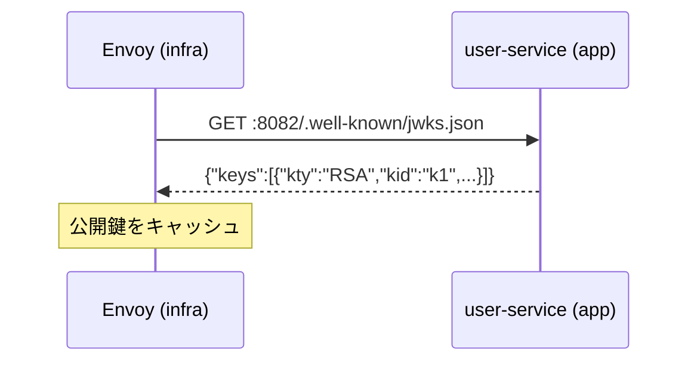
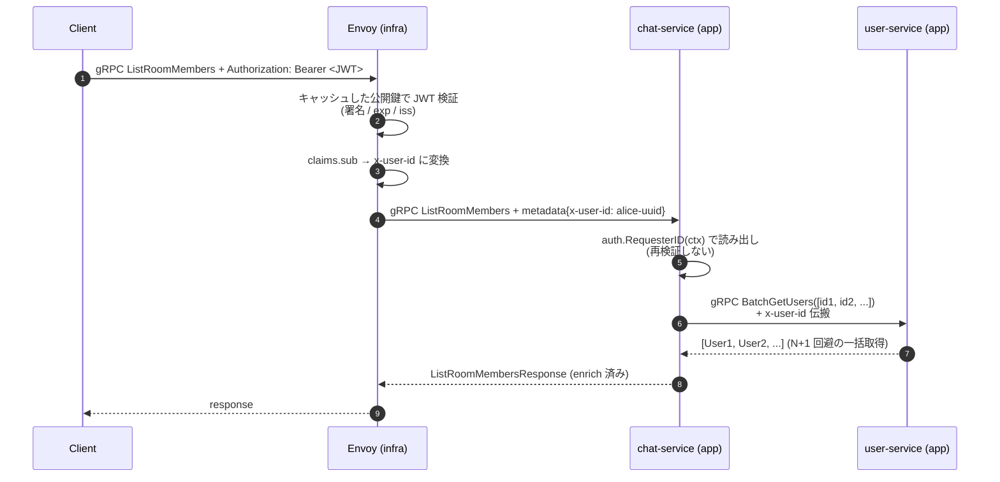

# Phase 1: user-service + chat-service (Room) 実装

---

## ディレクトリ構成 (Phase 1 完了時)

```
go-microservices-chat/
├── docs/
├── proto/                              # ★ Phase 1 で新規
│   ├── buf.yaml
│   ├── buf.gen.yaml
│   ├── user/v1/user.proto              # Register/Login/Refresh/GetMe/UpdateMe/GetUser (REST) + BatchGetUsers (内部)
│   └── chat/v1/chat.proto              # Room 系 RPC のみ (Message は Phase 2)
├── gen/go/                             # buf generate 出力
│   ├── user/v1/
│   └── chat/v1/
├── pkg/                                # ★ Phase 1 で新規
│   ├── auth/
│   │   ├── issuer.go                   # RS256 JWT Issuer (秘密鍵で署名、発行専用)
│   │   ├── jwks.go                     # JWKS HTTP Handler (公開鍵を JSON で配る)
│   │   └── context.go                  # auth.RequesterID(ctx) helper
│   └── interceptor/
│       └── logging.go                  # gRPC Logging Interceptor (リクエスト ID 注入)
├── services/
│   ├── user-service/                   # ★ Phase 1 で新規
│   │   ├── cmd/server/main.go          # gRPC :50051 + JWKS HTTP :8082
│   │   ├── internal/
│   │   │   ├── config/config.go
│   │   │   └── user/
│   │   │       ├── user.go             # エンティティ + ドメインエラー
│   │   │       ├── service.go          # Register/Login/Refresh/GetMe/UpdateMe/GetUser/BatchGetUsers
│   │   │       ├── repository.go       # Repository interface + PostgreSQL 実装
│   │   │       ├── repository_inmem.go # インメモリ実装 (テスト用)
│   │   │       ├── grpc.go             # GRPCAdapter (proto↔domain 変換 + RPC ハンドラ)
│   │   │       └── *_test.go
│   │   ├── migrations/
│   │   │   ├── 001_create_users.up.sql / down.sql
│   │   │   └── 002_create_refresh_tokens.up.sql / down.sql
│   │   └── go.mod
│   └── chat-service/                   # ★ Phase 1 で新規 (Room 部分のみ)
│       ├── cmd/server/main.go          # gRPC :50052
│       ├── internal/
│       │   ├── config/config.go
│       │   ├── room/
│       │   │   ├── room.go             # Room + RoomMember エンティティ
│       │   │   ├── service.go          # Create/Get/List/Search/Join/Leave/EnsureMember
│       │   │   ├── repository.go       # Repository interface + PostgreSQL 実装
│       │   │   ├── repository_inmem.go
│       │   │   ├── grpc.go             # GRPCAdapter (ChatServiceServer を単独で満たす)
│       │   │   └── *_test.go
│       │   └── userclient/
│       │       ├── client.go           # user-service 呼び出し (member enrich)
│       │       └── fake.go             # テスト用 fake
│       ├── migrations/
│       │   ├── 001_create_rooms.up.sql / down.sql
│       │   └── 002_create_room_members.up.sql / down.sql
│       └── go.mod
├── Makefile                            # ★ proto-gen / test
├── go.work                             # ★ 新規
└── README.md
```

> Phase 2 で realtime-service と Message 機能が追加される。Dockerfile は Phase 3 でまとめて書く。

---

## スコープ

Go Workspace 骨組みから始め、`pkg/auth/` (JWT **発行** + JWKS 配信 + RequesterID) → user-service (Register/Login/Refresh/GetMe/UpdateMe/GetUser) → chat-service (Room CRUD + Join/Leave) まで実装する。**アプリ側で JWT 検証は行わない** — `x-user-id` メタデータを信じて読むだけ。テストは metadata を直接注入して行う。

### API の画面マッピング方針

`/me` 系 (自分のプロフィール参照・更新) と他ユーザー参照を **gRPC レベルで別 RPC** に分ける:

| RPC | 用途 | REST 公開 |
|-----|------|----------|
| `GetMe` / `UpdateMe` | 画面 #7 (自分のプロフィール)。対象 ID は `x-user-id` から解決 | ✅ `/api/v1/users/me` |
| `GetUser(user_id)` | 画面 #8 (メンバー詳細モーダル) — 他人 **1 件** 取得 | ✅ `/api/v1/users/:id` |
| `BatchGetUsers([]user_ids)` | chat-service の `ListRoomMembers` メンバー一覧 enrich — 他人 **N 件** を 1 回で | ❌ (内部 RPC) |

これにより `/me` の表現で `user_id="me"` のようなマジックストリングが不要になり、`UpdateMe` は型レベルで「他人は触れない」ことが保証される (リソース所有者認可の実行時チェックが不要)。

### N+1 回避のバッチ

`ListRoomMembers` でメンバー一覧を enrich する時、各メンバーごとに `GetUser` を呼ぶと **メンバー数 N に比例して gRPC 呼び出しが増える (N+1 問題)**。user-service 側に `BatchGetUsers([]user_ids)` を用意し、chat-service は `ListRoomMembers` 内で ID を 1 配列にまとめて **1 回** で取得する。なお `GetRoom` は enrich 不要な軽量レスポンス (ヘッダのみ) なので、そもそも BatchGetUsers を呼ばない。

> Phase 2 の `GetMessages` は **メッセージ送信者の enrich をしない** 設計 (素の `sender_id` (UUID) のみ返す)。クライアント側で必要なら distinct な sender_id を集めて `BatchGetUsers` を別途叩くか、参加メンバー一覧 (`ListRoomMembers`) で取得済みの profile キャッシュを使う。MVP スコープに絞ったため。

### JWT に関する責務の切り分け

| 責務 | このフェーズでの扱い |
|------|-------------------|
| JWT **発行** (Login の返り値) | ✅ user-service `pkg/auth/issuer.go` で実装 |
| JWKS **配信** (公開鍵を HTTP で公開) | ✅ user-service `pkg/auth/jwks.go` で実装 |
| JWT **検証** (署名・期限・iss/aud) | ❌ 実装しない (infra リポジトリ側ゲートウェイの責務) |
| `x-user-id` を読む | ✅ `pkg/auth/context.go` の `RequesterID(ctx)` |

> bufconn テストでは `metadata.AppendToOutgoingContext(ctx, "x-user-id", "alice-uuid")` で直接注入する。実環境では infra 側 Envoyが Authorization ヘッダを検証して `x-user-id` を注入する。

---

## ステップ構成

| 部 | テーマ | ステップ |
|----|--------|----------|
| A | Go Workspace / Buf / proto 骨組み | 1〜2 |
| B | 共通パッケージ (`pkg/auth/` + `pkg/interceptor/`) | 3〜5 |
| C | user-service 実装 | 6〜8 |
| D | chat-service Room 部分の実装 | 9〜11 |

---

## A. Go Workspace / Buf / proto 骨組み

### ステップ 1: Go Workspace + Buf

- [ ] `go.work` 作成 (`use ./gen/go ./pkg ./services/user-service ./services/chat-service`)
- [ ] `pkg/` で `go mod init go-microservices-chat/pkg`
- [ ] `gen/go/` で `go mod init go-microservices-chat/gen/go`
- [ ] `proto/buf.yaml` / `proto/buf.gen.yaml`

**確認ポイント**: `go work sync` が通る、`buf lint` が通る。

---

### ステップ 2: proto 定義

- [ ] `proto/user/v1/user.proto`:
  - REST 公開 (`google.api.http` あり): Register / Login / Refresh / GetMe / UpdateMe / GetUser
  - 内部 RPC (アノテーションなし): BatchGetUsers([]user_ids)
- [ ] `proto/chat/v1/chat.proto`:
  - `Room` はヘッダ軽量情報 (id, name, created_by, member_count, created_at) のみ。メンバー配列は持たない
  - `RoomMember` に `display_name` / `avatar_url` を追加 (ListRoomMembers のレスポンスで enrich)
  - `ListRoomMembers(room_id, limit, cursor)` を追加 (画面 #9 用)
- [ ] `proto/chat/v1/chat.proto`: CreateRoom / GetRoom (軽量) / ListRooms / SearchRooms / JoinRoom / LeaveRoom / ListRoomMembers (enrich 付き) (Message 系はまだ書かない)
- [ ] `buf generate` で `gen/go/user/v1/` と `gen/go/chat/v1/`

**確認ポイント**: `user.pb.go` / `user_grpc.pb.go` / `chat.pb.go` / `chat_grpc.pb.go` が生成される。

---

## B. 共通パッケージ

### ステップ 3: `pkg/auth/issuer.go` (RS256 JWT Issuer)

RSA 秘密鍵と key ID を保持する `Issuer` 型を用意し、`IssueAccessToken(userID, username)` で RS256 署名済み JWT を返す。クレームは `sub=userID` / `iss=chat-app` / 短い有効期限 (15 分程度)、ヘッダには `kid` を入れて Envoy 側 JWKS から鍵を引けるようにする。**Validator は持たない** (検証は infra 側 Envoy 責務)。

- [ ] 実装 + ユニットテスト (発行した JWT のヘッダ / ペイロードを decode して検証)

**確認ポイント**: 発行されたトークンを [jwt.io](https://jwt.io/) に貼って RS256 として認識され、`sub` / `iss` / `kid` が想定通り入っている。

---

### ステップ 4: `pkg/auth/jwks.go` (JWKS HTTP Handler)

公開鍵と key ID を保持する `JWKSHandler` を `http.Handler` として実装し、`/.well-known/jwks.json` で JWKS 形式の JSON を返す。中身は `keys` 配列に 1 要素 (`kty=RSA` / `kid` / `alg=RS256` / `use=sig` / `n` (modulus を base64url) / `e=AQAB`) を入れた素直なレスポンス。Envoy が起動時にこの URL を fetch して公開鍵キャッシュに載せる前提。

- [ ] 実装 + ユニットテスト

**確認ポイント**: テストで JSON の形が合う (`kty`/`kid`/`alg`/`use`/`n`/`e` が全部入っている)。

---

### ステップ 5: `pkg/auth/context.go` (RequesterID) + `pkg/interceptor/logging.go`

`RequesterID(ctx)` は incoming metadata から `x-user-id` を 1 つ取り出して `(id, ok)` で返すだけのヘルパ。metadata が無い / `x-user-id` が無い場合は `ok=false`。**署名検証は一切しない** (Envoy が検証済みで注入してくる前提)。呼び出し側はこの bool を見て `Unauthenticated` を返す。

`pkg/interceptor/logging.go` は gRPC Unary Interceptor で、ctx にリクエスト ID を注入し、slog で JSON 形式の access log を出す。`authorization` ヘッダはマスクしてログに残さない。

- [ ] `pkg/auth/context.go` 実装 + テスト
- [ ] `pkg/interceptor/logging.go` 実装

**確認ポイント**: metadata 有無 2 ケースで `RequesterID` が正しく返る / Logging Interceptor が JSON を出す。

---

## C. user-service 実装

### ステップ 6: ドメイン + Repository (PostgreSQL + InMem)

- [ ] `internal/user/user.go`: `User` エンティティ + `ErrNotFound` / `ErrAlreadyExists`
- [ ] `internal/user/repository.go`: interface + PostgreSQL (`pgx` + `pgxpool`)
- [ ] `internal/user/repository_inmem.go`: テスト用 InMem
- [ ] `migrations/001_create_users.up.sql` + `002_create_refresh_tokens.up.sql`

**確認ポイント**: `service_test.go` (Service 経由で InMem 実装を回す) と `grpc_test.go` (bufconn) がテーブル駆動テストで PASS。Repository 単独のテストファイルは作らず、Service 層から InMem を介して挙動検証する設計。PostgreSQL 実装は本リポジトリ Phase 4 の compose や infra repo で実際の PG を立てて疎通確認する。

---

### ステップ 7: ビジネスロジック + gRPC ハンドラ

- [ ] `internal/user/service.go`: Register (bcrypt) / Login (GetByEmail → bcrypt 検証 → Issuer) / Refresh (ローテーション) / GetMe / UpdateMe / GetUser / BatchGetUsers
- [ ] `internal/user/repository.go`: `GetUsersByIDs([]ids)` を追加 (`WHERE id = ANY($1)` で 1 クエリ)
- [ ] `internal/user/grpc.go`: `GRPCAdapter` 型 + proto↔domain 変換 + エラーマッピング (UnimplementedUserServiceServer を embed)
- [ ] `GetMe` / `UpdateMe` は `auth.RequesterID(ctx)` から対象 ID を解決する (引数に取らない)
- [ ] `x-user-id` が無い状態で `GetMe` / `UpdateMe` を呼ぶと `Unauthenticated`
- [ ] `BatchGetUsers` は存在しない ID を結果から欠落させる (部分成功を許容、エラーにしない)

**確認ポイント**: bufconn テストで以下が通る:
- Register → Login で JWT が返る
- Login の JWT を [jwt.io](https://jwt.io/) で眺めると `sub=user-uuid`, `iss=chat-app`
- metadata に `x-user-id` を注入した bufconn コンテキストで GetMe / UpdateMe / GetUser が通る
- `x-user-id` 無しで `GetMe` を呼ぶと `Unauthenticated`

---

### ステップ 8: `cmd/server/main.go` + Graceful Shutdown

- [ ] gRPC :50051 + JWKS HTTP :8082 を goroutine で同時起動
- [ ] `grpc.ChainUnaryInterceptor(interceptor.Logging(logger))`
- [ ] SIGTERM 捕捉 → `srv.GracefulStop()`
- [ ] 環境変数: `DATABASE_URL` / `JWT_PRIVATE_KEY` (PEM) / `JWT_KEY_ID`

**確認ポイント**: `go run` してプロセスが起動、SIGTERM で graceful に落ちる。DB / 疎通確認は infra repo 側でまとめて行う。

---

## D. chat-service Room 部分

### ステップ 9: chat-service 骨組み + Room ドメイン

- [ ] `services/chat-service/` を `go mod init`
- [ ] `internal/room/`: `room.go` + `service.go` (Create/Get/List/Search/Join/Leave/EnsureMember) + `repository.go` + `repository_inmem.go`
- [ ] `migrations/001_create_rooms.up.sql` + `002_create_room_members.up.sql`
- [ ] `messages.sender_id` の FK は張らない方針 (サービス境界を跨ぐため)

**確認ポイント**: `service_test.go` で InMem 実装上の Service 経由検証 (CreateRoom 自動 join、ListMyRooms メンバーシップフィルタ、SearchRooms 部分一致 等) が PASS。

---

### ステップ 10: `internal/room/grpc.go` + userclient

- [ ] `internal/room/grpc.go`: `room.GRPCAdapter` が `ChatServiceServer` の Room 部分を実装 (Message は Phase 2 で `UnimplementedChatServiceServer` 由来の `Unimplemented` のままで OK)
- [ ] `GetRoom` 実装: **enrich しない軽量レスポンス** (id, name, created_by, member_count, created_at)。メンバー数は `CountMembers` で軽く取る
- [ ] `ListRoomMembers` 実装:
  - `room.Service.ListRoomMembers` でメンバー行を取得
  - メンバー ID を集めて `userClient.BatchGetUsers([]ids)` を **1 回** 呼ぶ (N+1 回避)
  - 結果を `user_id → Profile` の map にして `RoomMember.display_name` / `avatar_url` に差し込む
  - profile が無い member は user_id と joined_at のみ返す (部分成功)
- [ ] `internal/userclient/client.go`: `grpc.Dial(os.Getenv("USER_SERVICE_ADDR"))` で長寿命接続。`GetUser` と `BatchGetUsers` を expose
- [ ] `internal/userclient/fake.go`: テスト用。`Set(*Profile)` でシード、`GetUser` / `BatchGetUsers` どちらでも引ける
- [ ] `auth.PropagateRequester(ctx)` で `x-user-id` を下流 (user-service) に伝搬

**確認ポイント**: bufconn + fake userclient で以下が通る:
- `CreateRoom` → `JoinRoom` → `GetRoom` が動く (レスポンスは member_count のみ、メンバー配列は無い)
- `ListRoomMembers` のレスポンスで各 member に `display_name` / `avatar_url` が入っている (fake に profile を seed してあれば)
- profile が無い member は user_id のみ返る (部分成功)

---

### ステップ 11: `cmd/server/main.go`

- [ ] gRPC :50052 起動
- [ ] 環境変数: `DATABASE_URL` / `USER_SERVICE_ADDR`
- [ ] Logging Interceptor / Graceful Shutdown

**確認ポイント**: `go run` でプロセスが起動、SIGTERM で graceful に落ちる。

---

## 成果物

- [ ] `go test ./...` が **DB / 他プロセス無しで** PASS (InMem Repository + fake userclient で)
- [ ] user-service の Login RPC が RS256 署名の JWT を返す
- [ ] user-service の `/.well-known/jwks.json` が公開鍵を JWKS 形式で返す (curl で確認可能)
- [ ] `x-user-id` metadata を注入した bufconn で GetMe / UpdateMe / GetUser / Room 系が動く
- [ ] `x-user-id` 無しで `GetMe` / `UpdateMe` を呼ぶと `Unauthenticated` (他人を書き換える経路自体が存在しない)

### リクエスト処理のフロー (Phase 1 完了時のイメージ)

**事前準備** (Envoy 起動時 1 回 + 定期更新):



**リクエストごとの処理フロー**:



> **信頼境界**: JWT 検証はすべて Envoy 側。app サービスは `x-user-id` を信じて読むだけ。bufconn テストでは `metadata.AppendToOutgoingContext` で `x-user-id` を直接注入してこの境界より内側だけを検証する。
>
> Phase 1 では **実際の Envoy は立てない** (infra repo の範疇)。本リポジトリでは user-service / chat-service が bufconn テストで動くところまで。

---

## 次のフェーズ

[Phase 2: chat (Message) + realtime-service (WebSocket + Redis Pub/Sub)](./phase-2.md)
