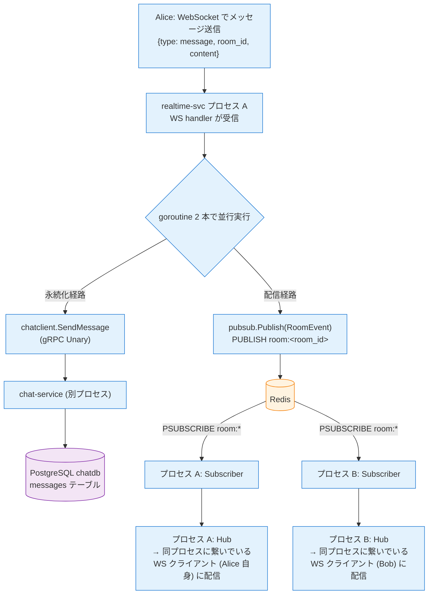

# Phase 2: chat (Message) + realtime-service (WebSocket + Redis Pub/Sub)

---

## ディレクトリ構成 (Phase 2 完了時)

```
go-microservices-chat/
├── proto/
│   ├── user/v1/user.proto              # Phase 1 から
│   └── chat/v1/chat.proto              # ★ SendMessage / GetMessages 追加
├── gen/go/                             # buf generate で再生成
├── pkg/                                # Phase 1 から (変更なし)
├── services/
│   ├── user-service/                   # Phase 1 完了 (変更なし)
│   ├── chat-service/
│   │   ├── internal/
│   │   │   ├── room/                   # Phase 1 から (grpc.go から UnimplementedChatServiceServer の embed を外す)
│   │   │   ├── message/                # ★ Phase 2 で新規
│   │   │   │   ├── message.go          # Message エンティティ + ドメインエラー
│   │   │   │   ├── service.go          # Send / GetMessages (cursor-based)
│   │   │   │   ├── repository.go       # Repository interface + PostgreSQL 実装
│   │   │   │   ├── repository_inmem.go
│   │   │   │   ├── grpc.go             # message.GRPCAdapter (SendMessage / GetMessages)
│   │   │   │   └── *_test.go           # service_test.go (InMem) + grpc_test.go (bufconn)
│   │   │   └── grpc/                   # ★ Phase 2 で新規 (合流層)
│   │   │       └── server.go           # Server: room.GRPCAdapter + message.GRPCAdapter を named field で保持し forward
│   │   ├── migrations/
│   │   │   └── 003_create_messages.up.sql / down.sql  # ★ 追加
│   │   └── ...
│   └── realtime-service/               # ★ Phase 2 で新規
│       ├── cmd/server/main.go          # WebSocket :8081 + Redis 接続 + Hub 起動 + chat-svc クライアント
│       ├── internal/
│       │   ├── config/config.go        # REDIS_ADDR / CHAT_SERVICE_ADDR / HTTP_ADDR を env から読む
│       │   ├── hub/
│       │   │   ├── hub.go              # Register / Unregister / LocalBroadcast (goroutine + channel)
│       │   │   ├── client.go           # 1 接続 = 1 Client (read/write goroutine)
│       │   │   └── *_test.go
│       │   ├── pubsub/
│       │   │   ├── pubsub.go           # Publisher / Subscriber interface + RoomEvent
│       │   │   ├── redis.go            # Redis 実装: PUBLISH / PSUBSCRIBE "room:*"
│       │   │   ├── inmem.go            # InMem 実装 (Go channel、Redis 不要でテスト用)
│       │   │   └── inmem_test.go       # InMem 実装で go test PASS (Redis 実装は infra repo or Phase 4 compose で疎通)
│       │   ├── chatclient/
│       │   │   ├── client.go           # chat-svc.SendMessage で永続化依頼
│       │   │   └── fake.go             # テスト用 fake (Calls() で履歴記録)
│       │   └── ws/
│       │       ├── handler.go          # HTTP Upgrade → Client 登録 → 読み取りループ → chat-svc + PUBLISH
│       │       ├── handler_test.go     # httptest + coder/websocket Dial で end-to-end
│       │       └── protocol.go         # WS メッセージ型 (Inbound: type=message のみ / Outbound: type=message or error)
│       └── go.mod
└── Makefile                            # run-realtime 追加
```

> Dockerfile は Phase 3 でまとめて作成する。K8s / Envoy ルート / Rate Limit / Transcoder 等は **infra リポジトリ側の責務** なのでここには出てこない。

---

## スコープ

Phase 1 の基盤に乗せる形で (a) chat-service に Message 機能、(b) realtime-service を丸ごと (WebSocket + Hub + Redis Pub/Sub) を実装する。**Pub/Sub を最初から採用** するのがポイント: 単一プロセスでも Pub/Sub を通す設計にしておけば、infra 側で複数インスタンスに増やした時にコードを 1 行も変えずに fan-out が成立する。

**前提**: Phase 1 完了 (user-service + chat-service の Room 部分が動く)。

---

## ステップ構成

| 部 | テーマ | ステップ |
|----|--------|----------|
| A | chat-service の Message 機能 | 1〜3 |
| B | realtime-service 実装 | 4〜7 |
| C | 2 プロセス Pub/Sub 検証 | 8 |

---

## A. chat-service の Message 機能

### ステップ 1: proto 拡張 + コード再生成

- [ ] `proto/chat/v1/chat.proto` に `SendMessage` / `GetMessages` を追加
- [ ] `SendMessage` は `google.api.http` を付けない (realtime-svc から gRPC でしか呼ばれない、REST 公開しない)
- [ ] `GetMessages` は `google.api.http` で GET `/api/v1/rooms/{room_id}/messages`
- [ ] `buf generate`

**確認ポイント**: `gen/go/chat/v1/` が再生成される。

---

### ステップ 2: Message ドメイン

- [ ] `internal/message/message.go` + `service.go` + `repository.go` + `repository_inmem.go`
- [ ] **`auth.RequesterID(ctx)` と `SendMessageRequest.SenderID` の一致確認は GRPCAdapter 側 (ステップ 3) で行う**。Service 自身は受け取った senderID を信用して INSERT する責務分担
- [ ] `Service.Send`: 引数で受け取った `(roomID, senderID, content)` でドメイン Message を生成して Repository に INSERT
- [ ] `Service.GetMessages`: cursor-based pagination (`(created_at, id)` のタプルを base64(JSON) でエンコード、limit+1 件 fetch して末尾を切るスタイルで `next_cursor` を返す)
- [ ] `migrations/003_create_messages.up.sql` (FK は張らない、`sender_id` は UUID で保持。INDEX は `(room_id, created_at DESC, id DESC)` で cursor pagination を高速化)

**確認ポイント**: `service_test.go` で InMem 実装上の `Send` / `GetMessages` (新着順 / pagination / cursor 不正) がテーブル駆動テストで PASS。

---

### ステップ 3: Message GRPCAdapter 新設 + `internal/grpc/` 合流層

Phase 1 では `room.GRPCAdapter` が `ChatServiceServer` を単独で満たしていたが、Phase 2 で Message RPC が加わるので構造を変える:

1. `internal/message/grpc.go` に `message.GRPCAdapter` を新設 (SendMessage / GetMessages)
2. `room/grpc.go` から `UnimplementedChatServiceServer` embed を外す (合流層に移す)
3. `internal/grpc/server.go` を新設し、両アダプタを **named field で保持して各 RPC を forward** する `Server` を置く

`message.GRPCAdapter` は message Service と room Service の 2 つを持つ。`SendMessage` ハンドラは ① `auth.RequesterID(ctx)` で送信者を取得 (無ければ `Unauthenticated`) ② `rooms.EnsureMember(roomID, senderID)` で **横断認可** (Room ↔ Message を結ぶ唯一の箇所、非メンバーなら `PermissionDenied`) ③ `messages.Send(...)` で永続化、の順で動く。`GetMessages` は cursor を decode して Service に委譲するだけ。

`internal/grpc/server.go` の `Server` は `*room.GRPCAdapter` と `*message.GRPCAdapter` を named field で保持し、9 個の RPC を 1 行ずつ対応するアダプタに forward する。`UnimplementedChatServiceServer` の embed はこの `Server` だけに置いて、将来 RPC が増えた時のデフォルトをここで吸収する。

> **なぜ struct embedding (フィールド名なし埋め込み) で済まさないか**: 両アダプタを `*room.GRPCAdapter` + `*message.GRPCAdapter` として無名で並べると、Go は埋め込みフィールド名を「型の simple name」 (パッケージ名を除いた最後の識別子) として解決するため、両方とも `GRPCAdapter` という同名フィールドになり duplicate field でコンパイルエラー。よって named field + 明示 forward が唯一の素直な書き方になる。

- [ ] `room.GRPCAdapter` から `chatv1.UnimplementedChatServiceServer` embed を外す
- [ ] `internal/message/grpc.go` に `message.GRPCAdapter` を実装 (SendMessage / GetMessages + mapError)
- [ ] `internal/grpc/server.go` で named field 保持 + 9 RPC の forward を書く
- [ ] `cmd/server/main.go` で両アダプタを `chatgrpc.NewServer(...)` に渡して `RegisterChatServiceServer` する

**確認ポイント**: bufconn で `CreateRoom` → `JoinRoom` → `SendMessage` → `GetMessages` が通る。`x-user-id` 未注入や非メンバーで `Unauthenticated` / `PermissionDenied`。

---

## B. realtime-service 実装

### ステップ 4: 骨組み + Hub

- [ ] `services/realtime-service/` を `go mod init`
- [ ] `go.work` に `./services/realtime-service` を追加
- [ ] `internal/hub/hub.go`: Register / Unregister / LocalBroadcast を select で回す 1 goroutine
- [ ] `internal/hub/client.go`: 読み取り / 書き込み goroutine ペア

`Hub` は `room_id → set of *Client` を保持する純メモリ構造で、`register` / `unregister` / `broadcast` / `stop` の 4 つのチャネルを 1 本の goroutine (`Run`) で `select` する。状態は単一 goroutine からしか触らないのでロック不要。

- **register**: room の map が無ければ作って Client を追加
- **unregister**: 同じ Client を 2 回 close しないよう、メンバーシップを確認してから `delete` + `close(send)`
- **broadcast**: 該当 room の全 Client に `c.send <- payload` するが、**`select { case ... default: }` で non-blocking 送信**。バッファ満杯の slow client は drop して Hub 全体を止めない (1 人遅い接続のせいで部屋全員が詰まらないようにする)
- **stop**: `Run` を抜ける

**確認ポイント**: `hub_test.go` の以下 3 シナリオが PASS:
- 同 room の購読者全員に payload が届く / 別 room の購読者には届かない
- `Unregister` で send channel が close される (range で抜けられる)
- バッファ満杯の Client があっても Hub が止まらず他 Client には届く (drop 動作)

---

### ステップ 5: Pub/Sub (interface + Redis + InMem)

- [ ] `internal/pubsub/pubsub.go`: `Publisher` / `Subscriber` interface
- [ ] `internal/pubsub/redis.go`: `go-redis` で `PUBLISH` / `PSUBSCRIBE "room:*"`
- [ ] `internal/pubsub/inmem.go`: Go channel ベース (Redis 無しで Hub のテストが書ける)
- [ ] Subscriber が受信イベントを Hub の broadcast に流す

公開する型は `RoomEvent{ RoomID, Payload []byte }` の 1 つと、`Publisher` (`Publish(ctx, ev) error`) / `Subscriber` (`Subscribe(ctx, onMessage func(RoomEvent)) error`) の 2 つの interface。`Subscribe` は ctx Done か致命エラーまでブロックする契約で、main 側で別 goroutine から呼び出す。

Redis 実装の `Publish` は `room:<room_id>` チャネルに payload を流すだけ。`Subscribe` は `PSUBSCRIBE "room:*"` で全 room を 1 接続で購読し、ループ内で `ctx.Done()` とメッセージ受信を select。受信時はチャネル名から `room:` prefix を剥がして `RoomEvent` を組み立て、`onMessage` コールバックに渡す (これが Hub の broadcast に繋がる)。

InMem 実装は Go channel ベースで Redis を立てずに同等の挙動を提供し、`go test ./...` を docker 無しで通すために存在する。

**確認ポイント**: `inmem_test.go` が PASS (`go test ./...` が Redis 無しで通る)。Redis 実装は本リポジトリ Phase 4 の compose、または手動で `docker run redis:7-alpine` を立てて Phase 2 ステップ 8 のクロスプロセス検証で疎通させる。

---

### ステップ 6: WebSocket ハンドラ + chat-svc クライアント

- [ ] `internal/ws/protocol.go`: `Inbound` (Type, Content) / `Outbound` (Type, ID, RoomID, SenderID, Content, CreatedAt, Code, Message) / 定数 `TypeMessage = "message"` / `TypeError = "error"`。**`join` 型は持たない** (1 接続 = 1 room、URL クエリで確定するため)
- [ ] `internal/ws/handler.go`: HTTP Upgrade → Hub に Client 登録 → 読み取りループ。`?room_id=` query 必須、`x-user-id` ヘッダ (Envoy 注入) or query (CLI 補助) で認証ユーザー解決
- [ ] `internal/chatclient/client.go`: `grpc.NewClient(os.Getenv("CHAT_SERVICE_ADDR"))` で長寿命接続。`SendMessage(ctx, senderID, roomID, content)` のシンプルな wrapper にして proto 型は外に漏らさない
- [ ] `internal/chatclient/fake.go`: 呼び出し履歴を `Calls()` で取り出せるテスト用 fake
- [ ] WS 受信時に **goroutine で並行実行**: (a) chat-svc.SendMessage / (b) Redis PUBLISH

WS 受信ハンドラ (`HandleMessage`) は受信内容から `Outbound` を組み立てて JSON シリアライズした後、**2 本の goroutine を並行に起動**する:

- **(a) 永続化**: `chatclient.SendMessage` を fire-and-forget で呼ぶ。専用の short timeout (5s) を持つ ctx を新しく作って渡す (WS 接続の ctx をそのまま使うと接続が切れた瞬間に永続化も中断するため、独立した `context.WithTimeout(context.Background(), 5s)` にする)。失敗したら slog.Error でログを出すだけで、配信側は止めない。chatclient が outgoing metadata に `x-user-id` を詰めて chat-svc に伝搬する
- **(b) 配信**: `pubsub.Publish(RoomEvent{RoomID, Payload})` で Redis に投げる。同プロセスの Subscriber が自分の PUBLISH も受け取って Hub 経由で配信するため、**送信者自身への echo もこの経路で実現** (handler から直接 Hub に書き込まない)。これによりプロセス数が 1 でも N でも経路が変わらない

永続化と配信を直列にすると DB 書き込みのレイテンシが他参加者のリアルタイム配信を遅らせるが、並行にすることで Bob 側はほぼ即座に Alice のメッセージを受け取れる。

**確認ポイント**: `handler_test.go` で httptest + coder/websocket Dial の end-to-end (受信メッセージが永続化呼び出し + Pub/Sub Publish の両方に流れる / Subscriber 経由で接続中の WS クライアントに届く / `x-user-id` 欠落で 401 / `room_id` 欠落で 400) が PASS。**アプリ側は JWT 検証しない** — WS Upgrade 時の `x-user-id` ヘッダを読むだけ (実環境では Envoy が注入する)。

---

### ステップ 7: `cmd/server/main.go`

- [ ] WebSocket :8081 起動 (`http.ListenAndServe`)
- [ ] Redis 接続 + Hub 起動 + Subscriber 起動
- [ ] SIGTERM で graceful shutdown (活きている WebSocket を close してから Redis 接続を閉じる順序)
- [ ] 環境変数: `REDIS_ADDR` / `CHAT_SERVICE_ADDR`

**確認ポイント**: `go run` でプロセスが起動、SIGTERM で graceful に落ちる。

---

## C. 2 プロセス Pub/Sub 検証 (infra repo が無くても手元で試す最短手順)

### ステップ 8: Redis 1 個立てて realtime 2 プロセスで検証

Redis と 2 つの realtime-service プロセスを手元で立てて、**プロセス境界を跨いで Pub/Sub が機能する** ことを確認する。

**chat-service は起動しなくて良い**: 永続化呼び出し (`chatclient.SendMessage`) は handler 内で fire-and-forget な goroutine で走るので、失敗しても WS 配信経路には影響しない。Step 8 の検証目的 = 「**プロセス間配信**」だけなので chat-service は不要。`CHAT_SERVICE_ADDR` には dummy 値を入れておけば起動できる。

ターミナルを 5 つ用意する: ①Redis ②realtime A ③realtime B ④wscat (Alice) ⑤wscat (Bob)。

```bash
# 事前: wscat を入れる (1 回だけ。お好みで websocat でも可)
npm install -g wscat

# ① Redis (--rm 付きなので Ctrl+C でコンテナごと消える)
docker run --rm -p 6379:6379 --name chat-redis redis:7-alpine

# ② realtime-service プロセス A (HTTP_ADDR=:8081)
REDIS_ADDR=localhost:6379 CHAT_SERVICE_ADDR=localhost:50052 \
HTTP_ADDR=:8081 \
go run ./services/realtime-service/cmd/server

# ③ realtime-service プロセス B (ポートだけずらす)
REDIS_ADDR=localhost:6379 CHAT_SERVICE_ADDR=localhost:50052 \
HTTP_ADDR=:8082 \
go run ./services/realtime-service/cmd/server

# ④ Alice の WS (プロセス A 経由)
#   room_id query は必須 (ハンドラが 1 接続 = 1 room の前提なので、未指定だと 400)。
#   x-user-id ヘッダは Envoy 注入の代わりに dev 用に直接付ける。
wscat -c "ws://localhost:8081/ws?room_id=room-1" -H "x-user-id: alice-uuid"

# ⑤ Bob の WS (プロセス B 経由)
wscat -c "ws://localhost:8082/ws?room_id=room-1" -H "x-user-id: bob-uuid"
```

**送信して検証**: Alice 側 (ターミナル ④) のプロンプト `>` で以下を貼って Enter。

```json
{"type":"message","content":"hi from alice"}
```

**確認ポイント**: Alice 自身 (`④`) と Bob (`⑤`) の **両方** に同じ payload が届く。Bob は別プロセスに繋がっているので、これが「**Redis Pub/Sub で複数インスタンス跨ぎの fan-out が成立している**」一番重要な検証。

```
< {"type":"message","room_id":"room-1","sender_id":"alice-uuid","content":"hi from alice","created_at":"..."}
```

Redis に流れている PUBLISH を直接覗きたければ、別ターミナルで `docker exec -it chat-redis redis-cli MONITOR`。

> これ以上の E2E (ゲートウェイ経由で JWT 付き / 本物の DB / 全コンポーネント連携) は **本リポジトリの Phase 4 (`compose.yaml` + `envoy.yaml`)** で組む。本番向け K8s / NetworkPolicy / Helm 等は infra リポジトリ側の責務。

---

## 成果物

- [ ] `go test ./...` が **Redis / 他プロセス無しで** PASS (InMem pubsub + fake chatclient で完結)
- [ ] chat-service で `SendMessage` / `GetMessages` が bufconn で動く
- [ ] realtime-service が `go run` で WebSocket :8081 を受け付ける
- [ ] Redis + 2 プロセスの手元検証で、**プロセス跨ぎの配信が Redis Pub/Sub 経由で機能する** (ステップ 8)

### メッセージ送信処理のフロー (Phase 2 完了時のイメージ)

**Alice が realtime-svc プロセス A に接続、Bob が realtime-svc プロセス B に接続している状況での送信フロー**:



**このフローの肝**:

- **永続化と配信を goroutine で並行実行** → Alice の送信遅延を最小化 (chat-service の書き込み完了を待たずに Bob に届く)
- **PUBLISH 先は Redis 1 点集中** → プロセス数が 1 でも N でも PUBLISH する側のコードは同じ
- **Subscriber は各プロセスで独立** → 新しいプロセスを立ち上げた瞬間から自動で配信が届く (Go コード変更不要)
- **chat-service は配信に関与しない** → 永続化専任。リアルタイム性の責務から完全に分離

> この「最初から Redis 通し」の設計で、infra 側でプロセスを 1 → 2 → N に増やしても **app のコードは 1 行も変わらない**。これが Phase 2 で Redis Pub/Sub を素直に入れる最大の理由。

---

## 前のフェーズ / 次のフェーズ

- 前: [Phase 1: user-service + chat-service (Room)](./phase-1.md)
- 次: [Phase 3: Dockerfile + イメージビルド](./phase-3.md)
