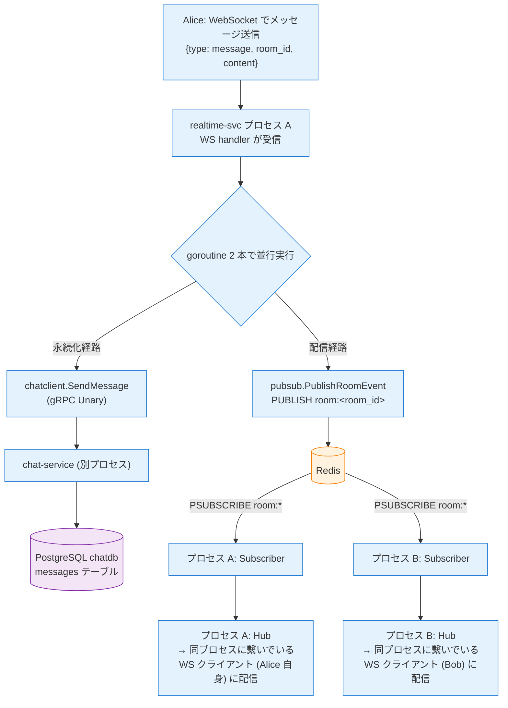

# Phase 2: chat (Message) + realtime-service (WebSocket + Redis Pub/Sub)

---

## ディレクトリ構成 (Phase 2 完了時)

```
go-microservices-chat/
├── proto/
│   ├── user/v1/user.proto              # Phase 1 から
│   └── chat/v1/chat.proto              # ★ SendMessage / GetMessages 追加
├── gen/go/                             # buf generate で再生成
├── pkg/                                # Phase 1 から (変更なし)
├── services/
│   ├── user-service/                   # Phase 1 完了 (変更なし)
│   ├── chat-service/
│   │   ├── internal/
│   │   │   ├── room/                   # Phase 1 から
│   │   │   └── message/                # ★ Phase 2 で新規
│   │   │       ├── message.go          # Message エンティティ + ドメインエラー
│   │   │       ├── service.go          # Send / GetMessages (cursor-based)
│   │   │       ├── repository.go       # Repository interface + PostgreSQL 実装
│   │   │       ├── repository_inmem.go
│   │   │       └── *_test.go
│   │   ├── migrations/
│   │   │   └── 003_create_messages.up.sql / down.sql  # ★ 追加
│   │   └── ...
│   └── realtime-service/               # ★ Phase 2 で新規
│       ├── cmd/server/main.go          # WebSocket :8081 + Redis 接続 + Hub 起動 + chat-svc クライアント
│       ├── internal/
│       │   ├── config/config.go        # REDIS_ADDR / CHAT_SERVICE_ADDR を env から読む
│       │   ├── hub/
│       │   │   ├── hub.go              # Register / Unregister / LocalBroadcast (goroutine + channel)
│       │   │   ├── client.go           # 1 接続 = 1 Client (read/write goroutine)
│       │   │   └── *_test.go
│       │   ├── pubsub/
│       │   │   ├── pubsub.go           # Publisher / Subscriber interface
│       │   │   ├── redis.go            # Redis 実装: PUBLISH / PSUBSCRIBE "room:*"
│       │   │   ├── inmem.go            # インメモリ実装 (Go channel、Redis 不要でテスト)
│       │   │   └── *_test.go           # 両実装を同じシナリオで回す
│       │   ├── chatclient/
│       │   │   ├── client.go           # chat-svc.SendMessage で永続化依頼
│       │   │   └── fake.go             # テスト用 fake
│       │   └── ws/
│       │       ├── handler.go          # HTTP Upgrade → Client 登録 → 読み取りループ → chat-svc + PUBLISH
│       │       └── protocol.go         # WS メッセージ型 (join/message/error)
│       └── go.mod
└── Makefile                            # run-realtime 追加
```

> Dockerfile は Phase 3 でまとめて作成する。K8s / Envoy ルート / Rate Limit / Transcoder 等は **infra リポジトリ側の責務** なのでここには出てこない。

---

## スコープ

Phase 1 の基盤に乗せる形で (a) chat-service に Message 機能、(b) realtime-service を丸ごと (WebSocket + Hub + Redis Pub/Sub) を実装する。**Pub/Sub を最初から採用** するのがポイント: 単一プロセスでも Pub/Sub を通す設計にしておけば、infra 側で複数インスタンスに増やした時にコードを 1 行も変えずに fan-out が成立する。

**前提**: Phase 1 完了 (user-service + chat-service の Room 部分が動く)。

---

## ステップ構成

| 部 | テーマ | ステップ |
|----|--------|----------|
| A | chat-service の Message 機能 | 1〜3 |
| B | realtime-service 実装 | 4〜7 |
| C | 2 プロセス Pub/Sub 検証 | 8 |

---

## A. chat-service の Message 機能

### ステップ 1: proto 拡張 + コード再生成

- [ ] `proto/chat/v1/chat.proto` に `SendMessage` / `GetMessages` を追加
- [ ] `SendMessage` は `google.api.http` を付けない (realtime-svc から gRPC でしか呼ばれない、REST 公開しない)
- [ ] `GetMessages` は `google.api.http` で GET `/api/v1/rooms/{room_id}/messages`
- [ ] `buf generate`

**確認ポイント**: `gen/go/chat/v1/` が再生成される。

---

### ステップ 2: Message ドメイン

- [ ] `internal/message/message.go` + `service.go` + `repository.go` + `repository_inmem.go`
- [ ] `SendMessage`: `auth.RequesterID(ctx)` と `p.SenderID` の一致確認 → INSERT
- [ ] `GetMessages`: cursor-based pagination (created_at + id)
- [ ] `migrations/003_create_messages.up.sql` (FK は張らない、`sender_id` は UUID で保持)

**確認ポイント**: `repository_test.go` で InMem 実装がテーブル駆動テストで PASS。

---

### ステップ 3: Message GRPCAdapter 新設 + `internal/grpc/` 合流層

Phase 1 では `room.GRPCAdapter` が `ChatServiceServer` を単独で満たしていたが、Phase 2 で Message RPC が加わるので構造を変える:

1. `internal/message/grpc.go` に `message.GRPCAdapter` を新設 (SendMessage / GetMessages)
2. `room/grpc.go` から `UnimplementedChatServiceServer` embed を外す (合流層に移す)
3. `internal/grpc/server.go` を新設し、両アダプタを embed した薄い `Server` を置く

```go
// internal/message/grpc.go
package message

type GRPCAdapter struct {
    svc   *Service
    rooms *room.Service  // EnsureMember (横断認可) のため
}

func (a *GRPCAdapter) SendMessage(ctx context.Context, req *chatv1.SendMessageRequest) (*chatv1.SendMessageResponse, error) {
    senderID, ok := auth.RequesterID(ctx)
    if !ok {
        return nil, status.Error(codes.Unauthenticated, "missing x-user-id")
    }
    // 認可: Room ↔ Message を横断する唯一の箇所
    if err := a.rooms.EnsureMember(ctx, req.GetRoomId(), senderID); err != nil {
        return nil, mapError(err)
    }
    m, err := a.svc.Send(ctx, req.GetRoomId(), senderID, req.GetContent())
    if err != nil { return nil, mapError(err) }
    return &chatv1.SendMessageResponse{Message: toProto(m)}, nil
}

// internal/grpc/server.go
package grpc

type Server struct {
    chatv1.UnimplementedChatServiceServer  // forward-compat (将来 RPC 追加時の defaults)
    *room.GRPCAdapter                      // Room 系 RPC を提供
    *message.GRPCAdapter                   // Message 系 RPC を提供
}
```

- [ ] `Server` 構造体に `messages *message.Service` を追加
- [ ] `SendMessage` / `GetMessages` ハンドラ実装

**確認ポイント**: bufconn で `CreateRoom` → `JoinRoom` → `SendMessage` → `GetMessages` が通る。`x-user-id` 未注入や非メンバーで `Unauthenticated` / `PermissionDenied`。

---

## B. realtime-service 実装

### ステップ 4: 骨組み + Hub

- [ ] `services/realtime-service/` を `go mod init`
- [ ] `go.work` に `./services/realtime-service` を追加
- [ ] `internal/hub/hub.go`: Register / Unregister / LocalBroadcast を select で回す 1 goroutine
- [ ] `internal/hub/client.go`: 読み取り / 書き込み goroutine ペア

```go
func (h *Hub) Run() {
    for {
        select {
        case c := <-h.register:
            h.rooms[c.roomID][c] = true
        case c := <-h.unregister:
            delete(h.rooms[c.roomID], c)
            close(c.send)
        case msg := <-h.broadcast:
            for c := range h.rooms[msg.roomID] {
                c.send <- msg.data
            }
        }
    }
}
```

**確認ポイント**: ユニットテストで Hub に Client を登録・メッセージ broadcast が動く。

---

### ステップ 5: Pub/Sub (interface + Redis + InMem)

- [ ] `internal/pubsub/pubsub.go`: `Publisher` / `Subscriber` interface
- [ ] `internal/pubsub/redis.go`: `go-redis` で `PUBLISH` / `PSUBSCRIBE "room:*"`
- [ ] `internal/pubsub/inmem.go`: Go channel ベース (Redis 無しで Hub のテストが書ける)
- [ ] Subscriber が受信イベントを Hub の broadcast に流す

```go
// Publish
func (c *RedisClient) PublishRoomEvent(ctx context.Context, roomID string, payload []byte) error {
    return c.rdb.Publish(ctx, "room:"+roomID, payload).Err()
}

// Subscribe (起動時 1 回の goroutine)
func (c *RedisClient) SubscribeAllRooms(ctx context.Context, onMessage func(channel string, payload []byte)) {
    ps := c.rdb.PSubscribe(ctx, "room:*")
    defer ps.Close()
    for msg := range ps.Channel() {
        onMessage(msg.Channel, []byte(msg.Payload))
    }
}
```

**確認ポイント**: `pubsub_test.go` が **InMem 実装で** PASS (`go test ./...` が Redis 無しで通る)。Redis 実装は infra repo 側で実際に Redis を立ててスモークテストで叩く。

---

### ステップ 6: WebSocket ハンドラ + chat-svc クライアント

- [ ] `internal/ws/protocol.go`: WS メッセージ型 (`join` / `message` / `error`)
- [ ] `internal/ws/handler.go`: HTTP Upgrade → Client 登録 → 読み取りループ
- [ ] `internal/chatclient/client.go`: `grpc.Dial(os.Getenv("CHAT_SERVICE_ADDR"))`
- [ ] `internal/chatclient/fake.go`: テスト用
- [ ] WS 受信時に **goroutine で並行実行**: (a) chat-svc.SendMessage / (b) Redis PUBLISH

```go
func (h *wsHandler) onChatMessage(ctx context.Context, userID, roomID, content string) {
    payload := encodeJSON(chatMessageEvent{...})
    go h.chatClient.SendMessage(ctx, &chatv1.SendMessageRequest{
        RoomId: roomID, SenderId: userID, Content: content,
    })
    go h.pubsub.PublishRoomEvent(ctx, roomID, payload)
}
```

**確認ポイント**: bufconn + fake chatclient + InMem pubsub で WS ハンドラのユニットテストが通る。**アプリ側は JWT 検証しない** — WS Upgrade 時の `x-user-id` ヘッダを読むだけ (infra 側 Envoyが注入する)。

---

### ステップ 7: `cmd/server/main.go`

- [ ] WebSocket :8081 起動 (`http.ListenAndServe`)
- [ ] Redis 接続 + Hub 起動 + Subscriber 起動
- [ ] SIGTERM で graceful shutdown (活きている WebSocket を close してから Redis 接続を閉じる順序)
- [ ] 環境変数: `REDIS_ADDR` / `CHAT_SERVICE_ADDR`

**確認ポイント**: `go run` でプロセスが起動、SIGTERM で graceful に落ちる。

---

## C. 2 プロセス Pub/Sub 検証 (infra repo が無くても手元で試す最短手順)

### ステップ 8: Redis 1 個立てて realtime 2 プロセスで検証

Redis と 2 つの realtime-service プロセスを手元で立てて、**プロセス境界を跨いで Pub/Sub が機能する** ことを確認する。chat-service / user-service は fake で代替しても良いし、素直に全部立ててもよい。

```bash
# Redis (docker で 1 コンテナ)
docker run --rm -p 6379:6379 redis:7-alpine

# realtime-service プロセス #1 (別ターミナル)
REDIS_ADDR=localhost:6379 CHAT_SERVICE_ADDR=localhost:50052 \
PORT=8081 go run ./services/realtime-service/cmd/server

# realtime-service プロセス #2 (別ターミナル、ポートだけずらす)
REDIS_ADDR=localhost:6379 CHAT_SERVICE_ADDR=localhost:50052 \
PORT=8082 go run ./services/realtime-service/cmd/server

# wscat で 2 つ接続 (別ターミナル x2)
wscat -c ws://localhost:8081/ws -H "x-user-id: alice-uuid"
wscat -c ws://localhost:8082/ws -H "x-user-id: bob-uuid"
```

**確認ポイント**: alice が 8081 プロセスに送信 → bob が 8082 プロセスで受信できる。これが **Redis Pub/Sub で複数インスタンス跨ぎの fan-out が成立している** という一番重要な検証。

> これ以上の E2E (ゲートウェイ経由で JWT 付き、本物の DB、NetworkPolicy 等) は **infra リポジトリ側** で docker-compose / K8s の形で組む。

---

## 成果物

- [ ] `go test ./...` が **Redis / 他プロセス無しで** PASS (InMem pubsub + fake chatclient で完結)
- [ ] chat-service で `SendMessage` / `GetMessages` が bufconn で動く
- [ ] realtime-service が `go run` で WebSocket :8081 を受け付ける
- [ ] Redis + 2 プロセスの手元検証で、**プロセス跨ぎの配信が Redis Pub/Sub 経由で機能する** (ステップ 8)

### メッセージ送信処理のフロー (Phase 2 完了時のイメージ)

**Alice が realtime-svc プロセス A に接続、Bob が realtime-svc プロセス B に接続している状況での送信フロー**:



**このフローの肝**:

- **永続化と配信を goroutine で並行実行** → Alice の送信遅延を最小化 (chat-service の書き込み完了を待たずに Bob に届く)
- **PUBLISH 先は Redis 1 点集中** → プロセス数が 1 でも N でも PUBLISH する側のコードは同じ
- **Subscriber は各プロセスで独立** → 新しいプロセスを立ち上げた瞬間から自動で配信が届く (Go コード変更不要)
- **chat-service は配信に関与しない** → 永続化専任。リアルタイム性の責務から完全に分離

> この「最初から Redis 通し」の設計で、infra 側でプロセスを 1 → 2 → N に増やしても **app のコードは 1 行も変わらない**。これが Phase 2 で Redis Pub/Sub を素直に入れる最大の理由。

---

## 前のフェーズ / 次のフェーズ

- 前: [Phase 1: user-service + chat-service (Room)](./phase-1.md)
- 次: [Phase 3: Dockerfile + イメージビルド](./phase-3.md)
